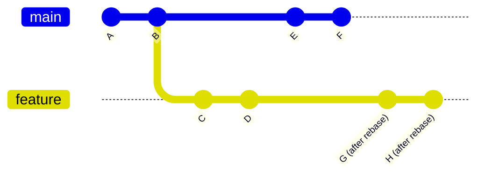

# 🎯 Advanced Git Concepts: Mastering Professional Version Control

<div style="background: linear-gradient(45deg, #667eea 0%, #764ba2 100%); padding: 20px; border-radius: 15px; color: white; text-align: center; margin-bottom: 30px;">
  <h2>🚀 From Git User to Git Expert</h2>
  <p>Master the advanced Git operations that professional developers use daily</p>
</div>

## 📚 **Table of Contents**

1. [🎯 Git Rebase Mastery](#-git-rebase-mastery)
2. [🍒 Cherry-picking Techniques](#-cherry-picking-techniques)
3. [📦 Advanced Stash Operations](#-advanced-stash-operations)
4. [🔄 Interactive Git Operations](#-interactive-git-operations)
5. [🔗 Git Hooks and Automation](#-git-hooks-and-automation)
6. [🏷️ Advanced Tagging Strategies](#️-advanced-tagging-strategies)
7. [🔍 Git Reflog and Recovery](#-git-reflog-and-recovery)
8. [⚡ Performance Optimization](#-performance-optimization)

---

## 🎯 **Git Rebase Mastery**

### 🤔 **What is Rebase?**

Rebase is one of Git's most powerful features that allows you to **rewrite commit history** by moving or combining commits from one branch onto another.



### 🆚 **Merge vs Rebase**

| Aspect | Merge | Rebase |
|--------|--------|--------|
| **History** | Preserves original commit history | Creates linear history |
| **Commits** | Creates merge commit | No merge commit |
| **Conflicts** | Resolve once | May resolve multiple times |
| **Use Case** | Public branches | Private feature branches |

### 🛠️ **Basic Rebase Operations**

#### 1. **Simple Rebase**

```bash
# Rebase current branch onto main
git rebase main

# Rebase specific branch onto main
git rebase main feature-branch

# Rebase with conflict resolution
git rebase main
# If conflicts occur:
git status
# Fix conflicts manually, then:
git add .
git rebase --continue
```

#### 2. **Interactive Rebase**

```bash
# Interactive rebase for last 3 commits
git rebase -i HEAD~3

# Interactive rebase from specific commit
git rebase -i abc123
```

**Interactive Rebase Commands:**
```bash
# Commands available in interactive rebase:
pick    # Use this commit as-is
reword  # Use commit, but edit commit message
edit    # Use commit, but stop for amending
squash  # Use commit, but meld into previous commit
fixup   # Like "squash", but discard commit message
exec    # Run command (the rest of the line) using shell
drop    # Remove commit
```

### 📝 **Practical Rebase Example**

**Scenario**: Clean up feature branch commits before merging

```bash
# 1. Check current commit history
git log --oneline
# Output:
# d4f7b2c Fix typo in documentation
# a8c9e1f Add validation logic
# 3f5a8d2 WIP: debugging session
# 2b7c4f9 Add new feature endpoint
# 1a5e3c8 Initial feature implementation

# 2. Interactive rebase to clean up
git rebase -i HEAD~5

# 3. In the editor, modify to:
pick 1a5e3c8 Initial feature implementation
squash 2b7c4f9 Add new feature endpoint
drop 3f5a8d2 WIP: debugging session
pick a8c9e1f Add validation logic
fixup d4f7b2c Fix typo in documentation

# 4. Result: Clean, professional commit history
git log --oneline
# b5d8f3a Add validation logic
# 7e2a9c4 Initial feature implementation with endpoint
```

### 🚨 **Rebase Best Practices**

#### ✅ **DO:**
- Rebase private feature branches
- Clean up commits before sharing
- Use interactive rebase for history cleanup
- Test after rebasing

#### ❌ **DON'T:**
- Rebase public/shared branches
- Rebase commits that others depend on
- Force push to main/master
- Rebase without backing up

---

## 🍒 **Cherry-picking Techniques**

### 🎯 **What is Cherry-picking?**

Cherry-picking allows you to **apply specific commits** from one branch to another without merging the entire branch.

### 🛠️ **Basic Cherry-pick Operations**

```bash
# Cherry-pick a single commit
git cherry-pick abc123

# Cherry-pick multiple commits
git cherry-pick abc123 def456 ghi789

# Cherry-pick a range of commits
git cherry-pick abc123..def456

# Cherry-pick without committing (for review)
git cherry-pick --no-commit abc123
```

### 🔧 **Advanced Cherry-pick Options**

```bash
# Cherry-pick with edit message
git cherry-pick -e abc123

# Cherry-pick and sign off
git cherry-pick -s abc123

# Cherry-pick a merge commit (specify parent)
git cherry-pick -m 1 abc123

# Cherry-pick with strategy
git cherry-pick -X theirs abc123
```

### 📝 **Practical Cherry-pick Scenarios**

#### **Scenario 1: Hotfix Deployment**

```bash
# Bug fix is on develop branch, need it on main
git checkout main
git cherry-pick develop~2  # Pick the bugfix commit

# If conflicts occur
git status
# Resolve conflicts
git add .
git cherry-pick --continue
```

#### **Scenario 2: Selective Feature Integration**

```bash
# Pick only specific features from a large branch
git log feature-branch --oneline
# 123abc Add authentication
# 456def Add user management
# 789ghi Add reporting (not ready)

# Cherry-pick only ready features
git checkout develop
git cherry-pick 123abc 456def
```

---

## 📦 **Advanced Stash Operations**

### 🎯 **Beyond Basic Stashing**

While `git stash` is commonly known, advanced stashing techniques can significantly improve your workflow.

### 🛠️ **Advanced Stash Commands**

```bash
# Stash with custom message
git stash save "WIP: implementing user authentication"

# Stash only tracked files (ignore new files)
git stash --keep-index

# Stash including untracked files
git stash -u
# or
git stash --include-untracked

# Stash everything including ignored files
git stash -a
# or
git stash --all

# Stash specific files
git stash push -m "partial work" file1.js file2.js
```

### 📋 **Stash Management**

```bash
# List all stashes with details
git stash list
git stash list --stat

# Show stash contents
git stash show stash@{0}
git stash show -p stash@{1}  # Show patch

# Apply stash without dropping
git stash apply stash@{1}

# Apply and drop specific stash
git stash pop stash@{0}

# Create branch from stash
git stash branch new-feature-branch stash@{1}

# Delete specific stash
git stash drop stash@{2}

# Clear all stashes
git stash clear
```

### 🎯 **Stash Workflow Patterns**

#### **Pattern 1: Quick Context Switch**

```bash
# Working on feature A, urgent bug fix needed
git stash save "Feature A: half-implemented validation"
git checkout main
git checkout -b hotfix-urgent-bug
# Fix the bug
git commit -m "Fix urgent production bug"
git checkout feature-A
git stash pop  # Resume work
```

#### **Pattern 2: Stash and Apply to Different Branch**

```bash
# Started work on wrong branch
git stash save "Work meant for feature-B"
git checkout feature-B
git stash pop
```

---

## 🔄 **Interactive Git Operations**

### 🎯 **Interactive Add**

```bash
# Interactive staging
git add -i

# Interactive patch mode
git add -p
# Options: y/n/q/a/d/s/e
```

### 🛠️ **Interactive Rebase Power Moves**

#### **Squashing Multiple Commits**

```bash
git rebase -i HEAD~4

# Change commits to:
pick a1b2c3d First commit
squash e4f5g6h Second commit
squash i7j8k9l Third commit
squash m1n2o3p Fourth commit
```

#### **Reordering Commits**

```bash
git rebase -i HEAD~3

# Reorder by moving lines:
pick c3d4e5f Third commit (move to first)
pick a1b2c3d First commit (move to second)  
pick e5f6g7h Second commit (move to third)
```

#### **Editing Commits**

```bash
git rebase -i HEAD~2

# Mark commit for editing:
edit a1b2c3d Commit to modify
pick e4f5g6h Keep this one

# When rebase stops:
# Make your changes
git add .
git commit --amend
git rebase --continue
```

---

## 🔗 **Git Hooks and Automation**

### 🎯 **Understanding Git Hooks**

Git hooks are scripts that run automatically at specific points in the Git workflow.

### 📁 **Hook Types and Locations**

```bash
# Local hooks (in .git/hooks/)
pre-commit      # Before commit is created
prepare-commit-msg  # Before commit message editor
commit-msg      # Validate commit message
post-commit     # After commit is created
pre-push        # Before push to remote
post-checkout   # After checkout
post-merge      # After successful merge

# Server-side hooks
pre-receive     # Before any refs are updated
post-receive    # After all refs are updated
update          # Before each ref is updated
```

### 🛠️ **Creating Practical Hooks**

#### **1. Pre-commit Hook for Code Quality**

```bash
# Create .git/hooks/pre-commit
#!/bin/bash

echo "Running pre-commit checks..."

# Check for debugging statements
if grep -r "console.log\|debugger\|print(" --include="*.js" --include="*.py" src/; then
    echo "❌ Please remove debugging statements before committing."
    exit 1
fi

# Run linter
npm run lint
if [ $? -ne 0 ]; then
    echo "❌ Linting failed. Please fix errors before committing."
    exit 1
fi

# Run tests
npm test
if [ $? -ne 0 ]; then
    echo "❌ Tests failed. Please fix tests before committing."
    exit 1
fi

echo "✅ All pre-commit checks passed!"
```

#### **2. Commit Message Hook**

```bash
# Create .git/hooks/commit-msg
#!/bin/bash

commit_regex='^(feat|fix|docs|style|refactor|test|chore)(\(.+\))?: .{1,50}'

if ! grep -qE "$commit_regex" "$1"; then
    echo "❌ Invalid commit message format!"
    echo "Format: type(scope): description"
    echo "Types: feat, fix, docs, style, refactor, test, chore"
    echo "Example: feat(auth): add user authentication"
    exit 1
fi

echo "✅ Commit message format is valid!"
```

#### **3. Pre-push Hook for Branch Protection**

```bash
# Create .git/hooks/pre-push
#!/bin/bash

protected_branch='main'
current_branch=$(git symbolic-ref HEAD | sed -e 's,.*/\(.*\),\1,')

if [ $protected_branch = $current_branch ]; then
    echo "❌ Direct push to $protected_branch branch is not allowed!"
    echo "Please create a feature branch and submit a PR."
    exit 1
fi

echo "✅ Push to $current_branch is allowed."
```

### 🔧 **Making Hooks Executable**

```bash
# Make hook executable
chmod +x .git/hooks/pre-commit
chmod +x .git/hooks/commit-msg
chmod +x .git/hooks/pre-push
```

### 📦 **Shared Hooks with Husky (Node.js)**

```bash
# Install husky
npm install --save-dev husky

# Initialize husky
npx husky install

# Add pre-commit hook
npx husky add .husky/pre-commit "npm run lint && npm test"

# Add commit-msg hook  
npx husky add .husky/commit-msg 'npx commitlint --edit $1'
```

---

## 🏷️ **Advanced Tagging Strategies**

### 🎯 **Semantic Versioning with Tags**

```bash
# Lightweight tag
git tag v1.0.0

# Annotated tag (recommended)
git tag -a v1.0.0 -m "Release version 1.0.0"

# Tag specific commit
git tag -a v0.9.0 abc123 -m "Beta release"

# Push tags to remote
git push origin v1.0.0
git push origin --tags  # Push all tags
```

### 📋 **Tag Management**

```bash
# List tags
git tag
git tag -l "v1.*"  # List tags matching pattern

# Show tag information
git show v1.0.0

# Delete local tag
git tag -d v1.0.0

# Delete remote tag
git push origin --delete v1.0.0

# Checkout tag (creates detached HEAD)
git checkout v1.0.0

# Create branch from tag
git checkout -b hotfix-1.0.1 v1.0.0
```

### 🚀 **Release Management Workflow**

```bash
# 1. Prepare release
git checkout main
git pull origin main

# 2. Create release branch
git checkout -b release/1.2.0

# 3. Bump version, update changelog
# ... make necessary changes ...
git commit -m "chore: prepare release 1.2.0"

# 4. Create and push tag
git tag -a v1.2.0 -m "Release version 1.2.0

New Features:
- Feature A implementation
- Feature B improvements

Bug Fixes:
- Fix critical bug in authentication
- Resolve performance issue in API

Breaking Changes:
- API endpoint /old-endpoint removed"

git push origin release/1.2.0
git push origin v1.2.0

# 5. Merge to main
git checkout main
git merge release/1.2.0
git push origin main

# 6. Clean up
git branch -d release/1.2.0
git push origin --delete release/1.2.0
```

---

## 🔍 **Git Reflog and Recovery**

### 🎯 **Understanding Reflog**

The reflog (reference log) tracks all changes to branch tips and other references in your local repository.

```bash
# View reflog
git reflog

# View reflog for specific branch
git reflog show main

# View reflog with dates
git reflog --date=relative
```

### 🚑 **Recovery Scenarios**

#### **Scenario 1: Recovering Lost Commits**

```bash
# Accidentally reset to wrong commit
git reset --hard HEAD~5

# Find lost commits in reflog
git reflog
# 4d8a1b2 HEAD@{1}: reset: moving to HEAD~5
# 7f3e9c5 HEAD@{0}: commit: important feature

# Recover the lost work
git reset --hard 7f3e9c5
```

#### **Scenario 2: Recovering Deleted Branch**

```bash
# Accidentally deleted branch
git branch -D feature-important

# Find the branch in reflog
git reflog
# Look for: checkout: moving from feature-important to main

# Recover the branch
git checkout -b feature-important 7f3e9c5
```

#### **Scenario 3: Undoing Bad Rebase**

```bash
# Bad rebase happened
git reflog

# Find the commit before rebase
# 4d8a1b2 HEAD@{5}: rebase finished: returning to refs/heads/feature
# 7f3e9c5 HEAD@{6}: checkout: moving to main

# Reset to before rebase
git reset --hard HEAD@{6}
```

### 🛡️ **Prevention and Backup Strategies**

```bash
# Create backup branch before dangerous operations
git branch backup-before-rebase

# Use aliases for safer operations
git config --global alias.undo 'reset --soft HEAD@{1}'
git config --global alias.save '!git add -A && git commit -m "SAVEPOINT"'
```

---

## ⚡ **Performance Optimization**

### 🎯 **Repository Maintenance**

```bash
# Clean up unnecessary files and optimize repository
git gc --aggressive

# Prune remote tracking branches
git remote prune origin

# Clean up reflog entries older than 30 days
git reflog expire --expire=30.days --all

# Verify repository integrity
git fsck --full
```

### 📊 **Repository Analysis**

```bash
# Show repository size
du -sh .git

# Show largest objects
git rev-list --objects --all | git cat-file --batch-check='%(objecttype) %(objectname) %(objectsize) %(rest)' | awk '/^blob/ {print substr($0,6)}' | sort --numeric-sort --key=2 | tail -10

# Find large files in history
git log --all --pretty=format: --name-only --diff-filter=A | sort -u | while read filename; do echo "$(git log --all --max-count=1 --pretty=format:"%H %ci %an" -- "$filename") $filename"; done | sort
```

### 🚀 **Performance Best Practices**

#### **Large Repository Handling**

```bash
# Shallow clone for faster downloads
git clone --depth 1 <repository-url>

# Fetch only specific branch
git clone -b main --single-branch <repository-url>

# Configure git for better performance
git config core.preloadindex true
git config core.fscache true
git config gc.auto 256
```

#### **Working with Large Files**

```bash
# Use Git LFS for large files
git lfs install
git lfs track "*.psd"
git lfs track "*.zip"
git add .gitattributes
```

---

## 🎯 **Practical Advanced Scenarios**

### 🔥 **Emergency Fixes**

#### **Hotfix Workflow**

```bash
# 1. Emergency bug discovered in production
git checkout main
git pull origin main

# 2. Create hotfix branch
git checkout -b hotfix/critical-security-fix

# 3. Make the fix
# ... implement fix ...
git add .
git commit -m "fix: resolve critical security vulnerability"

# 4. Test the fix
npm test

# 5. Push and create PR
git push origin hotfix/critical-security-fix

# 6. After PR approval, cherry-pick to develop
git checkout develop
git cherry-pick hotfix/critical-security-fix
```

### 🔄 **Complex Merge Scenarios**

#### **Three-way Merge with Custom Strategy**

```bash
# Merge with preferring current branch changes
git merge -X ours feature-branch

# Merge with preferring incoming changes  
git merge -X theirs feature-branch

# Merge ignoring whitespace changes
git merge -X ignore-space-change feature-branch
```

---

## 🏆 **Mastery Checklist**

### ✅ **Basic Advanced Operations**
- [ ] Perform interactive rebase to clean commit history
- [ ] Cherry-pick commits between branches
- [ ] Use advanced stash operations
- [ ] Recover lost commits using reflog

### 🥈 **Intermediate Advanced Operations**  
- [ ] Create and use Git hooks for automation
- [ ] Implement semantic versioning with tags
- [ ] Handle complex merge conflicts
- [ ] Optimize repository performance

### 🥇 **Expert Level Operations**
- [ ] Design custom Git workflows
- [ ] Create advanced Git aliases and scripts
- [ ] Troubleshoot complex repository issues
- [ ] Mentor team on advanced Git practices

---

## 🎉 **Congratulations!**

You've now mastered advanced Git concepts! These skills will make you a more effective developer and enable you to handle complex version control scenarios with confidence.

**Next Steps:**
- Practice these concepts in real projects
- Move on to [Git Workflow Strategies](./02-git-workflow-strategies.md)
- Implement advanced Git practices in your team

---

**🚀 Keep exploring and happy Git mastering! 🚀**

---

*Part of Day 5 - Git Advanced | DevOps Zero to Intermediate Journey*