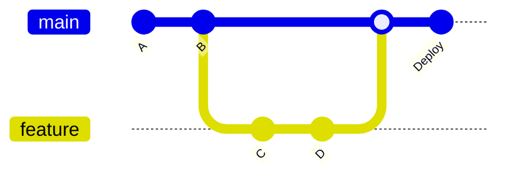
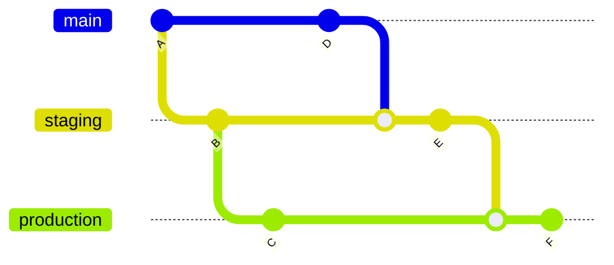

# 🔄 Git Workflow Strategies: Professional Team Collaboration

<div style="background: linear-gradient(45deg, #FF6B6B 0%, #4ECDC4 100%); padding: 20px; border-radius: 15px; color: white; text-align: center; margin-bottom: 30px;">
  <h2>🎯 Master Professional Git Workflows</h2>
  <p>Implement industry-standard workflows for team collaboration and release management</p>
</div>

## 📚 **Table of Contents**

1. [🌊 GitFlow Workflow](#-gitflow-workflow)
2. [🚀 GitHub Flow](#-github-flow)
3. [🔄 GitLab Flow](#-gitlab-flow)
4. [⚡ Feature Branch Workflow](#-feature-branch-workflow)
5. [🏢 Enterprise Workflows](#-enterprise-workflows)
6. [🤝 Collaboration Patterns](#-collaboration-patterns)
7. [🚀 CI/CD Integration](#-cicd-integration)
8. [📊 Workflow Comparison](#-workflow-comparison)

---

## 🌊 **GitFlow Workflow**

### 🎯 **Overview**

GitFlow is a branching model that provides a robust framework for managing large projects with scheduled releases.


### 🌿 **Branch Structure**

| Branch | Purpose | Lifetime | Merge Target |
|--------|---------|----------|--------------|
| `main` | Production-ready code | Permanent | Never directly |
| `develop` | Integration branch | Permanent | main (via release) |
| `feature/*` | New features | Temporary | develop |
| `release/*` | Release preparation | Temporary | main + develop |
| `hotfix/*` | Emergency fixes | Temporary | main + develop |

### 🛠️ **GitFlow Commands**

#### **Installation and Setup**

```bash
# Install git-flow (if not available)
# For macOS:
brew install git-flow-avh

# For Ubuntu:
sudo apt-get install git-flow

# For Windows:
# Download from: https://github.com/petervanderdoes/gitflow-avh

# Initialize GitFlow in repository
git flow init

# Configuration prompts:
# Branch name for production releases: [main]
# Branch name for "next release" development: [develop]
# Feature branches: feature/
# Bugfix branches: bugfix/
# Release branches: release/
# Hotfix branches: hotfix/
# Support branches: support/
```

#### **Feature Workflow**

```bash
# Start new feature
git flow feature start user-authentication

# Work on feature (creates feature/user-authentication)
# ... make changes ...
git add .
git commit -m "feat: implement user login"

# Publish feature (push to remote)
git flow feature publish user-authentication

# Pull feature updates
git flow feature pull origin user-authentication

# Finish feature (merge to develop and delete branch)
git flow feature finish user-authentication
```

#### **Release Workflow**

```bash
# Start release branch
git flow release start 1.2.0

# Prepare release (bug fixes, version bumps)
# ... make changes ...
git add .
git commit -m "chore: bump version to 1.2.0"

# Publish release
git flow release publish 1.2.0

# Finish release (merge to main and develop, create tag)
git flow release finish 1.2.0
# This will:
# 1. Merge release/1.2.0 to main
# 2. Tag the merge commit on main
# 3. Merge release/1.2.0 to develop  
# 4. Delete release/1.2.0
```

#### **Hotfix Workflow**

```bash
# Start hotfix from main
git flow hotfix start security-patch

# Fix the issue
# ... make urgent fix ...
git add .
git commit -m "fix: resolve security vulnerability"

# Finish hotfix (merge to main and develop)
git flow hotfix finish security-patch
# This will create tag automatically
```

### 📋 **GitFlow Best Practices**

#### ✅ **DO:**
- Use for projects with scheduled releases
- Keep feature branches small and focused
- Test thoroughly before finishing features
- Use semantic versioning for releases
- Write clear commit messages

#### ❌ **DON'T:**
- Use for continuous deployment projects
- Keep feature branches alive too long
- Merge directly to main/develop
- Skip release branches for major versions
- Force push shared branches

---

## 🚀 **GitHub Flow**

### 🎯 **Overview**

GitHub Flow is a lightweight workflow perfect for continuous deployment and small teams.



### 🔄 **Workflow Steps**

1. **Create branch** from main
2. **Make changes** and commit
3. **Open Pull Request**
4. **Review and discuss**
5. **Deploy from branch** (optional)
6. **Merge to main**
7. **Deploy from main**

### 🛠️ **Implementation**

#### **Step 1: Create Feature Branch**

```bash
# Always start from main
git checkout main
git pull origin main

# Create and checkout new branch
git checkout -b feature/add-user-dashboard

# Or in one command
git checkout -b feature/add-user-dashboard main
```

#### **Step 2: Work and Commit**

```bash
# Make changes
# ... develop feature ...

# Stage and commit frequently
git add .
git commit -m "feat: add user dashboard layout"

# Continue working
# ... more changes ...
git add .
git commit -m "feat: implement dashboard API integration"

# Push to remote
git push origin feature/add-user-dashboard
```

#### **Step 3: Create Pull Request**

```bash
# Push branch and create PR
git push origin feature/add-user-dashboard

# Using GitHub CLI (gh)
gh pr create --title "Add User Dashboard" --body "Implements user dashboard with real-time data"

# Or create PR via GitHub web interface
```

#### **Step 4: Review Process**

```bash
# Address review feedback
# ... make changes ...
git add .
git commit -m "fix: address PR review comments"
git push origin feature/add-user-dashboard

# Update PR description if needed
gh pr edit --body "Updated implementation based on review feedback"
```

#### **Step 5: Merge and Deploy**

```bash
# After approval, merge via GitHub interface or CLI
gh pr merge --squash

# Clean up local branch
git checkout main
git pull origin main
git branch -d feature/add-user-dashboard
```

### 🎯 **GitHub Flow Best Practices**

#### **Branch Naming Conventions**
```bash
feature/add-payment-processing
bugfix/fix-login-validation
hotfix/security-patch-auth
docs/update-api-documentation
chore/update-dependencies
```

#### **Pull Request Templates**

Create `.github/pull_request_template.md`:

```markdown
## Description
Brief description of changes

## Type of Change
- [ ] Bug fix
- [ ] New feature  
- [ ] Breaking change
- [ ] Documentation update

## Testing
- [ ] Tests pass locally
- [ ] Added new tests for new functionality

## Checklist
- [ ] Code follows style guidelines
- [ ] Self-review completed
- [ ] Documentation updated
- [ ] No conflicts with main branch
```

---

## 🔄 **GitLab Flow**

### 🎯 **Overview**

GitLab Flow combines the best of GitFlow and GitHub Flow, supporting multiple deployment environments.

### 🌿 **Environment Branches**



### 🏗️ **Environment Strategy**

```bash
# Main development branch
main → staging → production

# Or with multiple environments
main → pre-production → production
main → staging → production
```

### 🛠️ **Implementation**

#### **Development Workflow**

```bash
# 1. Feature development
git checkout main
git checkout -b feature/new-api-endpoint

# 2. Develop and test
# ... make changes ...
git add .
git commit -m "feat: add new API endpoint"
git push origin feature/new-api-endpoint

# 3. Create merge request to main
# ... review and merge ...

# 4. Deploy to staging
git checkout staging
git merge main
git push origin staging

# 5. Deploy to production (after staging validation)
git checkout production  
git merge staging
git push origin production
```

#### **Release Management**

```bash
# Create release branch from main
git checkout main
git checkout -b release/2.1.0

# Cherry-pick commits for release
git cherry-pick abc123  # Important feature
git cherry-pick def456  # Critical bug fix

# Merge to production
git checkout production
git merge release/2.1.0
git tag v2.1.0
git push origin production --tags

# Merge back to main
git checkout main
git merge release/2.1.0
```

---

## ⚡ **Feature Branch Workflow**

### 🎯 **Simple and Effective**

Perfect for small teams and simple projects.

### 🔄 **Workflow**

```bash
# 1. Create feature branch
git checkout main
git checkout -b feature/user-preferences

# 2. Develop feature
# ... make changes ...
git add .
git commit -m "feat: implement user preferences"

# 3. Keep branch updated
git fetch origin
git rebase origin/main

# 4. Push and create PR
git push origin feature/user-preferences

# 5. Merge after review
# ... merge via PR ...

# 6. Clean up
git checkout main
git pull origin main
git branch -d feature/user-preferences
```

---

## 🏢 **Enterprise Workflows**

### 🎯 **Large Scale Development**

For organizations with multiple teams and complex release cycles.

### 🏗️ **Multi-Repository Strategy**

#### **Mono-repo Approach**
```bash
project-monorepo/
├── frontend/
├── backend/
├── mobile/
├── shared/
└── tools/
```

#### **Multi-repo Approach**
```bash
# Separate repositories
user-service.git
payment-service.git
frontend-web.git
frontend-mobile.git
```

### 🔄 **Release Train Model**

```bash
# Monthly release train
main → release/2023.11 → production
      └→ release/2023.12 → staging

# Feature development continues on main
# Cherry-pick critical fixes to release branches
```

### 🛠️ **Implementation Example**

```bash
# 1. Feature development (2-week sprints)
git checkout main
git checkout -b feature/JIRA-1234-payment-integration

# 2. Development and review
# ... feature complete ...
git rebase main  # Keep history clean
git push origin feature/JIRA-1234-payment-integration

# 3. Merge to main after code review
# ... automated testing passes ...

# 4. Release branch creation (monthly)
git checkout main
git checkout -b release/2023.11

# 5. Cherry-pick features for release
git cherry-pick abc123  # JIRA-1234
git cherry-pick def456  # JIRA-1235

# 6. QA and stabilization
# ... bug fixes on release branch ...

# 7. Production deployment
git checkout production
git merge release/2023.11
git tag v2023.11.0

# 8. Merge fixes back to main
git checkout main
git merge release/2023.11
```

---

## 🤝 **Collaboration Patterns**

### 🎯 **Code Review Strategies**

#### **Review Types**

| Type | When to Use | Participants |
|------|-------------|--------------|
| **Pair Review** | Complex changes | Author + 1 reviewer |
| **Team Review** | Architecture changes | Author + team |
| **Expert Review** | Security/performance | Author + domain expert |
| **Self Review** | Small fixes | Author only |

#### **Review Checklist**

```markdown
## Code Review Checklist

### Functionality
- [ ] Code works as intended
- [ ] Edge cases handled
- [ ] Error handling implemented

### Quality
- [ ] Code is readable and maintainable
- [ ] Follows team coding standards
- [ ] No code duplication
- [ ] Performance considerations addressed

### Testing
- [ ] Adequate test coverage
- [ ] Tests are meaningful
- [ ] CI/CD pipeline passes

### Security
- [ ] No security vulnerabilities
- [ ] Input validation implemented
- [ ] Authentication/authorization correct

### Documentation
- [ ] Code is self-documenting
- [ ] Complex logic explained
- [ ] API documentation updated
```

### 🔄 **Conflict Resolution Strategies**

#### **Merge Conflicts**

```bash
# 1. Fetch latest changes
git fetch origin

# 2. Rebase onto main
git rebase origin/main

# 3. Resolve conflicts
# Edit conflicted files
git add <resolved-files>
git rebase --continue

# 4. Force push (carefully!)
git push --force-with-lease origin feature-branch
```

#### **Semantic Conflicts**

```bash
# When code merges cleanly but breaks functionality

# 1. Run tests after merge
npm test

# 2. If tests fail, investigate
git log --oneline main..HEAD

# 3. Fix integration issues
# ... make necessary changes ...
git add .
git commit -m "fix: resolve semantic conflict in authentication flow"
```

---

## 🚀 **CI/CD Integration**

### 🎯 **Automated Workflows**

#### **GitHub Actions Example**

`.github/workflows/feature-branch.yml`:

```yaml
name: Feature Branch CI

on:
  pull_request:
    branches: [ main ]

jobs:
  test:
    runs-on: ubuntu-latest
    
    steps:
    - uses: actions/checkout@v3
    
    - name: Setup Node.js
      uses: actions/setup-node@v3
      with:
        node-version: '18'
        cache: 'npm'
    
    - name: Install dependencies
      run: npm ci
    
    - name: Run linter
      run: npm run lint
    
    - name: Run tests
      run: npm run test:coverage
    
    - name: Upload coverage
      uses: codecov/codecov-action@v3
      
  security:
    runs-on: ubuntu-latest
    
    steps:
    - uses: actions/checkout@v3
    
    - name: Run security audit
      run: npm audit --audit-level moderate
      
    - name: Run CodeQL Analysis
      uses: github/codeql-action/analyze@v2
```

#### **Deployment Pipeline**

```yaml
name: Deploy to Production

on:
  push:
    branches: [ main ]
    tags: [ 'v*' ]

jobs:
  deploy-staging:
    if: github.ref == 'refs/heads/main'
    runs-on: ubuntu-latest
    environment: staging
    
    steps:
    - name: Deploy to staging
      run: echo "Deploying to staging"
      
  deploy-production:
    if: startsWith(github.ref, 'refs/tags/v')
    runs-on: ubuntu-latest
    environment: production
    
    steps:
    - name: Deploy to production
      run: echo "Deploying to production"
```

### 🔧 **Branch Protection Rules**

```bash
# Enable branch protection via GitHub CLI
gh api repos/:owner/:repo/branches/main/protection \
  --method PUT \
  --field required_status_checks='{"strict":true,"contexts":["ci/tests","ci/security"]}' \
  --field enforce_admins=true \
  --field required_pull_request_reviews='{"required_approving_review_count":2}' \
  --field restrictions=null
```

---

## 📊 **Workflow Comparison**

### 🏆 **When to Use Each Workflow**

| Workflow | Team Size | Release Cycle | Complexity | Best For |
|----------|-----------|---------------|------------|----------|
| **GitFlow** | Large (10+) | Scheduled | High | Enterprise, regulated industries |
| **GitHub Flow** | Small-Medium (2-10) | Continuous | Low | Startups, web applications |
| **GitLab Flow** | Medium-Large (5-20) | Mixed | Medium | SaaS products, multi-environment |
| **Feature Branch** | Small (2-5) | Flexible | Low | Simple projects, prototypes |

### 📈 **Adoption Strategy**

#### **Phase 1: Assessment (Week 1)**
```bash
# Evaluate current workflow
# Document pain points
# Survey team preferences
# Analyze project requirements
```

#### **Phase 2: Pilot (Weeks 2-4)**
```bash
# Choose workflow
# Setup branch protection
# Create documentation
# Train team on new process
```

#### **Phase 3: Implementation (Weeks 5-8)**
```bash
# Gradually migrate projects
# Monitor metrics
# Collect feedback
# Refine process
```

#### **Phase 4: Optimization (Ongoing)**
```bash
# Automate repetitive tasks
# Improve CI/CD integration
# Regular retrospectives
# Continuous improvement
```

---

## 🎯 **Practical Scenarios**

### 🔥 **Scenario 1: Emergency Hotfix**

**GitFlow Approach:**
```bash
git flow hotfix start critical-security-fix
# ... make fix ...
git flow hotfix finish critical-security-fix
```

**GitHub Flow Approach:**
```bash
git checkout main
git checkout -b hotfix/critical-security-fix
# ... make fix ...
git push origin hotfix/critical-security-fix
# Create PR and fast-track review
```

### 🚀 **Scenario 2: Feature Flag Deployment**

```bash
# Feature branch with feature flag
git checkout -b feature/new-ui-experiment

# Implement with feature flag
if (featureFlags.newUI) {
  renderNewUI()
} else {
  renderOldUI()
}

# Deploy to production with flag disabled
# Gradually enable for users
# Remove flag and old code after validation
```

### 🔄 **Scenario 3: Parallel Release Streams**

```bash
# Multiple versions in production
main → release/2.1 → production-v2.1
     → release/2.0 → production-v2.0 (maintenance)
     → release/1.9 → production-v1.9 (legacy)

# Cherry-pick critical fixes to all maintained versions
git checkout release/2.0
git cherry-pick <security-fix-commit>
git checkout release/1.9  
git cherry-pick <security-fix-commit>
```

---

## 🏆 **Mastery Checklist**

### ✅ **Workflow Fundamentals**
- [ ] Understand GitFlow, GitHub Flow, and GitLab Flow
- [ ] Choose appropriate workflow for project type
- [ ] Implement branch protection rules
- [ ] Set up automated testing

### 🥈 **Team Collaboration**
- [ ] Establish code review process
- [ ] Create pull request templates
- [ ] Implement conflict resolution strategies
- [ ] Set up CI/CD integration

### 🥇 **Advanced Workflow Management**
- [ ] Design custom workflows for complex projects
- [ ] Implement feature flags and deployment strategies
- [ ] Optimize workflow for team productivity
- [ ] Mentor team on workflow best practices

---

## 🎉 **Workflow Mastery Achieved!**

You now understand the major Git workflows used in professional development. The key is choosing the right workflow for your team and project needs, then implementing it consistently.

**Next Steps:**
- Choose a workflow for your current project
- Implement branch protection and automation
- Move on to [Git Troubleshooting](./03-git-troubleshooting.md)
- Practice with the [Hands-on Exercises](./04-hands-on-exercises.md)

---

**🚀 Master your workflow, master your productivity! 🚀**

---

*Part of Day 5 - Git Advanced | DevOps Zero to Intermediate Journey*