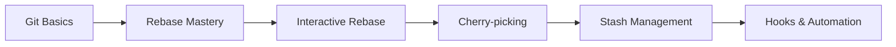

# 🚀 Day 5 - Git Advanced: Master Professional Version Control

<div style="background: linear-gradient(90deg, #FF6B6B 0%, #4ECDC4 100%); padding: 20px; border-radius: 10px; color: white; text-align: center;">
  <h2>🎯 Advanced Git Mastery for DevOps Professionals</h2>
  <p>Deep dive into advanced Git techniques, workflows, and collaboration strategies</p>
</div>

## 📚 **Course Overview**

Welcome to Day 5 of your DevOps journey! Today we'll explore advanced Git concepts that are essential for professional software development and DevOps workflows. This comprehensive guide builds upon the Git basics and takes you to expert-level proficiency.

### 🎯 **Learning Objectives**

By the end of this day, you will be able to:

- ✅ Master advanced Git operations (rebase, cherry-pick, squash)
- ✅ Implement professional Git workflows (GitFlow, GitHub Flow)
- ✅ Handle complex merge scenarios and conflicts
- ✅ Use Git hooks for automation and quality control
- ✅ Optimize Git performance and repository management
- ✅ Implement advanced branching strategies
- ✅ Troubleshoot complex Git issues
- ✅ Collaborate effectively in large development teams

---

## 🗂️ **Course Structure**

This day is organized into multiple detailed guides. Follow them in order for the best learning experience:

### 📖 **Core Topics**

| 📋 Topic | 📄 File | ⏱️ Est. Time | 🎯 Difficulty |
|----------|---------|--------------|---------------|
| **1. Advanced Git Concepts** | [`01-advanced-git-concepts.md`](./01-advanced-git-concepts.md) | 3-4 hours | 🟠 Advanced |
| **2. Git Workflow Strategies** | [`02-git-workflow-strategies.md`](./02-git-workflow-strategies.md) | 2-3 hours | 🟠 Advanced |
| **3. Git Troubleshooting** | [`03-git-troubleshooting.md`](./03-git-troubleshooting.md) | 2-3 hours | 🔴 Advanced |
| **4. Hands-on Exercises** | [`04-hands-on-exercises.md`](./04-hands-on-exercises.md) | 3-4 hours | 🔴 Advanced |
| **5. Professional Best Practices** | [`05-git-best-practices.md`](./05-git-best-practices.md) | 1-2 hours | 🟠 Advanced |

---

## 🚀 **Quick Start Guide**

### 📋 **Prerequisites**

Before diving into advanced Git topics, ensure you have:

```bash
# Check Git version (recommended 2.20+)
git --version

# Verify Git configuration
git config --list

# Check if you have a test repository
ls -la .git
```

**Required Knowledge:**
- ✅ Git basics (Day 4 content)
- ✅ Basic command line operations
- ✅ Understanding of branching and merging
- ✅ Remote repository operations

---

## 🔥 **What You'll Master Today**

### 🎯 **Advanced Operations**



### 🌟 **Key Skills**

| 🛠️ Skill | 📝 Description | 💼 Use Case |
|----------|----------------|-------------|
| **Interactive Rebase** | Rewrite commit history cleanly | Clean up commits before PR |
| **Cherry-picking** | Apply specific commits across branches | Hotfix deployment |
| **Advanced Merging** | Handle complex merge scenarios | Large team collaboration |
| **Git Hooks** | Automate quality checks | CI/CD integration |
| **Workflow Management** | Implement team workflows | Professional development |

---

## 📈 **Learning Path**

### 🏁 **Beginner Level**
- Review Git basics from Day 4
- Understand repository structure
- Practice basic branching

### 🎯 **Intermediate Level**
- Master rebasing techniques
- Learn conflict resolution
- Implement Git hooks

### 🚀 **Advanced Level**
- Design custom workflows
- Optimize repository performance
- Troubleshoot complex issues

---

## 🛠️ **Setup Instructions**

### 1. **Prepare Your Environment**

```bash
# Create a practice directory
mkdir git-advanced-practice
cd git-advanced-practice

# Initialize a new repository
git init

# Create initial commit structure
echo "# Advanced Git Practice" > README.md
git add README.md
git commit -m "Initial commit"

# Create development branch
git checkout -b develop
```

### 2. **Install Additional Tools**

```bash
# Install Git GUI tools (optional)
# For Windows: Git for Windows includes Git GUI
# For Linux:
sudo apt-get install gitk git-gui

# Install diff tools
git config --global merge.tool vimdiff
```

### 3. **Configure Advanced Settings**

```bash
# Enable helpful aliases
git config --global alias.lg "log --oneline --decorate --all --graph"
git config --global alias.s "status -s"
git config --global alias.co "checkout"
git config --global alias.br "branch"
git config --global alias.unstage "reset HEAD --"

# Configure push behavior
git config --global push.default simple

# Enable rerere (reuse recorded resolution)
git config --global rerere.enabled true
```

---

## 🎯 **Daily Challenges**

Each topic includes hands-on challenges:

- 🥉 **Bronze**: Basic advanced operations
- 🥈 **Silver**: Complex workflow scenarios  
- 🥇 **Gold**: Professional-level problem solving
- 💎 **Platinum**: Expert-level repository management

---

## 📊 **Progress Tracking**

- [ ] **Morning (3 hours)**: Advanced Git Concepts
- [ ] **Midday (2 hours)**: Workflow Strategies
- [ ] **Afternoon (3 hours)**: Hands-on Exercises
- [ ] **Evening (2 hours)**: Troubleshooting & Best Practices

---

## 🔗 **Quick Navigation**

### 📚 **Study Materials**
- [📖 Advanced Git Concepts](./01-advanced-git-concepts.md)
- [🔄 Workflow Strategies](./02-git-workflow-strategies.md)
- [🔧 Troubleshooting Guide](./03-git-troubleshooting.md)
- [💪 Hands-on Exercises](./04-hands-on-exercises.md)
- [⭐ Best Practices](./05-git-best-practices.md)

### 🌐 **External Resources**
- [Git Official Documentation](https://git-scm.com/docs)
- [Atlassian Git Tutorials](https://www.atlassian.com/git/tutorials)
- [Git Flow Cheatsheet](https://danielkummer.github.io/git-flow-cheatsheet/)
- [Interactive Git Branching](https://learngitbranching.js.org/)

---

## 💡 **Pro Tips for Success**

### 🎯 **Study Strategy**
1. **Practice First**: Set up the practice repository
2. **Read & Execute**: Follow along with examples
3. **Break & Reflect**: Take breaks between topics
4. **Apply Immediately**: Use concepts in real projects
5. **Ask Questions**: Don't hesitate to experiment

### ⚡ **Time Management**
- **Focus Blocks**: 25-minute focused study sessions
- **Active Practice**: 60% hands-on, 40% reading
- **Review Sessions**: End each topic with a quick review

---

## 🏆 **Mastery Goals**

By the end of Day 5, you should be able to:

### ✅ **Technical Skills**
- [ ] Perform interactive rebases confidently
- [ ] Resolve complex merge conflicts
- [ ] Implement Git hooks for automation
- [ ] Design and implement team workflows
- [ ] Troubleshoot repository issues

### 🎯 **Professional Skills**
- [ ] Collaborate effectively in large teams
- [ ] Maintain clean commit history
- [ ] Implement quality control processes
- [ ] Optimize development workflows
- [ ] Mentor others on Git best practices

---

## 🎉 **Ready to Begin?**

Great! You're all set to dive into advanced Git concepts. Start with the [Advanced Git Concepts](./01-advanced-git-concepts.md) guide and work your way through each topic systematically.

Remember: **Git mastery comes through practice**. Don't just read—experiment, break things, and learn from the process!

---

**🚀 Happy Git Advancing! Let's make you a Git expert!** 🚀

---

*Last Updated: Day 5 - Git Advanced | DevOps Zero to Intermediate Journey*