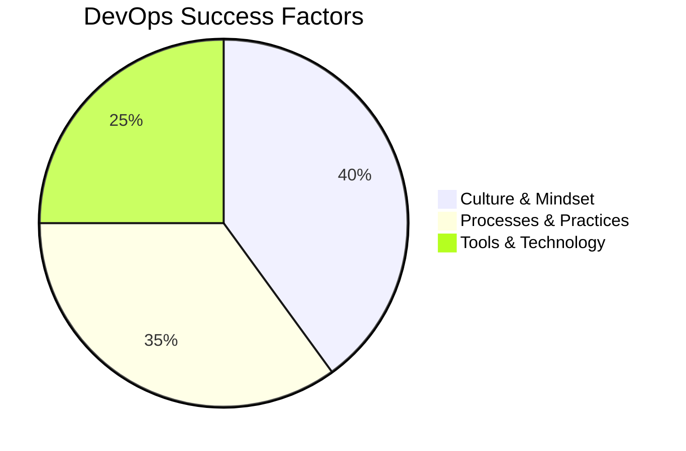
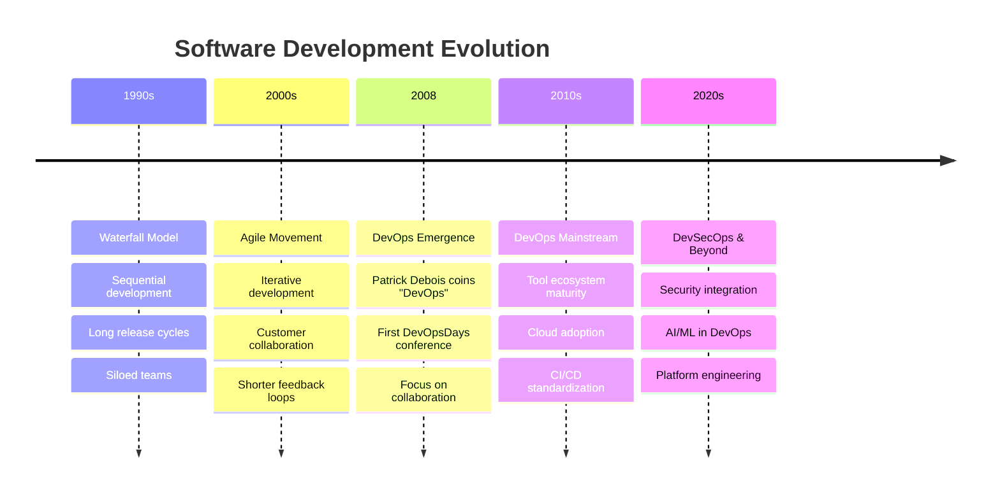
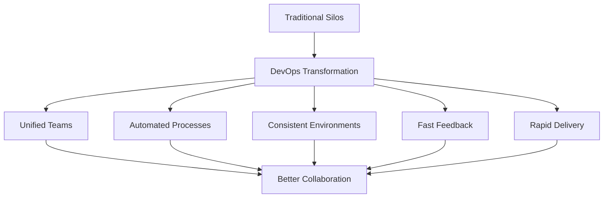
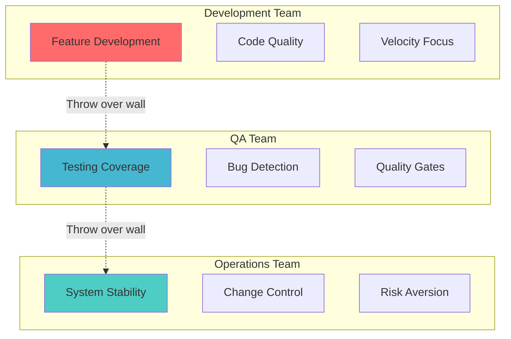
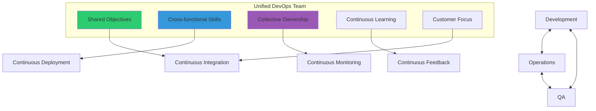
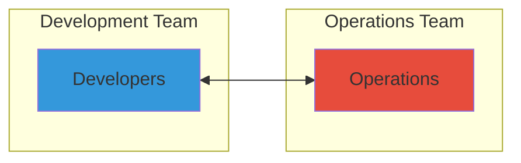
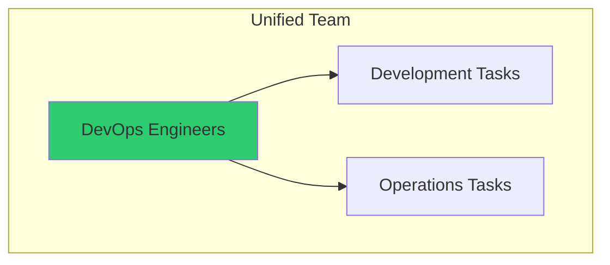
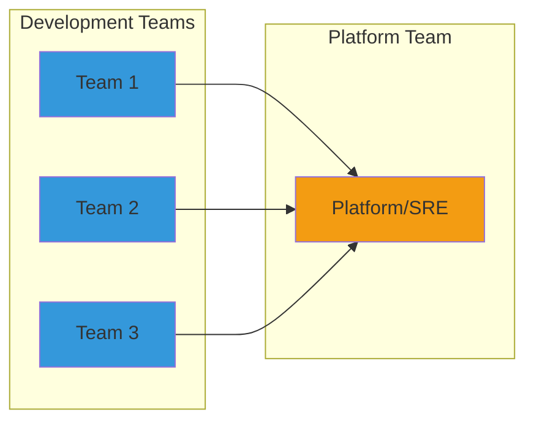

# 🎨 DevOps Culture & Principles

<div style="background: linear-gradient(135deg, #667eea 0%, #764ba2 100%); padding: 20px; border-radius: 10px; color: white; text-align: center;">
  <h2>🌟 Building a DevOps Mindset</h2>
  <p>Understanding the cultural foundation that makes DevOps successful</p>
</div>

---

## 📚 **Table of Contents**

- [🎯 What is DevOps?](#-what-is-devops)
- [🏛️ Historical Context](#️-historical-context)
- [🧠 Core Principles](#-core-principles)
- [🎭 Cultural Transformation](#-cultural-transformation)
- [🤝 Collaboration Models](#-collaboration-models)
- [📊 DevOps Success Metrics](#-devops-success-metrics)
- [🚧 Common Misconceptions](#-common-misconceptions)
- [🎯 Practical Implementation](#-practical-implementation)

---

## 🎯 **What is DevOps?**

### 📖 **Definition**

DevOps is a **cultural philosophy**, **set of practices**, and **collection of tools** that combines software development (Dev) and IT operations (Ops) to:

- **Shorten the development lifecycle**
- **Deliver high-quality software continuously**
- **Improve collaboration between teams**
- **Increase deployment frequency**
- **Achieve faster time to market**

### 🔍 **DevOps is NOT just about tools**



**Key Understanding**: Tools enable DevOps, but culture drives it!

---

## 🏛️ **Historical Context**

### 📈 **Evolution of Software Development**



### 🎯 **The Problem DevOps Solves**

#### 🚫 **Traditional Challenges**

| Area | Problem | Impact |
|------|---------|--------|
| **🏢 Organizational** | Siloed teams with conflicting goals | Slow delivery, poor quality |
| **⚡ Process** | Manual, error-prone deployments | High failure rates, rollback issues |
| **🛠️ Technical** | Inconsistent environments | "Works on my machine" syndrome |
| **📊 Feedback** | Long feedback loops | Late discovery of issues |
| **🎯 Business** | Slow time-to-market | Competitive disadvantage |

#### ✅ **DevOps Solutions**



---

## 🧠 **Core Principles**

### 🌟 **The Three Ways of DevOps**

#### 🌊 **1. The First Way: Flow**
**Goal**: Optimize the flow of work from Development to Operations

**Principles**:
- Make work visible
- Limit work in progress (WIP)
- Reduce batch sizes
- Identify and elevate constraints
- Eliminate waste and hardship

**Practices**:
```bash
# Example: Implementing continuous integration
git commit -m "Small, atomic changes"
# Trigger automated builds and tests
# Fast feedback on code quality
```

#### 🔄 **2. The Second Way: Feedback**
**Goal**: Create fast feedback loops from Operations back to Development

**Principles**:
- See problems as they occur
- Swarm and solve problems quickly
- Push quality closer to source
- Enable fast recovery

**Practices**:
- Automated testing at every stage
- Real-time monitoring and alerting
- Post-incident reviews (blameless)
- Customer feedback integration

#### 🔬 **3. The Third Way: Learning**
**Goal**: Foster a culture of continuous learning and experimentation

**Principles**:
- Encourage experimentation
- Learn from failures
- Practice repetition and mastery
- Share knowledge

**Practices**:
- Regular retrospectives
- Chaos engineering
- Game days and disaster recovery drills
- Cross-functional training

### 🏗️ **CALMS Framework**

DevOps success depends on five key areas:

#### **C** - Culture 🎭
```yaml
Culture:
  mindset: "Shared responsibility"
  values:
    - Collaboration over silos
    - Learning from failure
    - Customer focus
    - Continuous improvement
  behaviors:
    - Open communication
    - Trust and transparency
    - Blame-free post-mortems
```

#### **A** - Automation 🤖
```yaml
Automation:
  goal: "Eliminate manual, error-prone tasks"
  areas:
    - Build and deployment
    - Testing and validation
    - Infrastructure provisioning
    - Monitoring and alerting
  benefits:
    - Consistency
    - Speed
    - Reliability
    - Scalability
```

#### **L** - Lean 📉
```yaml
Lean:
  principles:
    - Value stream thinking
    - Eliminate waste
    - Optimize the whole
    - Deliver fast
  practices:
    - Small batch sizes
    - Short lead times
    - Continuous flow
    - Pull-based systems
```

#### **M** - Measurement 📊
```yaml
Measurement:
  philosophy: "You can't improve what you don't measure"
  key_metrics:
    - Deployment frequency
    - Lead time for changes
    - Mean time to recovery
    - Change failure rate
  tools:
    - Application Performance Monitoring
    - Infrastructure monitoring
    - Business metrics tracking
```

#### **S** - Sharing 🤝
```yaml
Sharing:
  knowledge_areas:
    - Best practices
    - Lessons learned
    - Tools and techniques
    - Success stories
  methods:
    - Documentation
    - Internal conferences
    - Communities of practice
    - Cross-team rotations
```

---

## 🎭 **Cultural Transformation**

### 🔄 **From Silos to Collaboration**

#### 🚫 **Traditional Siloed Culture**



**Problems**:
- Conflicting objectives
- Limited communication
- Finger-pointing when issues arise
- Slow problem resolution
- Knowledge silos

#### ✅ **DevOps Collaborative Culture**



**Benefits**:
- Aligned goals and metrics
- Shared responsibility
- Faster problem resolution
- Knowledge sharing
- Innovation through collaboration

### 🎯 **Cultural Change Strategies**

#### 1. **Leadership Commitment** 👨‍💼

```yaml
Leadership_Actions:
  vision:
    - Define clear DevOps vision
    - Communicate benefits
    - Set expectations
  support:
    - Provide resources
    - Remove obstacles
    - Recognize achievements
  modeling:
    - Demonstrate collaboration
    - Embrace failure as learning
    - Show continuous learning
```

#### 2. **Team Building** 🤝

```yaml
Team_Building:
  cross_training:
    - Dev learns operations
    - Ops learns development
    - Everyone learns customer perspective
  shared_activities:
    - Joint planning sessions
    - Shared on-call rotation
    - Cross-functional projects
  communication:
    - Daily standups
    - Regular retrospectives
    - Informal interactions
```

#### 3. **Psychological Safety** 🛡️

```yaml
Psychological_Safety:
  principles:
    - No blame culture
    - Failure as learning opportunity
    - Safe to speak up
    - Encouraged experimentation
  practices:
    - Blameless post-mortems
    - Failure celebrations
    - Open discussions
    - Experimentation time
```

---

## 🤝 **Collaboration Models**

### 🔀 **Team Topologies for DevOps**

#### 1. **Type 1: Dev and Ops Collaboration** 

**When to use**: Traditional organizations starting DevOps journey
**Challenges**: Still some separation, potential for conflicts

#### 2. **Type 2: Fully Shared Ops Responsibilities**

**When to use**: Small teams, startups, cloud-native applications
**Benefits**: Complete ownership, fastest feedback loops

#### 3. **Type 3: Dev with Ops Support**

**When to use**: Large organizations, complex systems
**Benefits**: Specialized expertise, scalable model

### 🎯 **Collaboration Practices**

#### 📅 **Daily Practices**

```yaml
Daily_Collaboration:
  morning_standup:
    participants: Dev + Ops + QA
    duration: 15 minutes
    focus:
      - Yesterday's achievements
      - Today's plans
      - Blockers and dependencies
      
  chat_channels:
    general: Team communication
    incidents: Real-time problem solving
    deployments: Release coordination
    
  shared_dashboards:
    metrics: Performance and health
    deployments: Pipeline status
    incidents: System status
```

#### 📋 **Weekly Practices**

```yaml
Weekly_Collaboration:
  retrospectives:
    frequency: End of sprint
    participants: Full team
    agenda:
      - What went well
      - What could improve
      - Action items
      
  architecture_reviews:
    frequency: Weekly
    focus:
      - Technical decisions
      - Infrastructure changes
      - Security considerations
      
  knowledge_sharing:
    format: Brown bag sessions
    topics: New tools, techniques, learnings
```

#### 📊 **Monthly Practices**

```yaml
Monthly_Collaboration:
  metrics_review:
    kpis: Business and technical metrics
    trends: Performance over time
    actions: Improvement initiatives
    
  planning_sessions:
    roadmap: Feature and infrastructure planning
    capacity: Resource allocation
    risks: Technical debt and dependencies
    
  training:
    skills: Cross-functional learning
    tools: New technology adoption
    certifications: Professional development
```

---

## 📊 **DevOps Success Metrics**

### 🎯 **The Four Key Metrics** (DORA)

Based on research by Google's DORA (DevOps Research and Assessment) team:

#### 1. **Deployment Frequency** 🚀
```yaml
Deployment_Frequency:
  definition: "How often code is deployed to production"
  measurement:
    elite: Multiple times per day
    high: Between daily and weekly
    medium: Between weekly and monthly
    low: Less than monthly
  
  improvement_strategies:
    - Automate deployment pipeline
    - Reduce batch sizes
    - Implement feature flags
    - Improve testing automation
```

#### 2. **Lead Time for Changes** ⏱️
```yaml
Lead_Time:
  definition: "Time from code commit to production deployment"
  measurement:
    elite: Less than 1 hour
    high: 1 day to 1 week
    medium: 1 week to 1 month
    low: More than 1 month
  
  improvement_strategies:
    - Streamline approval processes
    - Automate testing
    - Implement trunk-based development
    - Reduce environment differences
```

#### 3. **Mean Time to Recovery (MTTR)** 🔧
```yaml
MTTR:
  definition: "Time to recover from production incidents"
  measurement:
    elite: Less than 1 hour
    high: Less than 1 day
    medium: 1 day to 1 week
    low: More than 1 week
  
  improvement_strategies:
    - Implement comprehensive monitoring
    - Create runbooks and playbooks
    - Practice incident response
    - Improve rollback capabilities
```

#### 4. **Change Failure Rate** 📉
```yaml
Change_Failure_Rate:
  definition: "Percentage of deployments causing production issues"
  measurement:
    elite: 0-15%
    high: 16-30%
    medium: 31-45%
    low: More than 45%
  
  improvement_strategies:
    - Improve testing coverage
    - Implement canary deployments
    - Enhance code review process
    - Add more staging environments
```

### 📈 **Additional Metrics**

#### **Technical Metrics**
```yaml
Technical_Metrics:
  availability:
    measurement: "System uptime percentage"
    target: "99.9% or higher"
    
  performance:
    measurement: "Response time percentiles"
    target: "95th percentile < 200ms"
    
  error_rate:
    measurement: "Percentage of failed requests"
    target: "Less than 0.1%"
    
  test_coverage:
    measurement: "Percentage of code covered by tests"
    target: "80% or higher"
```

#### **Business Metrics**
```yaml
Business_Metrics:
  customer_satisfaction:
    measurement: "NPS or CSAT scores"
    target: "Increasing trend"
    
  time_to_market:
    measurement: "Feature conception to customer usage"
    target: "Decreasing trend"
    
  revenue_impact:
    measurement: "Business value of releases"
    target: "Positive ROI"
    
  employee_satisfaction:
    measurement: "Team happiness and retention"
    target: "High engagement scores"
```

---

## 🚧 **Common Misconceptions**

### ❌ **Myth vs Reality**

#### 1. **"DevOps is just about tools"**
```yaml
Myth: DevOps = Jenkins + Docker + Kubernetes
Reality:
  tools: 25% of success
  process: 35% of success
  culture: 40% of success
  message: "Tools enable, culture drives"
```

#### 2. **"DevOps means no operations team"**
```yaml
Myth: Developers do everything, Ops is eliminated
Reality:
  evolution: Operations role transforms
  focus: Infrastructure as code, platform engineering
  value: Higher-level system thinking
  outcome: More strategic operations work
```

#### 3. **"DevOps is only for startups"**
```yaml
Myth: Only small, agile companies can do DevOps
Reality:
  enterprises: Netflix, Amazon, Google scale DevOps
  benefits: Even larger for big organizations
  approach: Gradual transformation, not big bang
  success: Many Fortune 500 DevOps transformations
```

#### 4. **"DevOps means faster but lower quality"**
```yaml
Myth: Speed comes at expense of quality
Reality:
  quality: Automated testing improves quality
  feedback: Faster feedback catches issues earlier
  recovery: Better monitoring and rollback
  result: Higher quality through better processes
```

#### 5. **"DevOps is just automation"**
```yaml
Myth: Automate everything and you have DevOps
Reality:
  automation: Important but not sufficient
  collaboration: Human aspects critical
  culture: Mindset change required
  balance: Right mix of people, process, technology
```

---

## 🎯 **Practical Implementation**

### 🗺️ **DevOps Transformation Roadmap**

#### **Phase 1: Foundation (Months 1-3)**
```yaml
Foundation_Phase:
  culture:
    - Leadership alignment
    - Team formation
    - Communication channels
    - Shared objectives
    
  process:
    - Current state assessment
    - Value stream mapping
    - Initial automation wins
    - Basic CI setup
    
  technology:
    - Version control standardization
    - Basic build automation
    - Development environment consistency
    - Initial monitoring setup
    
  metrics:
    - Baseline measurements
    - Simple dashboards
    - Regular reviews
```

#### **Phase 2: Acceleration (Months 4-8)**
```yaml
Acceleration_Phase:
  culture:
    - Cross-functional training
    - Shared on-call rotation
    - Blameless post-mortems
    - Knowledge sharing sessions
    
  process:
    - Continuous integration
    - Automated testing
    - Deployment automation
    - Release management
    
  technology:
    - Infrastructure as code
    - Container adoption
    - Advanced monitoring
    - Security integration
    
  metrics:
    - DORA metrics tracking
    - Performance dashboards
    - Business impact measurement
```

#### **Phase 3: Optimization (Months 9-12)**
```yaml
Optimization_Phase:
  culture:
    - Experimentation mindset
    - Continuous learning
    - Innovation time
    - Community building
    
  process:
    - Continuous delivery
    - Advanced testing strategies
    - Chaos engineering
    - Value stream optimization
    
  technology:
    - Advanced orchestration
    - Self-healing systems
    - AI/ML integration
    - Multi-cloud strategies
    
  metrics:
    - Predictive analytics
    - Advanced business metrics
    - Continuous improvement tracking
```

### 🛠️ **Implementation Checklist**

#### **Cultural Readiness** ✅
- [ ] Leadership commitment and vision
- [ ] Team willingness to change
- [ ] Communication channels established
- [ ] Shared goals and metrics defined
- [ ] Learning culture promoted
- [ ] Failure tolerance demonstrated

#### **Process Foundations** ✅
- [ ] Current state documented
- [ ] Value streams mapped
- [ ] Automation opportunities identified
- [ ] Quality gates defined
- [ ] Feedback loops established
- [ ] Change management process

#### **Technical Prerequisites** ✅
- [ ] Version control system in place
- [ ] Build automation working
- [ ] Testing framework established
- [ ] Deployment pipeline started
- [ ] Monitoring and alerting basic setup
- [ ] Infrastructure documentation current

#### **Measurement Framework** ✅
- [ ] Key metrics identified
- [ ] Baseline measurements taken
- [ ] Dashboard created
- [ ] Regular review process
- [ ] Improvement tracking
- [ ] Business impact correlation

---

## 🎓 **Knowledge Check**

### 🤔 **Self-Assessment Questions**

1. **Conceptual Understanding**
   - What are the Three Ways of DevOps?
   - How does the CALMS framework support DevOps success?
   - What's the difference between DevOps culture and DevOps tools?

2. **Practical Application**
   - How would you measure DevOps success in your organization?
   - What are the biggest cultural barriers to DevOps adoption?
   - How do you handle the "Dev vs Ops" mindset?

3. **Strategic Thinking**
   - How would you design a DevOps transformation plan?
   - What role does leadership play in DevOps success?
   - How do you balance speed and quality in DevOps?

### 📊 **DevOps Maturity Assessment**

Rate your organization (1-5 scale):

```yaml
Culture_Assessment:
  collaboration: [ ] 1  [ ] 2  [ ] 3  [ ] 4  [ ] 5
  shared_responsibility: [ ] 1  [ ] 2  [ ] 3  [ ] 4  [ ] 5
  learning_mindset: [ ] 1  [ ] 2  [ ] 3  [ ] 4  [ ] 5
  failure_tolerance: [ ] 1  [ ] 2  [ ] 3  [ ] 4  [ ] 5

Process_Assessment:
  automation_level: [ ] 1  [ ] 2  [ ] 3  [ ] 4  [ ] 5
  deployment_frequency: [ ] 1  [ ] 2  [ ] 3  [ ] 4  [ ] 5
  feedback_speed: [ ] 1  [ ] 2  [ ] 3  [ ] 4  [ ] 5
  quality_practices: [ ] 1  [ ] 2  [ ] 3  [ ] 4  [ ] 5

Technology_Assessment:
  tool_integration: [ ] 1  [ ] 2  [ ] 3  [ ] 4  [ ] 5
  infrastructure_automation: [ ] 1  [ ] 2  [ ] 3  [ ] 4  [ ] 5
  monitoring_coverage: [ ] 1  [ ] 2  [ ] 3  [ ] 4  [ ] 5
  security_integration: [ ] 1  [ ] 2  [ ] 3  [ ] 4  [ ] 5
```

**Scoring**:
- **60-80**: DevOps Advanced
- **40-59**: DevOps Intermediate  
- **20-39**: DevOps Beginner
- **0-19**: Pre-DevOps

---

## 🚀 **Next Steps**

Congratulations! You've completed the DevOps Culture & Principles foundation. 

**Continue your journey**:
1. **Next Topic**: [DevOps Lifecycle & Methodologies →](./02-devops-lifecycle-methodologies.md)
2. **Practice**: Apply cultural assessment to your current team
3. **Reflect**: Consider what cultural changes would benefit your organization most

---

<div style="background: linear-gradient(90deg, #2196F3 0%, #21CBF3 100%); padding: 15px; border-radius: 8px; color: white; text-align: center;">
  <strong>🎯 Key Takeaway:</strong> DevOps success is 40% culture, 35% process, and 25% tools. Start with culture!
</div>

---

**Previous**: [← Day 6 Overview](./README.md) | **Next**: [DevOps Lifecycle & Methodologies →](./02-devops-lifecycle-methodologies.md)