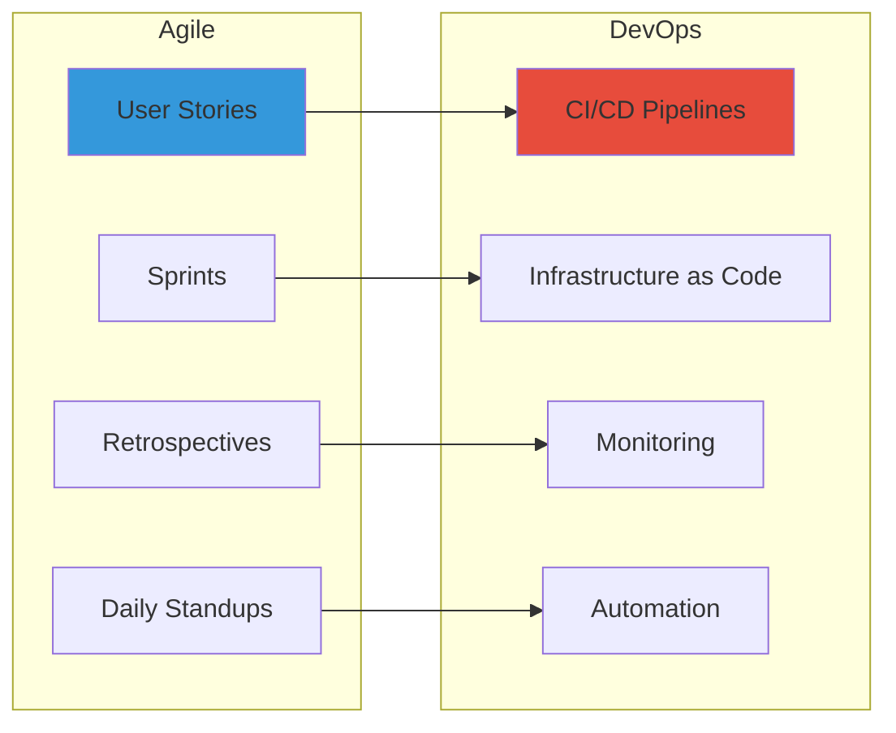
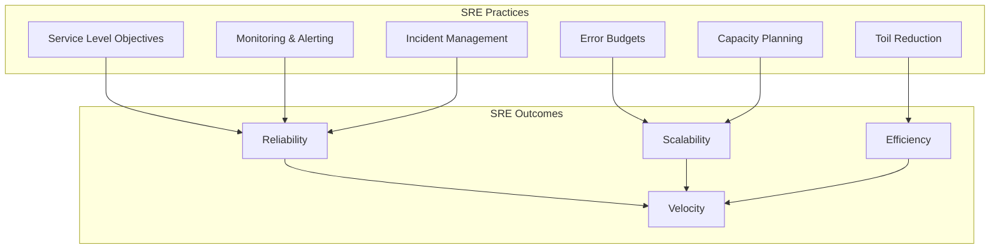
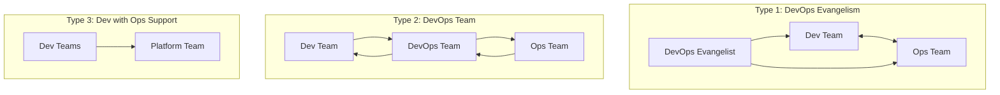
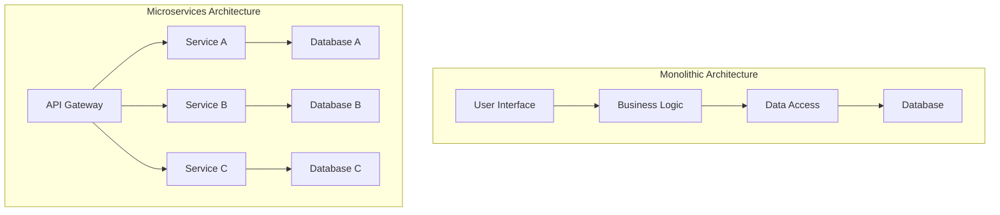
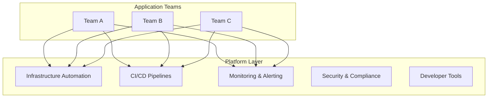

# 🔄 DevOps Lifecycle & Methodologies

<div style="background: linear-gradient(135deg, #ff7e5f 0%, #feb47b 100%); padding: 20px; border-radius: 10px; color: white; text-align: center;">
  <h2>⚡ Master the DevOps Journey</h2>
  <p>Complete guide to DevOps lifecycle, methodologies, and implementation strategies</p>
</div>

---

## 📚 **Table of Contents**

- [🌊 The DevOps Lifecycle](#-the-devops-lifecycle)
- [🛠️ Core Methodologies](#️-core-methodologies)
- [🔄 Continuous Practices](#-continuous-practices)
- [📊 Implementation Strategies](#-implementation-strategies)
- [🎯 Maturity Models](#-maturity-models)
- [🏗️ Architecture Patterns](#️-architecture-patterns)
- [📈 Scaling DevOps](#-scaling-devops)
- [🎮 Practical Scenarios](#-practical-scenarios)

---

## 🌊 **The DevOps Lifecycle**

### 🔁 **The Infinite Loop**

```mermaid
graph TB
    subgraph "DevOps Lifecycle"
        A[Plan] --> B[Code]
        B --> C[Build]
        C --> D[Test]
        D --> E[Release]
        E --> F[Deploy]
        F --> G[Operate]
        G --> H[Monitor]
        H --> A
    end
    
    subgraph "Feedback Loops"
        I[Customer Feedback]
        J[Performance Data]
        K[Security Insights]
        L[Business Metrics]
    end
    
    H --> I
    H --> J
    H --> K
    H --> L
    
    I --> A
    J --> A
    K --> A
    L --> A
    
    style A fill:#e74c3c
    style B fill:#3498db
    style C fill:#f39c12
    style D fill:#2ecc71
    style E fill:#9b59b6
    style F fill:#1abc9c
    style G fill:#34495e
    style H fill:#e67e22
```



### 📋 **Lifecycle Phases Deep Dive**

#### 1. **📋 Plan Phase**
```yaml
Planning:
  activities:
    - Requirements gathering
    - Architecture design
    - Sprint planning
    - Risk assessment
    - Resource allocation
    
  tools:
    - Jira / Azure DevOps
    - Confluence / Notion
    - Miro / Lucidchart
    - Slack / Microsoft Teams
    
  deliverables:
    - User stories
    - Architecture diagrams
    - Sprint backlog
    - Risk register
    - Definition of done
    
  success_metrics:
    - Story point velocity
    - Planning accuracy
    - Requirement stability
    - Team engagement
```

#### 2. **💻 Code Phase**
```yaml
Development:
  practices:
    - Version control (Git)
    - Branching strategies
    - Code reviews
    - Pair programming
    - Test-driven development
    
  tools:
    - Git (GitHub/GitLab/Bitbucket)
    - IDE/Code editors
    - Static analysis tools
    - Code formatting tools
    
  quality_gates:
    - Code coverage thresholds
    - Security scans
    - Code review approval
    - Style guide compliance
    
  success_metrics:
    - Code review time
    - Defect density
    - Code coverage percentage
    - Technical debt ratio
```

#### 3. **🔨 Build Phase**
```yaml
Build_Automation:
  components:
    - Source code compilation
    - Dependency management
    - Asset bundling
    - Package creation
    - Artifact versioning
    
  tools:
    - Maven / Gradle (Java)
    - npm / Yarn (JavaScript)
    - pip / Poetry (Python)
    - Docker
    - Make / CMake
    
  practices:
    - Reproducible builds
    - Build optimization
    - Parallel builds
    - Artifact caching
    - Build promotion
    
  success_metrics:
    - Build success rate
    - Build time
    - Build consistency
    - Artifact size
```

#### 4. **🧪 Test Phase**
```yaml
Testing_Strategy:
  test_pyramid:
    unit_tests:
      percentage: 70%
      focus: Individual functions/methods
      tools: JUnit, pytest, Jest
      
    integration_tests:
      percentage: 20%
      focus: Component interactions
      tools: TestContainers, Postman
      
    e2e_tests:
      percentage: 10%
      focus: User workflows
      tools: Selenium, Cypress, Playwright
  
  testing_types:
    - Functional testing
    - Performance testing
    - Security testing
    - Accessibility testing
    - Compatibility testing
    
  success_metrics:
    - Test coverage
    - Test execution time
    - Defect detection rate
    - Test stability
```

#### 5. **📦 Release Phase**
```yaml
Release_Management:
  strategies:
    blue_green:
      description: Two identical environments
      benefits: Zero downtime, quick rollback
      complexity: High resource usage
      
    canary:
      description: Gradual traffic shifting
      benefits: Risk mitigation, real-user feedback
      complexity: Advanced routing required
      
    rolling:
      description: Instance-by-instance updates
      benefits: Resource efficient
      complexity: Temporary version mixing
      
    feature_flags:
      description: Runtime feature toggling
      benefits: Decouple deployment from release
      complexity: Code complexity increase
  
  success_metrics:
    - Release frequency
    - Release duration
    - Rollback rate
    - Customer impact
```

#### 6. **🚀 Deploy Phase**
```yaml
Deployment_Automation:
  environments:
    development:
      purpose: Active development
      deployment: Automatic on commit
      data: Synthetic test data
      
    staging:
      purpose: Pre-production testing
      deployment: Manual approval
      data: Production-like data
      
    production:
      purpose: Live system
      deployment: Automated with gates
      data: Real customer data
  
  practices:
    - Infrastructure as Code
    - Immutable deployments
    - Configuration management
    - Secrets management
    - Health checks
    
  success_metrics:
    - Deployment success rate
    - Deployment time
    - Environment consistency
    - Configuration drift
```

#### 7. **⚙️ Operate Phase**
```yaml
Operations:
  activities:
    - System maintenance
    - Capacity planning
    - Performance tuning
    - Security patching
    - Incident response
    
  automation:
    - Auto-scaling
    - Self-healing systems
    - Automated backups
    - Patch management
    - Disaster recovery
    
  practices:
    - Site Reliability Engineering
    - Chaos engineering
    - Game days
    - Runbook automation
    - Change management
    
  success_metrics:
    - System uptime
    - Response time
    - Resource utilization
    - Incident count
```

#### 8. **📊 Monitor Phase**
```yaml
Monitoring_Strategy:
  observability_pillars:
    metrics:
      types: Business, application, infrastructure
      tools: Prometheus, Grafana, DataDog
      
    logs:
      types: Application, system, security
      tools: ELK Stack, Splunk, Fluentd
      
    traces:
      types: Distributed tracing
      tools: Jaeger, Zipkin, OpenTelemetry
  
  alerting:
    - SLA/SLO monitoring
    - Anomaly detection
    - Trend analysis
    - Predictive alerts
    
  success_metrics:
    - Mean time to detection
    - Alert accuracy
    - Dashboard usage
    - Troubleshooting time
```

---

## 🛠️ **Core Methodologies**

### 🔄 **Agile + DevOps Integration**



#### **Scrum + DevOps**
```yaml
Scrum_DevOps_Integration:
  sprint_planning:
    - Include infrastructure tasks
    - Plan deployment activities
    - Consider operational requirements
    - Set quality gates
    
  daily_standups:
    - Include ops team members
    - Discuss deployment status
    - Share monitoring insights
    - Address production issues
    
  sprint_reviews:
    - Demonstrate in production
    - Show monitoring dashboards
    - Include customer feedback
    - Review performance metrics
    
  retrospectives:
    - Analyze deployment issues
    - Improve automation
    - Review incident responses
    - Optimize processes
```

#### **Kanban + DevOps**
```yaml
Kanban_DevOps_Integration:
  workflow_stages:
    - Backlog
    - In Progress
    - Code Review
    - Testing
    - Deployment Ready
    - Deployed
    - Monitoring
    
  wip_limits:
    - Prevent bottlenecks
    - Smooth flow
    - Quality focus
    - Team capacity
    
  continuous_improvement:
    - Flow metrics
    - Cycle time analysis
    - Bottleneck identification
    - Process optimization
```

### 🏗️ **Lean Software Development**

#### **Lean Principles in DevOps**
```yaml
Lean_Principles:
  eliminate_waste:
    types:
      - Waiting time
      - Defects
      - Extra features
      - Task switching
      - Motion
    
    devops_application:
      - Automate repetitive tasks
      - Reduce handoffs
      - Eliminate manual deployments
      - Remove unnecessary documentation
      
  build_quality_in:
    practices:
      - Test-driven development
      - Code reviews
      - Automated testing
      - Continuous integration
      
  create_knowledge:
    methods:
      - Documentation as code
      - Knowledge sharing sessions
      - Post-incident reviews
      - Cross-training
      
  defer_commitment:
    techniques:
      - Feature flags
      - A/B testing
      - Progressive rollouts
      - Last responsible moment decisions
      
  deliver_fast:
    approaches:
      - Small batch sizes
      - Frequent releases
      - Automated pipelines
      - Rapid feedback
      
  respect_people:
    aspects:
      - Psychological safety
      - Continuous learning
      - Empowerment
      - Collaboration
      
  optimize_whole:
    perspective:
      - Value stream thinking
      - End-to-end optimization
      - System-level metrics
      - Cross-functional teams
```

### 🎯 **Site Reliability Engineering (SRE)**



#### **SLI/SLO/SLA Framework**
```yaml
Service_Reliability:
  SLI_Examples:
    availability:
      definition: "Percentage of successful requests"
      measurement: "HTTP 200 responses / total requests"
      
    latency:
      definition: "Request response time"
      measurement: "95th percentile response time"
      
    throughput:
      definition: "Requests per second"
      measurement: "Successful requests/second"
      
    error_rate:
      definition: "Failed request percentage"
      measurement: "4xx/5xx responses / total requests"
  
  SLO_Setting:
    availability_target: 99.9%
    latency_target: "95% of requests < 200ms"
    error_rate_target: "< 0.1%"
    
  Error_Budget:
    calculation: 1 - SLO
    monthly_budget: "43.2 minutes for 99.9% availability"
    usage_tracking: "Real-time budget consumption"
    policy: "Halt feature releases if budget exceeded"
```

---

## 🔄 **Continuous Practices**

### 🔄 **Continuous Integration (CI)**

```yaml
CI_Best_Practices:
  principles:
    - Commit frequently (multiple times daily)
    - Maintain single source repository
    - Automate build process
    - Make build self-testing
    - Keep build fast
    - Test in clone of production
    - Everyone can see build results
    - Automate deployment
    
  pipeline_stages:
    source:
      triggers: ["push", "pull_request", "schedule"]
      actions: ["checkout", "setup_environment"]
      
    build:
      actions: ["compile", "package", "version"]
      parallelization: true
      caching: dependencies
      
    test:
      unit_tests: "Fast feedback (< 10 minutes)"
      integration_tests: "Component verification"
      quality_gates: "Coverage, security, performance"
      
    publish:
      artifacts: "Store build outputs"
      notifications: "Team communication"
      reporting: "Test results, coverage"
```

#### **CI Pipeline Example**
```yaml
name: CI Pipeline
on:
  push:
    branches: [main, develop]
  pull_request:
    branches: [main]

jobs:
  build-and-test:
    runs-on: ubuntu-latest
    steps:
      - name: Checkout code
        uses: actions/checkout@v3
        
      - name: Setup environment
        uses: actions/setup-node@v3
        with:
          node-version: '18'
          cache: 'npm'
          
      - name: Install dependencies
        run: npm ci
        
      - name: Run linting
        run: npm run lint
        
      - name: Run unit tests
        run: npm run test:unit
        
      - name: Run security scan
        run: npm audit
        
      - name: Build application
        run: npm run build
        
      - name: Run integration tests
        run: npm run test:integration
        
      - name: Upload artifacts
        uses: actions/upload-artifact@v3
        with:
          name: build-artifacts
          path: dist/
```

### 🚀 **Continuous Deployment (CD)**

```yaml
CD_Strategies:
  deployment_patterns:
    blue_green:
      steps:
        1: Deploy to green environment
        2: Run health checks
        3: Switch load balancer
        4: Monitor for issues
        5: Keep blue as rollback
      
      pros:
        - Zero downtime
        - Quick rollback
        - Full testing in production
        
      cons:
        - Double infrastructure cost
        - Database migration complexity
        - State synchronization challenges
    
    canary:
      steps:
        1: Deploy to subset of servers
        2: Route small traffic percentage
        3: Monitor key metrics
        4: Gradually increase traffic
        5: Complete rollout or rollback
      
      traffic_splitting:
        phase_1: 5%
        phase_2: 25%
        phase_3: 50%
        phase_4: 100%
      
      success_criteria:
        - Error rate < 0.1%
        - Latency < SLO target
        - Business metrics stable
        - No customer complaints
    
    rolling:
      steps:
        1: Update one instance
        2: Health check verification
        3: Continue to next instance
        4: Monitor throughout process
        5: Rollback if issues detected
      
      configuration:
        batch_size: 2
        wait_time: 300s
        health_check_interval: 30s
        max_unavailable: 1
```

### 📈 **Continuous Monitoring**

```yaml
Monitoring_Layers:
  infrastructure:
    metrics:
      - CPU utilization
      - Memory usage
      - Disk I/O
      - Network throughput
      - Container metrics
    
    tools: [Prometheus, Grafana, Datadog, New Relic]
    
  application:
    metrics:
      - Request rate
      - Response time
      - Error rate
      - Business KPIs
      - User experience
    
    tools: [APM tools, Custom metrics, Log analysis]
    
  user_experience:
    metrics:
      - Page load time
      - User flows
      - Conversion rates
      - Bounce rate
      - Feature usage
    
    tools: [Real User Monitoring, Synthetic monitoring]
```

---

## 📊 **Implementation Strategies**

### 🗺️ **DevOps Transformation Approaches**

#### 1. **Big Bang Approach** 💥
```yaml
Big_Bang:
  description: "Complete transformation at once"
  
  pros:
    - Fast results
    - Unified approach
    - Clear timeline
    - High visibility
    
  cons:
    - High risk
    - Resource intensive
    - Difficult to manage
    - Resistance to change
    
  when_to_use:
    - Small organizations
    - Greenfield projects
    - Strong leadership support
    - Simple technology stack
```

#### 2. **Incremental Approach** 📈
```yaml
Incremental:
  description: "Gradual transformation by phases"
  
  phases:
    phase_1:
      focus: CI/CD basics
      duration: 3-6 months
      success_criteria: Automated builds and deployments
      
    phase_2:
      focus: Testing automation
      duration: 6-9 months
      success_criteria: Comprehensive test coverage
      
    phase_3:
      focus: Infrastructure automation
      duration: 9-12 months
      success_criteria: Infrastructure as Code
      
    phase_4:
      focus: Monitoring and optimization
      duration: 12-18 months
      success_criteria: Full observability
  
  pros:
    - Lower risk
    - Manageable change
    - Learning opportunities
    - Budget flexibility
    
  cons:
    - Slower results
    - Partial benefits
    - Change fatigue
    - Coordination complexity
```

#### 3. **Pilot Project Approach** 🎯
```yaml
Pilot_Project:
  description: "Start with one team/project"
  
  selection_criteria:
    - Willing team
    - Manageable scope
    - Business impact
    - Technology fit
    - Success metrics
  
  pilot_phases:
    preparation:
      - Team training
      - Tool setup
      - Process definition
      - Success criteria
      
    execution:
      - DevOps practices implementation
      - Continuous monitoring
      - Regular retrospectives
      - Adjustment and optimization
      
    scaling:
      - Document lessons learned
      - Create playbooks
      - Train other teams
      - Expand to more projects
  
  success_factors:
    - Executive sponsorship
    - Team commitment
    - Regular communication
    - Quick wins demonstration
```

### 🏢 **Organizational Models**

#### **DevOps Team Models**


#### **Conway's Law and Team Structure**
```yaml
Conway_Law_Application:
  principle: "Organizations design systems that mirror their communication structure"
  
  traditional_problems:
    - Siloed architecture
    - Integration challenges
    - Slow decision making
    - Poor communication
  
  devops_solutions:
    cross_functional_teams:
      - End-to-end responsibility
      - Direct communication
      - Shared objectives
      - Collective ownership
      
    platform_teams:
      - Self-service capabilities
      - Developer experience focus
      - Infrastructure abstraction
      - Standards and governance
      
    stream_aligned_teams:
      - Business capability focus
      - Fast flow of work
      - Customer value delivery
      - Minimal handoffs
```

---

## 🎯 **Maturity Models**

### 📊 **DevOps Maturity Assessment**

#### **Level 0: Traditional IT** 🔴
```yaml
Level_0_Characteristics:
  culture:
    - Siloed teams
    - Blame culture
    - Risk aversion
    - Slow decision making
    
  processes:
    - Manual deployments
    - Long release cycles
    - Waterfall methodology
    - Change advisory boards
    
  technology:
    - Manual provisioning
    - Inconsistent environments
    - Limited automation
    - Legacy systems
    
  metrics:
    - Deployment frequency: Months
    - Lead time: Weeks/Months
    - MTTR: Days/Weeks
    - Change failure rate: High (>50%)
```

#### **Level 1: Basic DevOps** 🟡
```yaml
Level_1_Characteristics:
  culture:
    - Limited collaboration
    - Some shared responsibility
    - Learning from failures
    - Gradual mindset change
    
  processes:
    - Basic CI/CD
    - Some automation
    - Agile practices
    - Regular releases
    
  technology:
    - Version control
    - Build automation
    - Basic testing
    - Configuration management
    
  metrics:
    - Deployment frequency: Weekly
    - Lead time: Days/Weeks
    - MTTR: Hours/Days
    - Change failure rate: Medium (30-50%)
```

#### **Level 2: Intermediate DevOps** 🟠
```yaml
Level_2_Characteristics:
  culture:
    - Cross-functional teams
    - Shared objectives
    - Experimentation encouraged
    - Continuous learning
    
  processes:
    - Automated pipelines
    - Infrastructure as Code
    - Comprehensive testing
    - Monitoring and alerting
    
  technology:
    - Container orchestration
    - Microservices architecture
    - Advanced monitoring
    - Security integration
    
  metrics:
    - Deployment frequency: Daily
    - Lead time: Hours/Days
    - MTTR: Minutes/Hours
    - Change failure rate: Low (10-30%)
```

#### **Level 3: Advanced DevOps** 🟢
```yaml
Level_3_Characteristics:
  culture:
    - High-trust environment
    - Innovation mindset
    - Customer-centric focus
    - Psychological safety
    
  processes:
    - Continuous delivery
    - Chaos engineering
    - Self-healing systems
    - Value stream optimization
    
  technology:
    - Cloud-native architecture
    - AI/ML integration
    - Advanced orchestration
    - Predictive analytics
    
  metrics:
    - Deployment frequency: Multiple daily
    - Lead time: Minutes/Hours
    - MTTR: Minutes
    - Change failure rate: Very low (<10%)
```

### 📈 **Capability Assessment Matrix**

```yaml
Assessment_Areas:
  version_control:
    basic: "Single repository, basic branching"
    intermediate: "Branch strategies, code reviews"
    advanced: "Trunk-based development, automated merging"
    
  build_automation:
    basic: "Manual builds, basic scripts"
    intermediate: "Automated builds, artifact management"
    advanced: "Optimized builds, advanced caching"
    
  testing:
    basic: "Manual testing, basic unit tests"
    intermediate: "Automated test suites, CI integration"
    advanced: "Test-driven development, shift-left testing"
    
  deployment:
    basic: "Manual deployments, basic scripts"
    intermediate: "Automated deployments, multiple environments"
    advanced: "Zero-downtime deployments, advanced strategies"
    
  monitoring:
    basic: "Basic system monitoring"
    intermediate: "Application monitoring, alerting"
    advanced: "Full observability, predictive monitoring"
    
  security:
    basic: "Basic security measures"
    intermediate: "Security scanning, compliance"
    advanced: "DevSecOps integration, security as code"
```

---

## 🏗️ **Architecture Patterns**

### 🏛️ **Microservices and DevOps**



#### **DevOps Impact on Architecture**
```yaml
Architecture_Considerations:
  microservices_benefits:
    - Independent deployments
    - Technology diversity
    - Team autonomy
    - Fault isolation
    - Scalability
    
  devops_enablers:
    - Container technology
    - Service mesh
    - API management
    - Distributed monitoring
    - Chaos engineering
    
  challenges:
    - Distributed complexity
    - Data consistency
    - Network reliability
    - Service discovery
    - Testing complexity
    
  solutions:
    service_mesh:
      - Traffic management
      - Security policies
      - Observability
      - Reliability features
      
    api_gateway:
      - Request routing
      - Authentication
      - Rate limiting
      - Monitoring
      
    distributed_tracing:
      - Request flow tracking
      - Performance analysis
      - Error diagnosis
      - Dependency mapping
```

### ☁️ **Cloud-Native Patterns**

```yaml
Cloud_Native_Principles:
  twelve_factors:
    1_codebase: "One codebase tracked in revision control"
    2_dependencies: "Explicitly declare and isolate dependencies"
    3_config: "Store config in environment"
    4_backing_services: "Treat backing services as attached resources"
    5_build_release_run: "Strictly separate build and run stages"
    6_processes: "Execute app as stateless processes"
    7_port_binding: "Export services via port binding"
    8_concurrency: "Scale out via process model"
    9_disposability: "Maximize robustness with fast startup and graceful shutdown"
    10_dev_prod_parity: "Keep development, staging, and production as similar as possible"
    11_logs: "Treat logs as event streams"
    12_admin_processes: "Run admin/management tasks as one-off processes"
  
  cloud_native_patterns:
    circuit_breaker:
      purpose: "Prevent cascading failures"
      implementation: "Monitor failures, open circuit when threshold reached"
      
    bulkhead:
      purpose: "Isolate critical resources"
      implementation: "Separate thread pools, connection pools"
      
    timeout:
      purpose: "Prevent hanging requests"
      implementation: "Set reasonable timeouts for all external calls"
      
    retry_with_backoff:
      purpose: "Handle transient failures"
      implementation: "Exponential backoff with jitter"
```

---

## 📈 **Scaling DevOps**

### 🌐 **Enterprise DevOps**

#### **Scaling Challenges**
```yaml
Enterprise_Challenges:
  organizational:
    - Multiple teams
    - Different technologies
    - Regulatory compliance
    - Legacy systems
    - Cultural resistance
    
  technical:
    - Complex architectures
    - Integration challenges
    - Security requirements
    - Performance at scale
    - Data consistency
    
  process:
    - Standardization needs
    - Governance requirements
    - Change management
    - Risk management
    - Quality assurance
```

#### **Scaling Strategies**
```yaml
Scaling_Approaches:
  federated_model:
    structure: "Center of Excellence + Autonomous teams"
    governance: "Guidelines and standards"
    support: "Platform teams, tooling, training"
    
  platform_engineering:
    focus: "Developer experience"
    capabilities: "Self-service infrastructure"
    benefits: "Reduced cognitive load"
    
  devops_dojo:
    approach: "Immersive learning"
    method: "Real project coaching"
    outcome: "Capability building"
    
  communities_of_practice:
    purpose: "Knowledge sharing"
    activities: "Regular meetings, workshops"
    benefits: "Cross-team learning"
```

### 🔧 **Platform Engineering**



#### **Platform Capabilities**
```yaml
Platform_Services:
  infrastructure:
    - Environment provisioning
    - Resource management
    - Networking setup
    - Storage management
    - Security configuration
    
  development:
    - Source code management
    - Build automation
    - Testing frameworks
    - Artifact repositories
    - Documentation systems
    
  deployment:
    - Pipeline templates
    - Environment promotion
    - Release management
    - Rollback capabilities
    - Feature flags
    
  operations:
    - Monitoring dashboards
    - Alerting rules
    - Log aggregation
    - Backup systems
    - Disaster recovery
    
  governance:
    - Security scanning
    - Compliance checking
    - Cost management
    - Usage analytics
    - Policy enforcement
```

---

## 🎮 **Practical Scenarios**

### 📋 **Scenario 1: E-commerce Platform**

#### **Business Context**
```yaml
Business_Requirements:
  company: "Online retailer"
  challenges:
    - Seasonal traffic spikes
    - Multiple development teams
    - Legacy monolithic application
    - Long deployment cycles (monthly)
    - Frequent production issues
  
  goals:
    - Faster time to market
    - Improved reliability
    - Better customer experience
    - Reduced operational costs
```

#### **DevOps Transformation Plan**
```yaml
Transformation_Plan:
  phase_1: "Foundation (Months 1-3)"
    objectives:
      - Establish CI/CD pipeline
      - Implement automated testing
      - Set up monitoring
    deliverables:
      - Jenkins pipeline
      - Unit test coverage >80%
      - Basic monitoring dashboard
    success_metrics:
      - Build success rate >95%
      - Deployment frequency: weekly
      - Detection time <30 minutes
  
  phase_2: "Modernization (Months 4-8)"
    objectives:
      - Container adoption
      - Microservices migration
      - Infrastructure automation
    deliverables:
      - Docker containerization
      - First microservices
      - Terraform infrastructure
    success_metrics:
      - Container deployment success
      - Service independence
      - Infrastructure consistency
  
  phase_3: "Optimization (Months 9-12)"
    objectives:
      - Advanced deployment strategies
      - Auto-scaling implementation
      - Performance optimization
    deliverables:
      - Blue-green deployments
      - Kubernetes auto-scaling
      - Performance dashboards
    success_metrics:
      - Zero-downtime deployments
      - Automatic scaling events
      - Page load time <2 seconds
```

### 🏦 **Scenario 2: Financial Services**

#### **Business Context**
```yaml
Business_Requirements:
  company: "Regional bank"
  constraints:
    - Strict regulatory compliance
    - High security requirements
    - Risk-averse culture
    - Legacy mainframe systems
    - Limited automation
  
  goals:
    - Digital transformation
    - Competitive advantage
    - Operational efficiency
    - Customer satisfaction
    - Regulatory compliance
```

#### **DevOps Approach**
```yaml
Compliance_Focused_DevOps:
  security_first:
    practices:
      - Security as Code
      - Automated security scanning
      - Compliance checking
      - Audit logging
      - Access controls
    
    tools:
      - SAST/DAST scanning
      - Vulnerability management
      - Secret management
      - Compliance dashboards
      - Security monitoring
  
  risk_management:
    approaches:
      - Gradual rollouts
      - Extensive testing
      - Change approval boards
      - Rollback procedures
      - Impact assessments
    
    governance:
      - Policy as Code
      - Automated compliance checks
      - Change tracking
      - Audit trails
      - Risk scoring
```

### 🏥 **Scenario 3: Healthcare Platform**

#### **Business Context**
```yaml
Business_Requirements:
  company: "Healthcare technology provider"
  requirements:
    - HIPAA compliance
    - 99.99% availability
    - Data privacy
    - Integration with medical devices
    - Real-time processing
  
  challenges:
    - Patient safety criticality
    - Regulatory oversight
    - Data sensitivity
    - System complexity
    - 24/7 operations
```

#### **Reliability-Focused DevOps**
```yaml
High_Reliability_DevOps:
  sre_practices:
    - Service Level Objectives
    - Error budget management
    - Incident response procedures
    - Capacity planning
    - Disaster recovery
  
  quality_assurance:
    - Comprehensive testing
    - Chaos engineering
    - Performance testing
    - Security testing
    - Compliance validation
  
  operational_excellence:
    - 24/7 monitoring
    - Automated alerting
    - Self-healing systems
    - Predictive maintenance
    - Continuous improvement
```

---

## 🎓 **Knowledge Check**

### 🤔 **Assessment Questions**

#### **Conceptual Understanding**
1. What are the eight phases of the DevOps lifecycle?
2. How does the CALMS framework support DevOps implementation?
3. What's the difference between CI and CD?
4. Explain the concept of "shift-left" in DevOps.

#### **Practical Application**
1. Design a CI/CD pipeline for a microservices application.
2. How would you implement blue-green deployment?
3. What metrics would you use to measure DevOps success?
4. How do you handle security in a DevOps environment?

#### **Strategic Thinking**
1. How would you scale DevOps in a large enterprise?
2. What role does culture play in DevOps transformation?
3. How do you balance speed and quality in DevOps?
4. What are the key considerations for DevOps in regulated industries?

### 📊 **Maturity Self-Assessment**

Rate your organization (1-5 scale):

```yaml
DevOps_Maturity_Check:
  automation:
    build_automation: [ ] 1  [ ] 2  [ ] 3  [ ] 4  [ ] 5
    test_automation: [ ] 1  [ ] 2  [ ] 3  [ ] 4  [ ] 5
    deployment_automation: [ ] 1  [ ] 2  [ ] 3  [ ] 4  [ ] 5
    infrastructure_automation: [ ] 1  [ ] 2  [ ] 3  [ ] 4  [ ] 5
  
  practices:
    continuous_integration: [ ] 1  [ ] 2  [ ] 3  [ ] 4  [ ] 5
    continuous_deployment: [ ] 1  [ ] 2  [ ] 3  [ ] 4  [ ] 5
    monitoring_observability: [ ] 1  [ ] 2  [ ] 3  [ ] 4  [ ] 5
    incident_management: [ ] 1  [ ] 2  [ ] 3  [ ] 4  [ ] 5
  
  culture:
    collaboration: [ ] 1  [ ] 2  [ ] 3  [ ] 4  [ ] 5
    shared_responsibility: [ ] 1  [ ] 2  [ ] 3  [ ] 4  [ ] 5
    learning_culture: [ ] 1  [ ] 2  [ ] 3  [ ] 4  [ ] 5
    experimentation: [ ] 1  [ ] 2  [ ] 3  [ ] 4  [ ] 5
```

---

## 🚀 **Next Steps**

Excellent progress! You've mastered DevOps lifecycle and methodologies.

**Continue your journey**:
1. **Next Topic**: [DevOps Tools & Technologies →](./03-devops-tools-technologies.md)
2. **Practice**: Design a DevOps transformation plan for your organization
3. **Reflect**: Consider which methodologies best fit your current context

---

<div style="background: linear-gradient(90deg, #FF6B6B 0%, #4ECDC4 100%); padding: 15px; border-radius: 8px; color: white; text-align: center;">
  <strong>🎯 Key Takeaway:</strong> DevOps is a journey, not a destination. Focus on continuous improvement across people, process, and technology!
</div>

---

**Previous**: [← DevOps Culture & Principles](./01-devops-culture-principles.md) | **Next**: [DevOps Tools & Technologies →](./03-devops-tools-technologies.md)