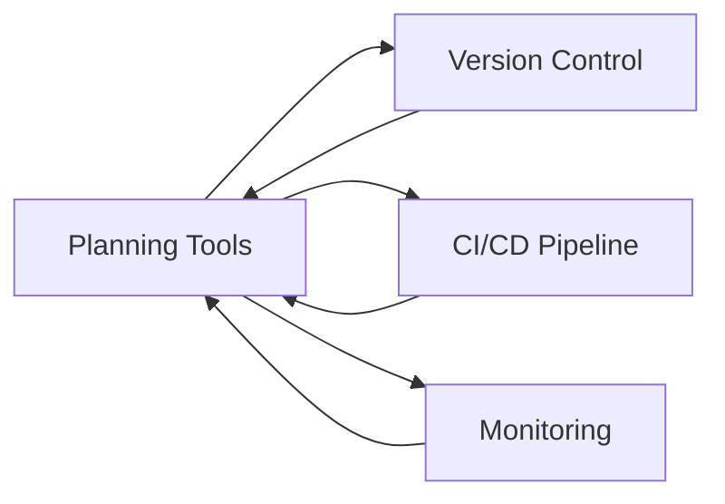
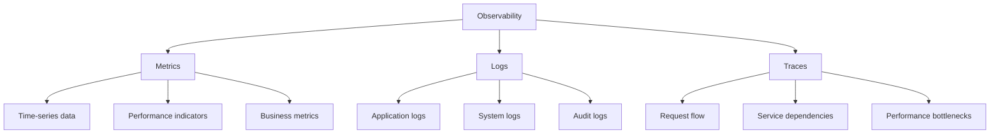
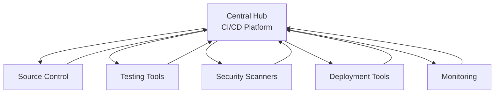
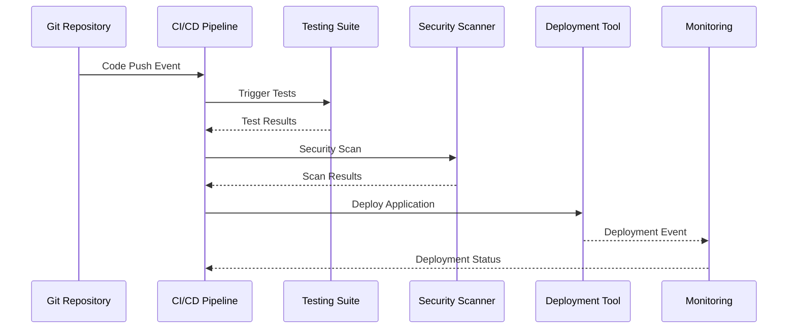
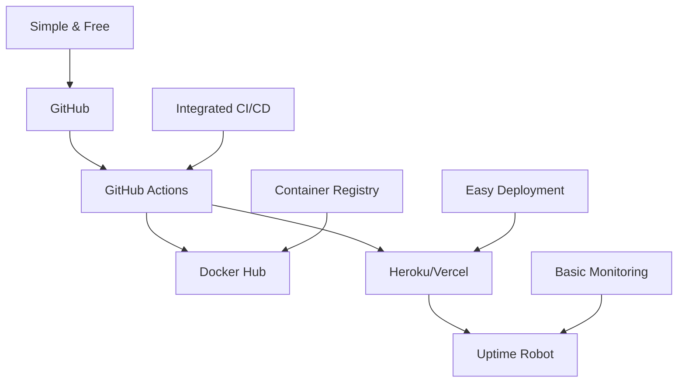
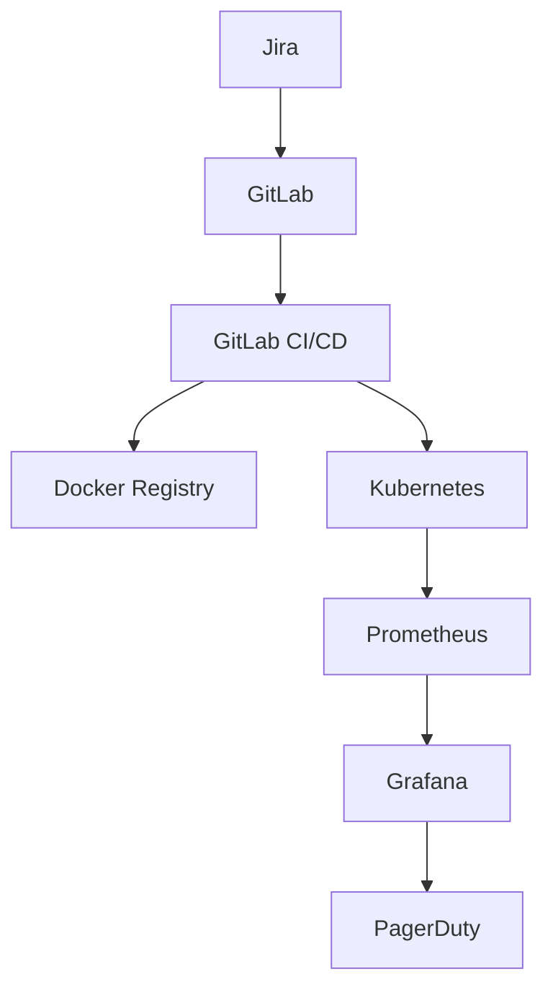
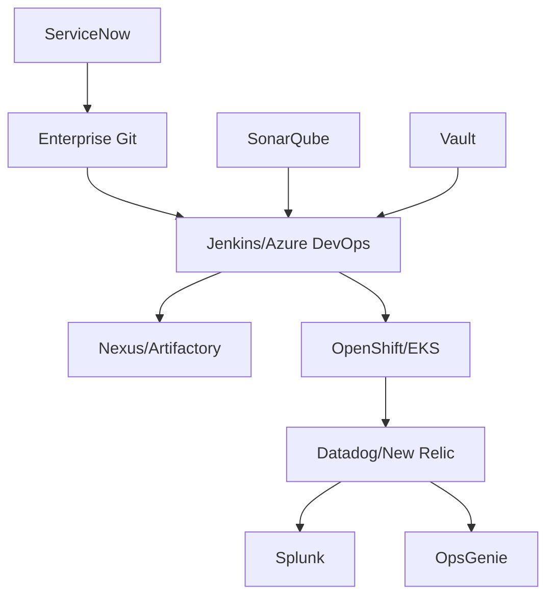
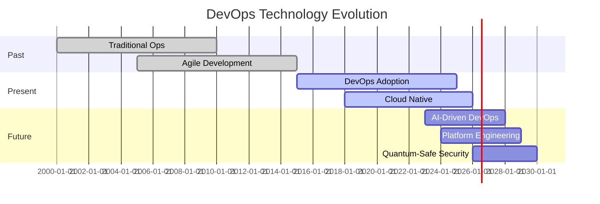

# 🛠️ DevOps Tools & Technologies Overview

<div style="background: linear-gradient(90deg, #667eea 0%, #764ba2 100%); padding: 20px; border-radius: 10px; color: white; text-align: center;">
  <h2>🔧 Master the DevOps Toolchain</h2>
  <p>Comprehensive guide to DevOps tools, technologies, and integration strategies</p>
</div>

---

## 📚 **Table of Contents**

1. [🎯 Overview](#-overview)
2. [🔄 DevOps Toolchain Categories](#-devops-toolchain-categories)
3. [🛠️ Popular DevOps Tools](#️-popular-devops-tools)
4. [📊 Tool Comparison Matrices](#-tool-comparison-matrices)
5. [🔗 Integration Strategies](#-integration-strategies)
6. [🎯 Tool Selection Criteria](#-tool-selection-criteria)
7. [🚀 Getting Started Recommendations](#-getting-started-recommendations)
8. [📈 Future Trends](#-future-trends)

---

## 🎯 **Overview**

The DevOps toolchain is the backbone of successful DevOps implementation. This comprehensive guide covers the essential tools and technologies that enable automation, collaboration, and continuous delivery across the software development lifecycle.

### 🎯 **Learning Objectives**

By the end of this section, you will:

- ✅ Understand the complete DevOps toolchain ecosystem
- ✅ Know the strengths and use cases of popular DevOps tools
- ✅ Be able to make informed tool selection decisions
- ✅ Understand integration patterns and strategies
- ✅ Know how to build a cohesive toolchain

---

## 🔄 **DevOps Toolchain Categories**

The DevOps toolchain spans the entire software development lifecycle. Here's a detailed breakdown:

### 1. 📋 **Planning & Project Management**

**Purpose**: Requirements management, sprint planning, issue tracking, and project coordination.

| Tool | Type | Strengths | Best For |
|------|------|-----------|----------|
| **Jira** | Commercial | Advanced workflows, reporting | Large teams, complex projects |
| **Azure DevOps** | Commercial/Cloud | Integrated suite, Microsoft ecosystem | .NET projects, hybrid teams |
| **GitHub Projects** | Cloud | Git integration, simple setup | Open source, small teams |
| **Trello** | Cloud | Visual Kanban, ease of use | Simple projects, visual teams |
| **Asana** | Cloud | Task management, collaboration | Marketing teams, cross-functional |

**Integration Points**:


### 2. 💻 **Source Code Management (SCM)**

**Purpose**: Version control, code collaboration, branching strategies, and code review.

| Tool | Type | Key Features | Use Cases |
|------|------|--------------|-----------|
| **Git** | Open Source | Distributed, fast, lightweight | Universal version control |
| **GitHub** | Cloud | Social coding, GitHub Actions | Open source, collaboration |
| **GitLab** | Cloud/Self-hosted | Built-in CI/CD, security scanning | Complete DevOps platform |
| **Bitbucket** | Cloud/Self-hosted | Atlassian integration, pull requests | Atlassian ecosystem |
| **Azure Repos** | Cloud | Microsoft integration, TFVC support | Microsoft environments |

**Advanced Git Workflows**:
```bash
# Feature Branch Workflow
git checkout -b feature/user-authentication
git add .
git commit -m "Implement user login functionality"
git push origin feature/user-authentication

# GitFlow Workflow
git flow init
git flow feature start new-feature
git flow feature finish new-feature

# Trunk-based Development
git checkout main
git pull origin main
git checkout -b short-lived-branch
# Make small changes and merge quickly
```

### 3. 🔨 **Build & Compilation Tools**

**Purpose**: Code compilation, dependency management, artifact creation, and build automation.

#### **Language-Specific Build Tools**

| Language | Popular Tools | Key Features |
|----------|---------------|--------------|
| **Java** | Maven, Gradle, Ant | Dependency management, multi-module builds |
| **JavaScript** | npm, Yarn, Webpack, Vite | Package management, bundling |
| **Python** | pip, Poetry, setuptools | Virtual environments, packaging |
| **C#/.NET** | MSBuild, dotnet CLI, NuGet | Solution building, package management |
| **Go** | go build, go mod | Built-in tooling, module system |
| **Rust** | Cargo | Integrated build system and package manager |

#### **Universal Build Platforms**

| Tool | Strengths | Best For |
|------|-----------|----------|
| **Bazel** | Scalability, reproducibility | Large codebases, Google-scale |
| **Buck** | Fast builds, dependency analysis | Mobile apps, Facebook ecosystem |
| **Pants** | Monorepo support, incremental builds | Python/Scala monorepos |

**Build Configuration Example (Maven)**:
```xml
<project>
    <modelVersion>4.0.0</modelVersion>
    <groupId>com.example</groupId>
    <artifactId>my-app</artifactId>
    <version>1.0-SNAPSHOT</version>
    
    <properties>
        <maven.compiler.source>11</maven.compiler.source>
        <maven.compiler.target>11</maven.compiler.target>
    </properties>
    
    <dependencies>
        <dependency>
            <groupId>org.springframework.boot</groupId>
            <artifactId>spring-boot-starter-web</artifactId>
            <version>2.7.0</version>
        </dependency>
    </dependencies>
    
    <build>
        <plugins>
            <plugin>
                <groupId>org.springframework.boot</groupId>
                <artifactId>spring-boot-maven-plugin</artifactId>
            </plugin>
        </plugins>
    </build>
</project>
```

### 4. 🧪 **Testing & Quality Assurance**

**Purpose**: Automated testing, code quality analysis, security scanning, and test management.

#### **Testing Frameworks by Type**

| Test Type | Purpose | Tools |
|-----------|---------|-------|
| **Unit Testing** | Individual component testing | JUnit, TestNG, Jest, PyTest, NUnit |
| **Integration Testing** | Component interaction testing | Postman, REST Assured, Cypress |
| **UI Testing** | User interface automation | Selenium, Playwright, Puppeteer |
| **Performance Testing** | Load and stress testing | JMeter, Gatling, Artillery |
| **Security Testing** | Vulnerability scanning | OWASP ZAP, SonarQube, Snyk |

#### **Code Quality Tools**

| Tool | Language Support | Key Features |
|------|------------------|--------------|
| **SonarQube** | 25+ languages | Code smell detection, technical debt |
| **ESLint** | JavaScript | Customizable rules, auto-fixing |
| **Pylint** | Python | PEP 8 compliance, error detection |
| **RuboCop** | Ruby | Style guide enforcement |
| **Checkstyle** | Java | Coding standard verification |

**Testing Pipeline Example**:
```yaml
# GitHub Actions Testing Pipeline
name: Test Suite
on: [push, pull_request]

jobs:
  test:
    runs-on: ubuntu-latest
    steps:
      - uses: actions/checkout@v3
      - name: Setup Node.js
        uses: actions/setup-node@v3
        with:
          node-version: '16'
      
      - name: Install dependencies
        run: npm ci
      
      - name: Run unit tests
        run: npm test
      
      - name: Run integration tests
        run: npm run test:integration
      
      - name: Run E2E tests
        run: npm run test:e2e
      
      - name: Upload coverage
        uses: codecov/codecov-action@v3
```

### 5. 📦 **Continuous Integration & Continuous Deployment (CI/CD)**

**Purpose**: Build automation, testing automation, deployment pipelines, and release management.

#### **CI/CD Platforms Comparison**

| Platform | Type | Strengths | Best For |
|----------|------|-----------|----------|
| **Jenkins** | Self-hosted | Highly customizable, plugin ecosystem | Enterprise, complex workflows |
| **GitLab CI** | Cloud/Self-hosted | Git integration, built-in registry | GitLab users, complete DevOps |
| **GitHub Actions** | Cloud | GitHub integration, marketplace | GitHub users, open source |
| **Azure DevOps** | Cloud | Microsoft ecosystem, hybrid deployments | .NET applications, Azure |
| **CircleCI** | Cloud | Docker support, parallel execution | Fast builds, containerized apps |
| **TeamCity** | Self-hosted | JetBrains integration, build chains | Java/.NET development |

#### **Pipeline as Code Examples**

**Jenkins Pipeline (Declarative)**:
```groovy
pipeline {
    agent any
    
    environment {
        DOCKER_REGISTRY = 'registry.company.com'
        APP_NAME = 'my-application'
    }
    
    stages {
        stage('Checkout') {
            steps {
                git branch: 'main', url: 'https://github.com/company/repo.git'
            }
        }
        
        stage('Build') {
            steps {
                sh 'mvn clean compile'
            }
        }
        
        stage('Test') {
            steps {
                sh 'mvn test'
            }
            post {
                always {
                    publishTestResults testResultsPattern: 'target/surefire-reports/*.xml'
                }
            }
        }
        
        stage('Package') {
            steps {
                sh 'mvn package'
            }
        }
        
        stage('Docker Build') {
            steps {
                script {
                    def image = docker.build("${APP_NAME}:${BUILD_NUMBER}")
                    image.push()
                    image.push('latest')
                }
            }
        }
        
        stage('Deploy to Staging') {
            steps {
                sh 'kubectl apply -f k8s/staging/'
            }
        }
        
        stage('Integration Tests') {
            steps {
                sh 'npm run test:integration'
            }
        }
        
        stage('Deploy to Production') {
            when {
                branch 'main'
            }
            steps {
                input message: 'Deploy to production?', ok: 'Deploy'
                sh 'kubectl apply -f k8s/production/'
            }
        }
    }
    
    post {
        failure {
            emailext (
                subject: "Build Failed: ${env.JOB_NAME} - ${env.BUILD_NUMBER}",
                body: "Build failed. Check console output at ${env.BUILD_URL}",
                to: "${env.CHANGE_AUTHOR_EMAIL}"
            )
        }
    }
}
```

**GitLab CI/CD (.gitlab-ci.yml)**:
```yaml
stages:
  - build
  - test
  - security
  - deploy

variables:
  DOCKER_DRIVER: overlay2
  DOCKER_TLS_CERTDIR: "/certs"

before_script:
  - docker login -u $CI_REGISTRY_USER -p $CI_REGISTRY_PASSWORD $CI_REGISTRY

build:
  stage: build
  script:
    - docker build -t $CI_REGISTRY_IMAGE:$CI_COMMIT_SHA .
    - docker push $CI_REGISTRY_IMAGE:$CI_COMMIT_SHA

test:
  stage: test
  script:
    - npm install
    - npm test
    - npm run test:coverage
  coverage: '/Coverage: \d+\.\d+/'
  artifacts:
    reports:
      junit: test-results.xml
      coverage_report:
        coverage_format: cobertura
        path: coverage/cobertura-coverage.xml

security_scan:
  stage: security
  script:
    - docker run --rm -v $(pwd):/app owasp/zap2docker-stable zap-baseline.py -t http://localhost:3000

deploy_staging:
  stage: deploy
  script:
    - kubectl config use-context staging
    - helm upgrade --install myapp ./helm-chart --set image.tag=$CI_COMMIT_SHA
  environment:
    name: staging
    url: https://staging.example.com
  only:
    - develop

deploy_production:
  stage: deploy
  script:
    - kubectl config use-context production
    - helm upgrade --install myapp ./helm-chart --set image.tag=$CI_COMMIT_SHA
  environment:
    name: production
    url: https://example.com
  when: manual
  only:
    - main
```

### 6. 🚀 **Deployment & Orchestration**

**Purpose**: Application deployment, container orchestration, infrastructure management, and scaling.

#### **Container Technologies**

| Technology | Purpose | Key Features |
|------------|---------|--------------|
| **Docker** | Containerization | Lightweight, portable, reproducible |
| **Podman** | Container runtime | Rootless, daemonless, OCI compliant |
| **containerd** | Container runtime | Industry standard, Kubernetes native |

#### **Container Orchestration**

| Platform | Complexity | Best For |
|----------|------------|----------|
| **Kubernetes** | High | Production, scalable applications |
| **Docker Swarm** | Medium | Simple clustering, Docker-native |
| **Amazon ECS** | Medium | AWS ecosystem, managed service |
| **Azure Container Instances** | Low | Serverless containers, simple workloads |

**Kubernetes Deployment Example**:
```yaml
apiVersion: apps/v1
kind: Deployment
metadata:
  name: web-app
  labels:
    app: web-app
spec:
  replicas: 3
  selector:
    matchLabels:
      app: web-app
  template:
    metadata:
      labels:
        app: web-app
    spec:
      containers:
      - name: web-app
        image: nginx:1.21
        ports:
        - containerPort: 80
        resources:
          requests:
            memory: "64Mi"
            cpu: "250m"
          limits:
            memory: "128Mi"
            cpu: "500m"
        livenessProbe:
          httpGet:
            path: /health
            port: 80
          initialDelaySeconds: 30
          periodSeconds: 10
        readinessProbe:
          httpGet:
            path: /ready
            port: 80
          initialDelaySeconds: 5
          periodSeconds: 5
---
apiVersion: v1
kind: Service
metadata:
  name: web-app-service
spec:
  selector:
    app: web-app
  ports:
    - protocol: TCP
      port: 80
      targetPort: 80
  type: LoadBalancer
```

### 7. ⚡ **Infrastructure as Code (IaC)**

**Purpose**: Infrastructure provisioning, configuration management, and infrastructure automation.

#### **Infrastructure Provisioning Tools**

| Tool | Approach | Strengths | Best For |
|------|----------|-----------|----------|
| **Terraform** | Declarative | Multi-cloud, state management | Cloud infrastructure |
| **Pulumi** | Imperative | Programming languages, type safety | Developer-friendly IaC |
| **AWS CloudFormation** | Declarative | AWS native, rollback capabilities | AWS-specific deployments |
| **Azure ARM Templates** | Declarative | Azure native, parameter support | Azure environments |
| **Google Cloud Deployment Manager** | Declarative | GCP native, Python/Jinja2 | Google Cloud Platform |

#### **Configuration Management Tools**

| Tool | Approach | Language | Best For |
|------|----------|----------|----------|
| **Ansible** | Agentless | YAML | Simple automation, ad-hoc tasks |
| **Chef** | Agent-based | Ruby DSL | Complex configurations, compliance |
| **Puppet** | Agent-based | Puppet DSL | Large-scale infrastructure |
| **SaltStack** | Agent/Agentless | YAML/Python | High-performance automation |

**Terraform Example**:
```hcl
# main.tf
terraform {
  required_version = ">= 1.0"
  required_providers {
    aws = {
      source  = "hashicorp/aws"
      version = "~> 5.0"
    }
  }
}

provider "aws" {
  region = var.aws_region
}

# VPC
resource "aws_vpc" "main" {
  cidr_block           = var.vpc_cidr
  enable_dns_hostnames = true
  enable_dns_support   = true
  
  tags = {
    Name        = "${var.project_name}-vpc"
    Environment = var.environment
  }
}

# Internet Gateway
resource "aws_internet_gateway" "main" {
  vpc_id = aws_vpc.main.id
  
  tags = {
    Name = "${var.project_name}-igw"
  }
}

# Subnets
resource "aws_subnet" "public" {
  count = length(var.availability_zones)
  
  vpc_id                  = aws_vpc.main.id
  cidr_block              = cidrsubnet(var.vpc_cidr, 8, count.index)
  availability_zone       = var.availability_zones[count.index]
  map_public_ip_on_launch = true
  
  tags = {
    Name = "${var.project_name}-public-subnet-${count.index + 1}"
    Type = "public"
  }
}

# Security Group
resource "aws_security_group" "web" {
  name_prefix = "${var.project_name}-web-"
  vpc_id      = aws_vpc.main.id
  
  ingress {
    from_port   = 80
    to_port     = 80
    protocol    = "tcp"
    cidr_blocks = ["0.0.0.0/0"]
  }
  
  ingress {
    from_port   = 443
    to_port     = 443
    protocol    = "tcp"
    cidr_blocks = ["0.0.0.0/0"]
  }
  
  egress {
    from_port   = 0
    to_port     = 0
    protocol    = "-1"
    cidr_blocks = ["0.0.0.0/0"]
  }
  
  tags = {
    Name = "${var.project_name}-web-sg"
  }
}

# Load Balancer
resource "aws_lb" "main" {
  name               = "${var.project_name}-alb"
  internal           = false
  load_balancer_type = "application"
  security_groups    = [aws_security_group.web.id]
  subnets            = aws_subnet.public[*].id
  
  enable_deletion_protection = false
  
  tags = {
    Name = "${var.project_name}-alb"
  }
}
```

**Ansible Playbook Example**:
```yaml
---
- name: Deploy Web Application
  hosts: webservers
  become: yes
  vars:
    app_name: my-web-app
    app_port: 3000
    node_version: "16.x"
    
  tasks:
    - name: Update package cache
      apt:
        update_cache: yes
        cache_valid_time: 3600
        
    - name: Install required packages
      apt:
        name:
          - curl
          - git
          - nginx
        state: present
        
    - name: Add NodeSource repository
      shell: |
        curl -fsSL https://deb.nodesource.com/setup_{{ node_version }} | sudo -E bash -
      args:
        creates: /etc/apt/sources.list.d/nodesource.list
        
    - name: Install Node.js
      apt:
        name: nodejs
        state: present
        update_cache: yes
        
    - name: Create application directory
      file:
        path: "/opt/{{ app_name }}"
        state: directory
        owner: www-data
        group: www-data
        mode: '0755'
        
    - name: Clone application repository
      git:
        repo: "https://github.com/company/{{ app_name }}.git"
        dest: "/opt/{{ app_name }}"
        version: main
        force: yes
      become_user: www-data
      notify: restart application
      
    - name: Install application dependencies
      npm:
        path: "/opt/{{ app_name }}"
      become_user: www-data
      
    - name: Build application
      command: npm run build
      args:
        chdir: "/opt/{{ app_name }}"
      become_user: www-data
      
    - name: Create systemd service file
      template:
        src: app.service.j2
        dest: "/etc/systemd/system/{{ app_name }}.service"
        mode: '0644'
      notify: restart application
      
    - name: Configure Nginx
      template:
        src: nginx.conf.j2
        dest: "/etc/nginx/sites-available/{{ app_name }}"
        mode: '0644'
      notify: restart nginx
      
    - name: Enable Nginx site
      file:
        src: "/etc/nginx/sites-available/{{ app_name }}"
        dest: "/etc/nginx/sites-enabled/{{ app_name }}"
        state: link
      notify: restart nginx
      
    - name: Start and enable services
      systemd:
        name: "{{ item }}"
        state: started
        enabled: yes
      loop:
        - "{{ app_name }}"
        - nginx
        
  handlers:
    - name: restart application
      systemd:
        name: "{{ app_name }}"
        state: restarted
        
    - name: restart nginx
      systemd:
        name: nginx
        state: restarted
```

### 8. 📊 **Monitoring & Observability**

**Purpose**: System monitoring, application performance monitoring, logging, alerting, and observability.

#### **Monitoring Stack Components**

| Component | Purpose | Popular Tools |
|-----------|---------|---------------|
| **Metrics Collection** | System and application metrics | Prometheus, InfluxDB, CloudWatch |
| **Log Management** | Centralized logging | ELK Stack, Splunk, Fluentd |
| **Distributed Tracing** | Request tracing across services | Jaeger, Zipkin, AWS X-Ray |
| **Visualization** | Dashboards and charts | Grafana, Kibana, Datadog |
| **Alerting** | Incident response | PagerDuty, Slack, OpsGenie |

#### **The Three Pillars of Observability**



**Prometheus Configuration Example**:
```yaml
# prometheus.yml
global:
  scrape_interval: 15s
  evaluation_interval: 15s

alerting:
  alertmanagers:
    - static_configs:
        - targets:
          - alertmanager:9093

rule_files:
  - "alerts.yml"

scrape_configs:
  - job_name: 'prometheus'
    static_configs:
      - targets: ['localhost:9090']

  - job_name: 'node-exporter'
    static_configs:
      - targets: ['localhost:9100']

  - job_name: 'application'
    metrics_path: '/metrics'
    static_configs:
      - targets: ['app:3000']
    scrape_interval: 5s

  - job_name: 'kubernetes-pods'
    kubernetes_sd_configs:
      - role: pod
    relabel_configs:
      - source_labels: [__meta_kubernetes_pod_annotation_prometheus_io_scrape]
        action: keep
        regex: true
      - source_labels: [__meta_kubernetes_pod_annotation_prometheus_io_path]
        action: replace
        target_label: __metrics_path__
        regex: (.+)
```

---

## 📊 **Tool Comparison Matrices**

### CI/CD Platforms Detailed Comparison

| Feature | Jenkins | GitLab CI | GitHub Actions | Azure DevOps | CircleCI |
|---------|---------|-----------|----------------|--------------|----------|
| **Hosting** | Self-hosted | Cloud/Self | Cloud | Cloud | Cloud |
| **Price** | Free | Freemium | Freemium | Freemium | Freemium |
| **Setup Complexity** | High | Low | Very Low | Low | Low |
| **Plugin Ecosystem** | Excellent | Good | Excellent | Good | Good |
| **Parallel Jobs** | Unlimited | Limited | Limited | Limited | Limited |
| **Docker Support** | Excellent | Excellent | Excellent | Good | Excellent |
| **Kubernetes Integration** | Good | Excellent | Good | Good | Good |
| **Enterprise Features** | Excellent | Excellent | Good | Excellent | Good |
| **Community** | Large | Growing | Large | Medium | Medium |

### Monitoring Tools Comparison

| Tool | Type | Strengths | Weaknesses | Best For |
|------|------|-----------|------------|----------|
| **Prometheus** | Open Source | Powerful query language, scalable | Complex setup, storage limitations | Kubernetes, microservices |
| **Datadog** | Commercial | Easy setup, great UX, APM | Expensive, vendor lock-in | Enterprise, full-stack monitoring |
| **New Relic** | Commercial | APM focus, AI insights | Cost, complexity | Application monitoring |
| **Grafana** | Open Source | Beautiful dashboards, flexible | Requires data sources | Visualization, dashboards |
| **ELK Stack** | Open Source | Comprehensive logging | Resource intensive, complexity | Log analysis, search |

---

## 🔗 **Integration Strategies**

### 1. **Tool Integration Patterns**

#### **Hub and Spoke Model**


#### **Event-Driven Integration**


### 2. **API-First Integration**

**Webhook Configuration Example**:
```json
{
  "webhooks": [
    {
      "name": "build-trigger",
      "url": "https://jenkins.company.com/github-webhook/",
      "events": ["push", "pull_request"],
      "secret": "webhook-secret-key",
      "active": true
    },
    {
      "name": "deployment-notification",
      "url": "https://slack.com/api/webhook/...",
      "events": ["deployment", "deployment_status"],
      "active": true
    }
  ]
}
```

**REST API Integration (Python)**:
```python
import requests
import json

class DevOpsIntegrator:
    def __init__(self):
        self.jenkins_url = "https://jenkins.company.com"
        self.jira_url = "https://company.atlassian.net"
        self.slack_webhook = "https://hooks.slack.com/services/..."
        
    def trigger_build(self, job_name, parameters=None):
        """Trigger Jenkins build via API"""
        url = f"{self.jenkins_url}/job/{job_name}/buildWithParameters"
        auth = ('username', 'api_token')
        
        response = requests.post(url, auth=auth, data=parameters or {})
        return response.status_code == 201
    
    def create_jira_ticket(self, summary, description, issue_type="Bug"):
        """Create JIRA ticket for build failures"""
        url = f"{self.jira_url}/rest/api/2/issue"
        auth = ('email', 'api_token')
        
        payload = {
            "fields": {
                "project": {"key": "PROJ"},
                "summary": summary,
                "description": description,
                "issuetype": {"name": issue_type}
            }
        }
        
        response = requests.post(url, auth=auth, json=payload)
        return response.json() if response.status_code == 201 else None
    
    def send_slack_notification(self, message, channel="#devops"):
        """Send Slack notification"""
        payload = {
            "channel": channel,
            "text": message,
            "username": "DevOps Bot"
        }
        
        response = requests.post(self.slack_webhook, json=payload)
        return response.status_code == 200
    
    def deployment_workflow(self, build_id, environment):
        """Orchestrate deployment workflow"""
        try:
            # Trigger deployment
            success = self.trigger_build(f"deploy-{environment}", 
                                       {"BUILD_ID": build_id})
            
            if success:
                message = f"✅ Deployment to {environment} started for build {build_id}"
                self.send_slack_notification(message)
            else:
                # Create JIRA ticket for failed deployment
                ticket = self.create_jira_ticket(
                    f"Deployment failed for build {build_id}",
                    f"Automatic deployment to {environment} failed. Investigation required."
                )
                
                message = f"❌ Deployment failed. Created ticket: {ticket['key']}"
                self.send_slack_notification(message, "#alerts")
                
        except Exception as e:
            error_msg = f"🚨 Critical error in deployment workflow: {str(e)}"
            self.send_slack_notification(error_msg, "#alerts")
```

### 3. **Configuration as Code**

**GitOps Workflow**:
```yaml
# .github/workflows/gitops.yml
name: GitOps Deployment
on:
  push:
    branches: [main]
    paths: ['k8s/**']

jobs:
  deploy:
    runs-on: ubuntu-latest
    steps:
      - uses: actions/checkout@v3
      
      - name: Setup kubectl
        uses: azure/setup-kubectl@v3
        with:
          version: 'v1.24.0'
      
      - name: Configure kubeconfig
        run: |
          echo "${{ secrets.KUBECONFIG }}" | base64 -d > $HOME/.kube/config
      
      - name: Validate manifests
        run: |
          kubectl apply --dry-run=client -f k8s/
      
      - name: Deploy to cluster
        run: |
          kubectl apply -f k8s/
      
      - name: Wait for rollout
        run: |
          kubectl rollout status deployment/app-deployment --timeout=300s
      
      - name: Run smoke tests
        run: |
          kubectl run smoke-test --rm -i --restart=Never --image=curlimages/curl:latest -- \
            sh -c "curl -f http://app-service/health"
```

---

## 🎯 **Tool Selection Criteria**

### 1. **Evaluation Framework**

#### **Technical Criteria**
| Criterion | Weight | Description |
|-----------|---------|-------------|
| **Functionality** | 25% | Does it meet your requirements? |
| **Performance** | 20% | Speed, scalability, resource usage |
| **Reliability** | 20% | Uptime, stability, error handling |
| **Integration** | 15% | API quality, ecosystem compatibility |
| **Security** | 10% | Authentication, authorization, compliance |
| **Usability** | 10% | User experience, learning curve |

#### **Business Criteria**
| Criterion | Weight | Description |
|-----------|---------|-------------|
| **Total Cost of Ownership** | 30% | Licensing, implementation, maintenance |
| **Vendor Viability** | 20% | Company stability, roadmap, support |
| **Community & Support** | 20% | Documentation, community, professional support |
| **Compliance** | 15% | Regulatory requirements, certifications |
| **Risk** | 15% | Vendor lock-in, technology obsolescence |

### 2. **Decision Matrix Template**

```python
class ToolEvaluationMatrix:
    def __init__(self):
        self.criteria = {
            'functionality': 0.25,
            'performance': 0.20,
            'reliability': 0.20,
            'integration': 0.15,
            'security': 0.10,
            'usability': 0.10
        }
        
    def evaluate_tool(self, tool_name, scores):
        """
        Evaluate tool based on weighted criteria
        scores: dict with criterion -> score (1-10)
        """
        weighted_score = sum(
            scores.get(criterion, 5) * weight 
            for criterion, weight in self.criteria.items()
        )
        
        return {
            'tool': tool_name,
            'weighted_score': weighted_score,
            'max_score': 10.0,
            'percentage': (weighted_score / 10.0) * 100
        }
    
    def compare_tools(self, tools_scores):
        """Compare multiple tools"""
        results = []
        
        for tool, scores in tools_scores.items():
            result = self.evaluate_tool(tool, scores)
            results.append(result)
        
        # Sort by weighted score
        results.sort(key=lambda x: x['weighted_score'], reverse=True)
        
        return results

# Example usage
evaluator = ToolEvaluationMatrix()

ci_cd_tools = {
    'Jenkins': {
        'functionality': 9,
        'performance': 7,
        'reliability': 8,
        'integration': 9,
        'security': 7,
        'usability': 6
    },
    'GitLab CI': {
        'functionality': 8,
        'performance': 8,
        'reliability': 9,
        'integration': 8,
        'security': 8,
        'usability': 8
    },
    'GitHub Actions': {
        'functionality': 8,
        'performance': 8,
        'reliability': 8,
        'integration': 9,
        'security': 8,
        'usability': 9
    }
}

results = evaluator.compare_tools(ci_cd_tools)
for result in results:
    print(f"{result['tool']}: {result['percentage']:.1f}%")
```

---

## 🚀 **Getting Started Recommendations**

### 1. **Beginner-Friendly Toolchain**

**For Small Teams (1-5 developers)**:


**Recommended Stack**:
- **Source Control**: GitHub
- **CI/CD**: GitHub Actions
- **Containerization**: Docker
- **Registry**: Docker Hub
- **Deployment**: Heroku (web apps) or Vercel (frontend)
- **Monitoring**: Uptime Robot + GitHub Insights
- **Communication**: Slack + GitHub notifications

### 2. **Intermediate Toolchain**

**For Medium Teams (5-20 developers)**:


**Recommended Stack**:
- **Planning**: Jira + Confluence
- **Source Control**: GitLab
- **CI/CD**: GitLab CI/CD
- **Containerization**: Docker
- **Orchestration**: Kubernetes
- **Infrastructure**: Terraform + Ansible
- **Monitoring**: Prometheus + Grafana
- **Logging**: ELK Stack
- **Alerting**: PagerDuty

### 3. **Enterprise Toolchain**

**For Large Teams (20+ developers)**:


**Recommended Stack**:
- **Planning**: ServiceNow + Jira
- **Source Control**: GitHub Enterprise / Bitbucket Data Center
- **Build**: Jenkins / Azure DevOps
- **Artifacts**: Nexus / Artifactory
- **Security**: SonarQube + Vault + Aqua Security
- **Orchestration**: OpenShift / Amazon EKS
- **Infrastructure**: Terraform Enterprise + Ansible Tower
- **Monitoring**: Datadog / New Relic
- **Logging**: Splunk / ELK Stack
- **Alerting**: OpsGenie / PagerDuty

---

## 📈 **Future Trends**

### 1. **Emerging Technologies**

#### **Platform Engineering**
- **Internal Developer Platforms (IDPs)**
- **Self-service infrastructure**
- **Golden paths and templates**

#### **AI/ML in DevOps**
- **Predictive analytics for failures**
- **Intelligent alerting and noise reduction**
- **Automated root cause analysis**
- **Code quality and security analysis**

#### **Cloud-Native Evolution**
- **Serverless computing integration**
- **Edge computing deployments**
- **Multi-cloud orchestration**
- **Service mesh adoption**

### 2. **Technology Evolution Timeline**



### 3. **Preparing for the Future**

**Key Skills to Develop**:
- **Platform Engineering**: Building internal developer platforms
- **AI/ML Integration**: Incorporating AI into DevOps workflows
- **Security-First Mindset**: DevSecOps and zero-trust architectures
- **Multi-Cloud Expertise**: Managing workloads across cloud providers
- **Edge Computing**: Deploying applications at the edge

**Technologies to Watch**:
- **WebAssembly (WASM)** for portable applications
- **eBPF** for observability and security
- **GitOps 2.0** with progressive delivery
- **Chaos Engineering** for resilience testing
- **Policy as Code** for governance automation

---

## 🎯 **Summary & Key Takeaways**

### 🔑 **Essential Points**

1. **No One-Size-Fits-All**: Tool selection depends on team size, complexity, and requirements
2. **Integration Matters**: Focus on how tools work together, not individual capabilities
3. **Start Simple**: Begin with basic tools and evolve as needs grow
4. **Automation First**: Prioritize tools that enable automation and reduce manual work
5. **Observability is Key**: Invest in monitoring and logging from the beginning

### ✅ **Quick Assessment Checklist**

- [ ] Do you have version control with proper branching strategy?
- [ ] Is your build process automated and reproducible?
- [ ] Are you running automated tests in your pipeline?
- [ ] Can you deploy with one command/click?
- [ ] Do you have monitoring and alerting in place?
- [ ] Are your infrastructure changes version controlled?
- [ ] Can you rollback deployments quickly?
- [ ] Are security scans integrated into your pipeline?

### 🚀 **Next Steps**

1. **Assess Current State**: Evaluate your existing toolchain
2. **Identify Gaps**: Find areas for improvement or automation
3. **Plan Evolution**: Design a roadmap for tool adoption
4. **Start Small**: Implement one improvement at a time
5. **Measure Impact**: Track metrics to validate improvements

---

<div style="background: linear-gradient(90deg, #2196F3 0%, #21CBF3 100%); padding: 15px; border-radius: 8px; color: white; text-align: center; margin-top: 20px;">
  <strong>🎯 Remember:</strong> The best DevOps toolchain is one that your team actually uses effectively!
</div>

---

**Previous**: [DevOps Lifecycle & Methodologies ←](./02-devops-lifecycle-methodologies.md) | **Next**: [Implementation Best Practices →](./04-implementation-best-practices.md)