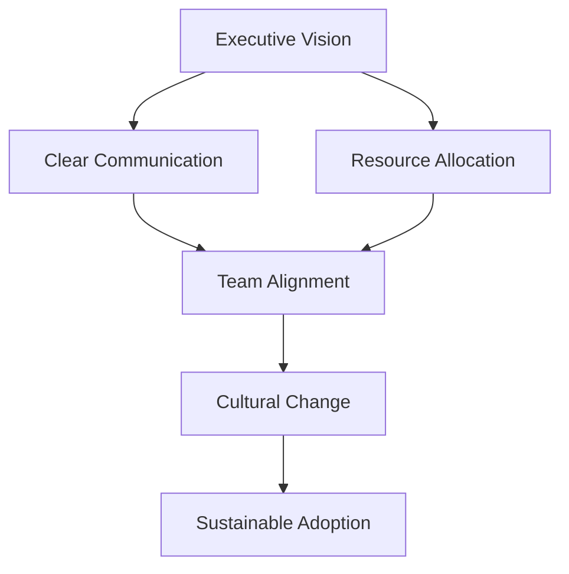
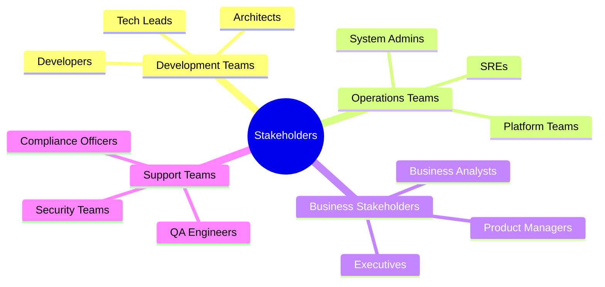
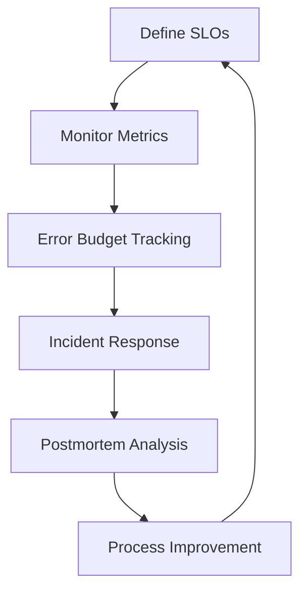
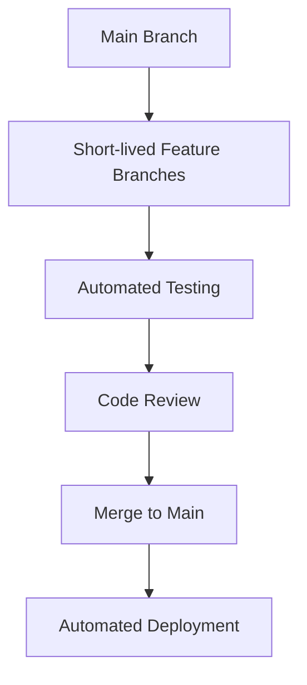
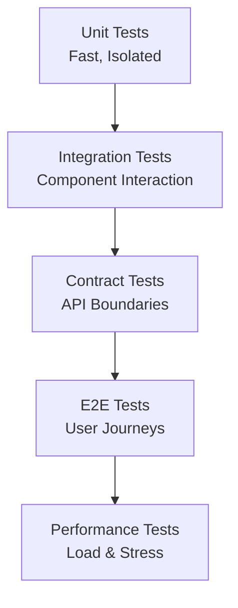
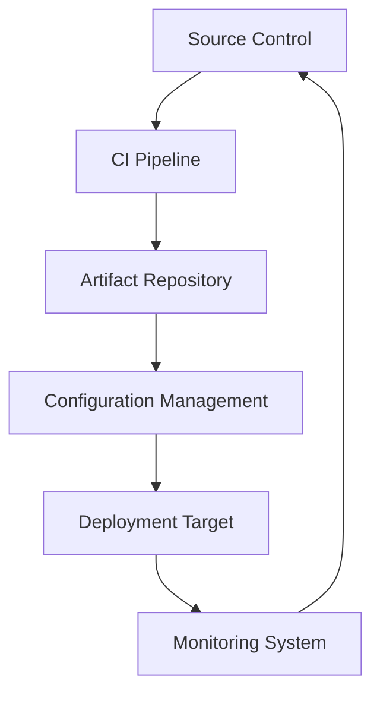
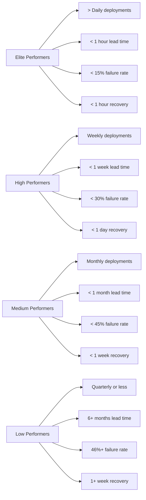
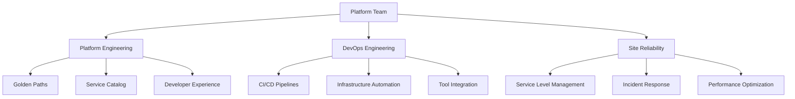

# 🏆 DevOps Implementation Best Practices

<div style="background: linear-gradient(135deg, #ff9a9e 0%, #fecfef 100%, #fecfef 100%); padding: 20px; border-radius: 10px; color: white; text-align: center;">
  <h2>🌟 Mastering DevOps Implementation</h2>
  <p>Proven strategies, patterns, and best practices for successful DevOps adoption</p>
</div>

---

## 📚 **Table of Contents**

- [🎯 Introduction](#-introduction)
- [🏢 Organizational Change Management](#-organizational-change-management)
- [👥 Team Structure & Roles](#-team-structure--roles)
- [🔄 Process Optimization](#-process-optimization)
- [🛠️ Toolchain Implementation](#️-toolchain-implementation)
- [📊 Metrics & Measurement](#-metrics--measurement)
- [🚧 Common Pitfalls & Solutions](#-common-pitfalls--solutions)
- [📈 Scaling DevOps](#-scaling-devops)
- [🎯 Implementation Roadmap](#-implementation-roadmap)

---

## 🎯 **Introduction**

### 📖 **Why Best Practices Matter**

DevOps implementation is a complex organizational transformation that requires careful planning, stakeholder alignment, and systematic execution. This guide provides battle-tested best practices drawn from successful DevOps transformations across industries.

### 🎯 **Learning Objectives**

By the end of this section, you will:

- ✅ Understand organizational change management for DevOps adoption
- ✅ Know optimal team structures and collaboration models
- ✅ Master process optimization techniques
- ✅ Learn toolchain implementation strategies
- ✅ Understand metrics and measurement frameworks
- ✅ Avoid common implementation pitfalls
- ✅ Create scalable DevOps practices

---

## 🏢 **Organizational Change Management**

### 🎭 **Cultural Transformation Strategy**

#### **1. Leadership Buy-in & Vision Setting**

**Critical Success Factor**: Executive sponsorship is the #1 predictor of DevOps success.



**Best Practices**:
- **Executive Sponsorship**: Identify and engage C-level champions
- **Clear Vision**: Define measurable DevOps goals aligned with business objectives
- **Communication Plan**: Regular updates, town halls, and transparent progress reporting
- **Change Agents**: Appoint internal champions to drive adoption

#### **2. Stakeholder Mapping & Engagement**

**Identify Key Stakeholders**:


**Engagement Strategies**:
- **Early Involvement**: Include stakeholders in planning phases
- **Regular Communication**: Weekly updates, monthly reviews
- **Training Programs**: Role-specific DevOps education
- **Feedback Loops**: Surveys, retrospectives, suggestion boxes

### 📋 **Change Management Framework**

#### **ADKAR Model for DevOps Adoption**

```
A - Awareness: Understanding the need for change
D - Desire: Willingness to participate in transformation
K - Knowledge: Understanding how to implement DevOps
A - Ability: Skills to execute DevOps practices
R - Reinforcement: Sustaining change through recognition
```

**Implementation Timeline**:
- **Month 1-2**: Awareness campaigns and vision setting
- **Month 3-6**: Pilot projects and skill building
- **Month 6-12**: Organization-wide rollout
- **Year 2+**: Continuous improvement and scaling

---

## 👥 **Team Structure & Roles**

### 🏗️ **DevOps Team Models**

#### **1. DevOps as Culture (Recommended)**

**Description**: DevOps becomes everyone's responsibility, not a separate team's job.

```
Benefits:
✅ Faster feedback loops
✅ Shared ownership
✅ Cross-functional collaboration
✅ Reduced handoffs

Challenges:
❌ Requires cultural change
❌ Initial resistance
❌ Skill gaps
```

#### **2. Dedicated DevOps Team**

**Description**: Specialized team handles DevOps tooling and processes.

```
Benefits:
✅ Expertise concentration
✅ Tool standardization
✅ Process consistency

Challenges:
❌ Potential silos
❌ Dependency bottlenecks
❌ Limited scalability
```

#### **3. DevOps Embedded Teams**

**Description**: DevOps engineers embedded within development teams.

```
Benefits:
✅ Direct collaboration
✅ Contextual understanding
✅ Faster problem resolution

Challenges:
❌ Resource allocation
❌ Career progression
❌ Knowledge sharing
```

### 👤 **Key Roles & Responsibilities**

#### **DevOps Engineer Role Definition**

| Responsibility | Description | Skills Required |
|----------------|-------------|-----------------|
| **Infrastructure as Code** | Define infrastructure using code | Terraform, CloudFormation, Ansible |
| **CI/CD Pipeline Management** | Design and maintain deployment pipelines | Jenkins, GitLab CI, GitHub Actions |
| **Monitoring & Observability** | Implement monitoring and alerting | Prometheus, Grafana, ELK Stack |
| **Security Integration** | Embed security in DevOps processes | DevSecOps tools, compliance frameworks |
| **Performance Optimization** | Optimize system performance and reliability | Load testing, profiling tools |

#### **Site Reliability Engineer (SRE) Role**

**Core Principles**:
- **Service Level Objectives (SLOs)**: Define and maintain service reliability targets
- **Error Budgets**: Allow calculated risk-taking for innovation
- **Blameless Postmortems**: Focus on system improvements, not individual fault
- **Automation First**: Automate toil and manual processes

**SRE Implementation Framework**:


---

## 🔄 **Process Optimization**

### 🚀 **Continuous Integration Best Practices**

#### **CI Pipeline Optimization**

**Essential Practices**:
- **Fast Feedback**: Keep build times under 10 minutes
- **Parallel Execution**: Run tests in parallel to reduce wait times
- **Fail Fast**: Stop pipeline on first failure
- **Artifact Management**: Store and version build artifacts

**Advanced CI Patterns**:
```yaml
# GitHub Actions Example - Optimized CI Pipeline
name: CI Pipeline
on: [push, pull_request]

jobs:
  test:
    runs-on: ubuntu-latest
    strategy:
      matrix:
        python-version: [3.8, 3.9, '3.10']
    steps:
    - uses: actions/checkout@v3
    - name: Set up Python ${{ matrix.python-version }}
      uses: actions/setup-python@v4
      with:
        python-version: ${{ matrix.python-version }}
    - name: Install dependencies
      run: |
        python -m pip install --upgrade pip
        pip install -r requirements.txt
    - name: Run tests
      run: |
        pytest --cov=./ --cov-report=xml
    - name: Upload coverage
      uses: codecov/codecov-action@v3
```

#### **Branching Strategy Optimization**

**Recommended: Trunk-Based Development**



**Benefits**:
- Reduced merge conflicts
- Faster integration
- Better collaboration
- Simplified rollback

### 🚀 **Continuous Deployment Best Practices**

#### **Deployment Strategy Selection**

| Strategy | Use Case | Risk Level | Rollback Complexity |
|----------|----------|------------|-------------------|
| **Blue-Green** | Zero-downtime deployments | Low | Simple |
| **Canary** | Gradual rollout with monitoring | Medium | Moderate |
| **Rolling Update** | Resource-efficient updates | Medium | Complex |
| **Feature Flags** | Runtime feature control | Low | Simple |

#### **Blue-Green Deployment Implementation**

```bash
# Blue-Green Deployment Script
#!/bin/bash

# Deploy to green environment
kubectl apply -f deployment-green.yaml
kubectl rollout status deployment/my-app-green

# Switch traffic to green
kubectl patch service my-app -p '{"spec":{"selector":{"version":"green"}}}'

# Verify deployment
curl -f http://my-app-service/health

# Keep blue as rollback option
echo "Blue environment ready for rollback if needed"
```

### 📊 **Quality Gates & Testing Strategy**

#### **Testing Pyramid Optimization**



**Testing Best Practices**:
- **Shift Left**: Test early and often
- **Test Automation**: Automate all regression tests
- **Parallel Testing**: Run tests concurrently
- **Test Data Management**: Use realistic, sanitized data
- **Flaky Test Management**: Identify and fix unreliable tests

---

## 🛠️ **Toolchain Implementation**

### 🔗 **Integration Strategy**

#### **API-First Tool Integration**

**Benefits**:
- Loose coupling between tools
- Easier tool replacement
- Better observability
- Standardized interfaces

**Integration Patterns**:


#### **Tool Selection Framework**

**Evaluate Tools Based On**:
- **Business Requirements**: Must support your use cases
- **Team Skills**: Current expertise and learning curve
- **Integration Capabilities**: API availability and documentation
- **Scalability**: Performance under load
- **Cost**: Total cost of ownership
- **Vendor Stability**: Long-term viability

### 🏗️ **Infrastructure as Code Best Practices**

#### **IaC Maturity Model**

```
Level 1: Ad-hoc scripts
├── Manual execution
├── No version control
└── Environment drift

Level 2: Templated infrastructure
├── Parameterized templates
├── Basic version control
└── Some automation

Level 3: Fully automated
├── Declarative definitions
├── Comprehensive testing
├── CI/CD integration
└── Self-service capabilities

Level 4: Policy-driven
├── Governance and compliance
├── Automated remediation
└── Continuous optimization
```

#### **Terraform Best Practices**

```hcl
# Example: Modular Infrastructure with Best Practices
terraform {
  required_version = ">= 1.0"
  backend "s3" {
    bucket = "my-terraform-state"
    key    = "prod/terraform.tfstate"
    region = "us-east-1"
  }
}

# Use modules for reusability
module "vpc" {
  source = "./modules/vpc"
  cidr_block = var.vpc_cidr
  tags = local.common_tags
}

# Implement proper tagging strategy
locals {
  common_tags = {
    Environment = var.environment
    Project     = var.project_name
    ManagedBy   = "Terraform"
    Owner       = var.owner
  }
}

# Use data sources for dynamic values
data "aws_availability_zones" "available" {
  state = "available"
}

# Implement resource dependencies explicitly
resource "aws_security_group" "web" {
  name_prefix = "web-"
  vpc_id      = module.vpc.vpc_id

  ingress {
    from_port   = 80
    to_port     = 80
    protocol    = "tcp"
    cidr_blocks = ["0.0.0.0/0"]
  }
}

# Use lifecycle rules for resource management
resource "aws_instance" "web" {
  ami           = data.aws_ami.ubuntu.id
  instance_type = "t2.micro"

  lifecycle {
    create_before_destroy = true
    ignore_changes = [
      tags["LastModified"],
    ]
  }

  tags = merge(local.common_tags, {
    Name = "web-server"
    Role = "web"
  })
}
```

---

## 📊 **Metrics & Measurement**

### 🎯 **DevOps Metrics Framework**

#### **DORA Metrics (DevOps Research and Assessment)**

**Four Key Metrics**:
1. **Deployment Frequency**: How often you deploy to production
2. **Lead Time for Changes**: Time from commit to production
3. **Change Failure Rate**: Percentage of deployments causing failures
4. **Time to Restore Service**: Time to recover from incidents

**Benchmark Performance**:


#### **Implementation Strategy**

**Start Simple, Measure What Matters**:
```yaml
# Example: DORA Metrics Collection
metrics:
  deployment_frequency:
    query: "sum(rate(deployment_total[30d]))"
    target: "> 1 per day"
    
  lead_time:
    query: "histogram_quantile(0.95, rate(commit_to_deploy_duration_bucket[30d]))"
    target: "< 1 hour"
    
  change_failure_rate:
    query: "rate(failed_deployment_total[30d]) / rate(deployment_total[30d])"
    target: "< 15%"
    
  time_to_restore:
    query: "histogram_quantile(0.95, rate(incident_resolution_duration_bucket[30d]))"
    target: "< 1 hour"
```

### 📈 **Additional Key Metrics**

#### **Process Metrics**
- **Code Review Coverage**: Percentage of code reviewed
- **Test Coverage**: Automated test coverage percentage
- **Technical Debt**: Code quality and maintainability metrics
- **Team Satisfaction**: Developer experience and morale

#### **Business Metrics**
- **Time to Market**: Speed of feature delivery
- **Customer Satisfaction**: User experience and feedback
- **Revenue Impact**: Business value from DevOps improvements
- **Cost Reduction**: Infrastructure and operational cost savings

---

## 🚧 **Common Pitfalls & Solutions**

### 🔍 **Top 10 DevOps Implementation Mistakes**

#### **1. Tool-Centric Approach**
**Problem**: Focusing on tools rather than culture and processes.

**Solution**: Start with culture, then processes, finally tools.

#### **2. Big Bang Implementation**
**Problem**: Trying to change everything at once.

**Solution**: Start with pilot projects, demonstrate value, then scale.

#### **3. Lack of Executive Support**
**Problem**: No leadership buy-in or resource allocation.

**Solution**: Secure executive sponsorship and clear business case.

#### **4. Insufficient Training**
**Problem**: Teams lack necessary skills for DevOps practices.

**Solution**: Invest in comprehensive training and certification programs.

#### **5. Ignoring Security**
**Problem**: Treating security as an afterthought.

**Solution**: Integrate security from the beginning (DevSecOps).

#### **6. Poor Communication**
**Problem**: Lack of transparency between teams.

**Solution**: Establish regular cross-team communication channels.

#### **7. Inadequate Monitoring**
**Problem**: No visibility into system performance and issues.

**Solution**: Implement comprehensive observability from day one.

#### **8. Resistance to Change**
**Problem**: Team members resistant to new ways of working.

**Solution**: Address concerns, provide support, celebrate small wins.

#### **9. Technical Debt Accumulation**
**Problem**: Ignoring code quality and infrastructure debt.

**Solution**: Regular refactoring and technical debt reduction sprints.

#### **10. Lack of Measurement**
**Problem**: No way to track progress or demonstrate value.

**Solution**: Define clear metrics and regular reporting.

### 🛠️ **Recovery Strategies**

#### **DevOps Transformation Stuck?**

**Assessment Questions**:
- Are you measuring the right things?
- Is there clear executive support?
- Are teams properly trained?
- Is there a clear roadmap and milestones?
- Are you celebrating successes?

**Recovery Actions**:
1. **Reassess Goals**: Ensure alignment with business objectives
2. **Secure Leadership**: Get executive commitment
3. **Start Small**: Focus on quick wins
4. **Invest in People**: Training and skill development
5. **Measure Progress**: Regular metrics review
6. **Communicate Success**: Share wins and learnings

---

## 📈 **Scaling DevOps**

### 🏗️ **Platform Engineering**

#### **Internal Developer Platform (IDP)**

**Purpose**: Provide self-service capabilities for development teams.

**Key Components**:
- **Golden Paths**: Pre-approved technology stacks and patterns
- **Service Catalog**: Available services and components
- **Automated Provisioning**: Self-service infrastructure and environments
- **Guardrails**: Security and compliance automation

**Benefits**:
- Faster development cycles
- Consistent architecture decisions
- Reduced cognitive load on teams
- Better governance and compliance

#### **Platform Team Structure**



### 🌐 **Multi-Team Coordination**

#### **DevOps Center of Excellence (CoE)**

**Role**: Provide governance, standards, and support for DevOps adoption.

**Responsibilities**:
- Define and maintain DevOps standards
- Provide tooling and platform support
- Offer training and mentoring
- Measure and report on DevOps maturity
- Drive continuous improvement initiatives

#### **Federated DevOps Model**

**Structure**:
- **Central Platform Team**: Provides shared services and tools
- **Embedded DevOps Engineers**: Work within product teams
- **Specialized SRE Teams**: Handle production stability
- **CoE**: Oversees standards and governance

**Benefits**:
- Scalability across large organizations
- Local autonomy with global standards
- Knowledge sharing and collaboration
- Consistent quality and practices

---

## 🎯 **Implementation Roadmap**

### 📅 **12-Month DevOps Transformation Plan**

#### **Month 1-2: Foundation & Assessment**
- **Week 1**: Executive alignment and vision setting
- **Week 2-3**: Current state assessment (people, process, technology)
- **Week 4-6**: Pilot team selection and training
- **Week 7-8**: Tool evaluation and initial setup

#### **Month 3-4: Pilot Implementation**
- **Week 9-12**: CI/CD pipeline implementation
- **Week 13-14**: Infrastructure automation
- **Week 15-16**: Monitoring and observability setup

#### **Month 5-6: Expansion & Optimization**
- **Week 17-20**: Additional team onboarding
- **Week 21-24**: Process refinement and optimization
- **Week 25-26**: Security integration (DevSecOps)

#### **Month 7-8: Organization-Wide Rollout**
- **Week 27-32**: Scaled implementation across teams
- **Week 33-34**: Training programs and documentation
- **Week 35-36**: Change management and communication

#### **Month 9-12: Maturity & Continuous Improvement**
- **Week 37-44**: Advanced practices implementation
- **Week 45-48**: Metrics analysis and optimization
- **Week 49-52**: Next phase planning and scaling

### 📊 **Success Milestones**

| Month | Milestone | Success Criteria |
|-------|-----------|------------------|
| **2** | Pilot Launch | First automated deployment |
| **4** | MVP Complete | 50% reduction in deployment time |
| **6** | Scaled Adoption | 3+ teams using DevOps practices |
| **8** | Organization Ready | 80% teams trained and equipped |
| **12** | Mature Practice | Elite DORA metrics achieved |

### 🎯 **Key Success Factors**

#### **People**
- Leadership commitment and support
- Comprehensive training programs
- Cultural change management
- Team empowerment and autonomy

#### **Process**
- Clear roadmap and milestones
- Regular assessment and adjustment
- Continuous improvement culture
- Risk management and mitigation

#### **Technology**
- Right tool selection and integration
- Automation of repetitive tasks
- Monitoring and observability
- Security integration

#### **Measurement**
- Clear metrics and KPIs
- Regular reporting and communication
- Data-driven decision making
- Continuous feedback loops

---

## 📚 **Additional Resources**

### 📖 **Recommended Reading**
- **"The DevOps Handbook"** by Gene Kim, Jez Humble, Patrick Debois
- **"Accelerate"** by Nicole Forsgren, Jez Humble, Gene Kim
- **"The Phoenix Project"** by Gene Kim, Kevin Behr, George Spafford
- **"Site Reliability Engineering"** by Betsy Beyer et al.

### 🎓 **Training & Certification**
- **Docker Certified Associate**
- **Kubernetes Certified Administrator**
- **AWS DevOps Engineer Professional**
- **Certified Kubernetes Administrator (CKA)**

### 🌐 **Communities & Events**
- **DevOpsDays** conferences worldwide
- **DevOps Enterprise Summit**
- **Kubernetes Community**
- **CNCF (Cloud Native Computing Foundation)**

---

<div style="background: linear-gradient(135deg, #667eea 0%, #764ba2 100%); padding: 20px; border-radius: 10px; color: white; text-align: center; margin-top: 30px;">
  <h3>🚀 Ready to Transform Your Organization?</h3>
  <p>DevOps is a journey, not a destination. Start small, learn fast, and scale what works.</p>
</div>