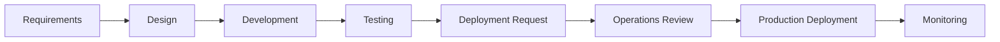
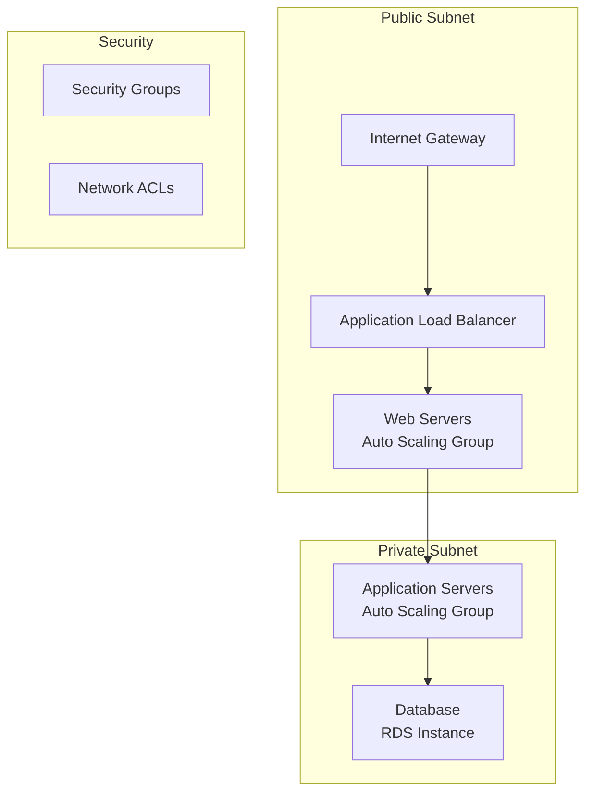
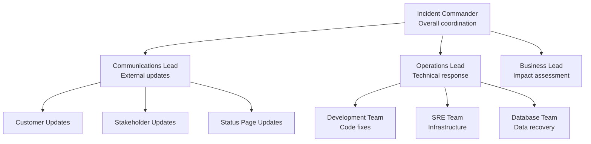

# 🏋️ Hands-on Exercises & Labs

<div style="background: linear-gradient(135deg, #f093fb 0%, #f5576c 100%); padding: 20px; border-radius: 10px; color: white; text-align: center;">
  <h2>🎯 Practice Makes DevOps Perfect</h2>
  <p>Interactive exercises and real-world scenarios to master DevOps fundamentals</p>
</div>

---

## 📚 **Table of Contents**

- [🎯 Introduction](#-introduction)
- [🏢 Exercise 1: DevOps Culture Assessment](#-exercise-1-devops-culture-assessment)
- [👥 Exercise 2: Team Collaboration Scenarios](#-exercise-2-team-collaboration-scenarios)
- [🔄 Exercise 3: CI/CD Pipeline Implementation](#-exercise-3-cicd-pipeline-implementation)
- [🛠️ Exercise 4: Infrastructure as Code](#️-exercise-4-infrastructure-as-code)
- [📊 Exercise 5: Monitoring & Observability](#-exercise-5-monitoring--observability)
- [🚧 Exercise 6: Incident Response Simulation](#-exercise-6-incident-response-simulation)
- [📈 Exercise 7: DevOps Metrics Dashboard](#-exercise-7-devops-metrics-dashboard)
- [🎯 Exercise 8: DevOps Transformation Planning](#-exercise-8-devops-transformation-planning)
- [📚 Additional Resources](#-additional-resources)

---

## 🎯 **Introduction**

### 📖 **Why Hands-on Learning Matters**

DevOps is a practical discipline that requires hands-on experience to master. These exercises provide real-world scenarios and guided practice to help you develop the skills and mindset needed for successful DevOps implementation.

### 🎯 **Learning Objectives**

By completing these exercises, you will:

- ✅ Assess and improve DevOps culture in organizations
- ✅ Practice collaborative problem-solving scenarios
- ✅ Build and optimize CI/CD pipelines
- ✅ Implement Infrastructure as Code solutions
- ✅ Set up monitoring and alerting systems
- ✅ Handle incident response situations
- ✅ Create meaningful DevOps metrics dashboards
- ✅ Plan comprehensive DevOps transformations

### 🛠️ **Prerequisites**

Before starting these exercises, ensure you have:

- ✅ Basic understanding of software development and deployment
- ✅ Familiarity with version control (Git)
- ✅ Access to a cloud platform (AWS, Azure, or GCP free tier)
- ✅ Local development environment with Docker
- ✅ Text editor or IDE of your choice

---

## 🏢 **Exercise 1: DevOps Culture Assessment**

### 🎯 **Objective**
Assess the current DevOps maturity of an organization and identify improvement areas.

### ⏱️ **Duration**: 45 minutes

### 📋 **Scenario**
You are a DevOps consultant hired to evaluate TechCorp's development practices. The company has 50 developers, uses waterfall methodology, and deploys quarterly. Your task is to assess their current state and create an improvement roadmap.

### 🏃 **Steps**

#### **Step 1: Stakeholder Interviews (15 minutes)**

**Conduct simulated interviews with key stakeholders:**

**Developer Interview Questions:**
```markdown
1. How often do you deploy code to production?
2. Who handles production issues when they occur?
3. How do you get feedback on your code changes?
4. What frustrates you most about the current process?
5. How much time do you spend on manual tasks?
```

**Operations Interview Questions:**
```markdown
1. How many production incidents occur monthly?
2. What's the average time to resolve production issues?
3. How do you handle deployment requests?
4. What are your biggest challenges with development teams?
5. How much time do you spend on repetitive tasks?
```

**Management Interview Questions:**
```markdown
1. What's your biggest business challenge?
2. How quickly can you respond to market changes?
3. What's your target time-to-market for new features?
4. How do you measure development team performance?
5. What's your biggest technical debt concern?
```

#### **Step 2: Process Mapping (15 minutes)**

**Map the current development lifecycle:**



**Identify bottlenecks and handoffs:**
- **Handoff Points**: Where work passes between teams
- **Wait Times**: How long work sits idle
- **Failure Points**: Where things commonly go wrong

#### **Step 3: DevOps Maturity Assessment (10 minutes)**

**Rate the organization on a 1-5 scale:**

| Dimension | Current Rating | Target Rating | Gap Analysis |
|-----------|----------------|----------------|--------------|
| **Culture & Collaboration** | 2/5 | 4/5 | Need cross-team training |
| **Automation** | 1/5 | 5/5 | Heavy manual processes |
| **Monitoring & Feedback** | 3/5 | 5/5 | Reactive monitoring only |
| **Infrastructure** | 2/5 | 4/5 | Manual server management |
| **Security** | 3/5 | 4/5 | Security as afterthought |

#### **Step 4: Create Improvement Roadmap (5 minutes)**

**Prioritize initiatives based on impact vs. effort:**

```markdown
🚀 Quick Wins (High Impact, Low Effort):
- Implement automated testing in CI
- Set up basic monitoring alerts
- Create cross-team communication channels

🏗️ Major Projects (High Impact, High Effort):
- CI/CD pipeline implementation
- Infrastructure automation
- DevOps training program

🔧 Process Improvements (Medium Impact, Low Effort):
- Daily standup meetings
- Code review process standardization
- Incident response procedure
```

### 📊 **Deliverables**
1. **Assessment Report**: Current state analysis with ratings
2. **Improvement Roadmap**: Prioritized initiatives with timelines
3. **Quick Win Recommendations**: Immediate actions for impact

### 💡 **Key Learnings**
- DevOps assessment requires understanding people, processes, and technology
- Cultural resistance is often the biggest barrier
- Start with visible quick wins to build momentum

---

## 👥 **Exercise 2: Team Collaboration Scenarios**

### 🎯 **Objective**
Practice resolving common collaboration challenges in DevOps environments.

### ⏱️ **Duration**: 60 minutes

### 📋 **Scenario**
You're leading a DevOps transformation at StartupXYZ. The development and operations teams have historically been siloed, leading to frequent conflicts and deployment delays.

### 🏃 **Steps**

#### **Scenario 1: The Blame Game (20 minutes)**

**Situation**: A production outage occurs during business hours. The development team blames operations for poor infrastructure, while operations blames development for releasing buggy code.

**Your Role**: Facilitate a blameless postmortem and establish better collaboration practices.

**Exercise Tasks:**
1. **Stop the Blame**: Redirect focus from "who" to "what" and "how"
2. **Timeline Reconstruction**: Create a detailed incident timeline
3. **Root Cause Analysis**: Identify contributing factors (not single causes)
4. **Action Items**: Define specific, measurable improvements

**Sample Incident Timeline:**
```markdown
2024-01-15 14:30 - Code deployment starts
2024-01-15 14:45 - Deployment completes successfully
2024-01-15 15:00 - Monitoring alerts trigger (high CPU)
2024-01-15 15:15 - Application becomes unresponsive
2024-01-15 15:30 - Operations team receives user complaints
2024-01-15 16:00 - Emergency rollback initiated
2024-01-15 16:30 - Service restored
```

**Blameless Postmortem Template:**
```markdown
# Incident Postmortem: Production Outage 2024-01-15

## Summary
Brief description of what happened and impact

## Timeline
Detailed chronological events

## Contributing Factors
- Factor 1: Description and impact
- Factor 2: Description and impact
- Factor 3: Description and impact

## Lessons Learned
- What went well
- What didn't go well
- What we can improve

## Action Items
- Action 1: Owner, Due Date, Success Criteria
- Action 2: Owner, Due Date, Success Criteria
- Action 3: Owner, Due Date, Success Criteria

## Follow-up
Date and time for follow-up review
```

#### **Scenario 2: Deployment Conflicts (20 minutes)**

**Situation**: Development wants to deploy daily, but operations can only support weekly deployments due to manual processes and testing requirements.

**Resolution Strategy:**
1. **Understand Constraints**: Document operational limitations and requirements
2. **Find Common Ground**: Identify shared goals (reliability, speed, quality)
3. **Incremental Changes**: Start with small improvements that benefit both teams
4. **Shared Ownership**: Create joint processes and responsibilities

**Negotiation Framework:**
```markdown
Development Priorities:
- Faster feedback loops
- Feature delivery speed
- Innovation freedom

Operations Priorities:
- System stability
- Security compliance
- Change management
- Supportability

Shared Goals:
- Business success
- Customer satisfaction
- Team satisfaction
- System reliability
```

#### **Scenario 3: Knowledge Sharing Initiative (20 minutes)**

**Design a program to break down silos between development and operations teams.**

**Program Components:**
1. **Lunch and Learns**: Monthly technical sessions
2. **Job Shadowing**: Cross-team observation days
3. **Shared Tools**: Common platforms and documentation
4. **Mentorship Program**: Pairing dev and ops team members
5. **Celebration Events**: Recognizing collaborative successes

### 📊 **Deliverables**
1. **Postmortem Report**: Complete incident analysis with action items
2. **Collaboration Plan**: Strategies for improving dev-ops relationships
3. **Knowledge Sharing Program**: Detailed implementation plan

### 💡 **Key Learnings**
- Blameless culture is essential for learning and improvement
- Collaboration requires understanding different perspectives
- Small changes can lead to significant improvements

---

## 🔄 **Exercise 3: CI/CD Pipeline Implementation**

### 🎯 **Objective**
Build a complete CI/CD pipeline for a sample application.

### ⏱️ **Duration**: 90 minutes

### 📋 **Scenario**
You need to implement CI/CD for a Node.js web application. The current process is manual and error-prone, taking 2-3 days for each release.

### 🏃 **Steps**

#### **Step 1: Application Setup (15 minutes)**

**Create a sample Node.js application:**

```javascript
// app.js
const express = require('express');
const app = express();

app.get('/', (req, res) => {
  res.json({ message: 'Hello from DevOps CI/CD Demo!' });
});

app.get('/health', (req, res) => {
  res.json({ status: 'healthy', timestamp: new Date().toISOString() });
});

const port = process.env.PORT || 3000;
app.listen(port, () => {
  console.log(`Server running on port ${port}`);
});

module.exports = app;
```

**Create package.json:**
```json
{
  "name": "devops-cicd-demo",
  "version": "1.0.0",
  "description": "Sample app for CI/CD pipeline demo",
  "main": "app.js",
  "scripts": {
    "start": "node app.js",
    "test": "jest",
    "lint": "eslint app.js"
  },
  "dependencies": {
    "express": "^4.18.2"
  },
  "devDependencies": {
    "jest": "^29.5.0",
    "eslint": "^8.38.0"
  }
}
```

#### **Step 2: Unit Tests (15 minutes)**

**Create comprehensive tests:**

```javascript
// app.test.js
const request = require('supertest');
const app = require('./app');

describe('GET /', () => {
  it('should return hello message', async () => {
    const response = await request(app).get('/');
    expect(response.status).toBe(200);
    expect(response.body.message).toBe('Hello from DevOps CI/CD Demo!');
  });
});

describe('GET /health', () => {
  it('should return health status', async () => {
    const response = await request(app).get('/health');
    expect(response.status).toBe(200);
    expect(response.body.status).toBe('healthy');
    expect(response.body.timestamp).toBeDefined();
  });
});
```

#### **Step 3: GitHub Actions CI/CD Pipeline (30 minutes)**

**Create `.github/workflows/cicd.yml`:**

```yaml
name: CI/CD Pipeline

on:
  push:
    branches: [ main, develop ]
  pull_request:
    branches: [ main ]

jobs:
  test:
    runs-on: ubuntu-latest
    steps:
    - name: Checkout code
      uses: actions/checkout@v4

    - name: Setup Node.js
      uses: actions/setup-node@v4
      with:
        node-version: '18'
        cache: 'npm'

    - name: Install dependencies
      run: npm ci

    - name: Run linter
      run: npm run lint

    - name: Run tests
      run: npm test -- --coverage

    - name: Upload coverage reports
      uses: codecov/codecov-action@v3
      with:
        file: ./coverage/lcov.info

  build-and-push:
    needs: test
    runs-on: ubuntu-latest
    if: github.ref == 'refs/heads/main'
    steps:
    - name: Checkout code
      uses: actions/checkout@v4

    - name: Setup Node.js
      uses: actions/setup-node@v4
      with:
        node-version: '18'
        cache: 'npm'

    - name: Install dependencies
      run: npm ci

    - name: Build application
      run: npm run build

    - name: Build and push Docker image
      uses: docker/build-push-action@v4
      with:
        context: .
        push: true
        tags: myapp:${{ github.sha }}, myapp:latest

  deploy:
    needs: build-and-push
    runs-on: ubuntu-latest
    if: github.ref == 'refs/heads/main'
    steps:
    - name: Deploy to production
      run: |
        echo "Deploying to production..."
        # Add your deployment commands here
        # This could be kubectl, docker-compose, etc.
```

#### **Step 4: Docker Containerization (15 minutes)**

**Create Dockerfile:**

```dockerfile
# Use Node.js official image
FROM node:18-alpine

# Set working directory
WORKDIR /app

# Copy package files
COPY package*.json ./

# Install dependencies
RUN npm ci --only=production

# Copy application code
COPY . .

# Expose port
EXPOSE 3000

# Health check
HEALTHCHECK --interval=30s --timeout=3s --start-period=5s --retries=3 \
  CMD curl -f http://localhost:3000/health || exit 1

# Start application
CMD ["npm", "start"]
```

**Create .dockerignore:**
```
node_modules
npm-debug.log
.git
.github
coverage
.nyc_output
```

#### **Step 5: Deployment Configuration (15 minutes)**

**Create docker-compose.yml for local testing:**

```yaml
version: '3.8'

services:
  app:
    build: .
    ports:
      - "3000:3000"
    environment:
      - NODE_ENV=production
    restart: unless-stopped
    healthcheck:
      test: ["CMD", "curl", "-f", "http://localhost:3000/health"]
      interval: 30s
      timeout: 10s
      retries: 3
```

### 📊 **Deliverables**
1. **Complete CI/CD Pipeline**: GitHub Actions workflow file
2. **Containerized Application**: Dockerfile and docker-compose.yml
3. **Test Suite**: Unit tests with coverage reporting
4. **Deployment Scripts**: Automated deployment configuration

### 💡 **Key Learnings**
- CI/CD pipelines automate the entire software delivery process
- Testing should be automated and run on every change
- Containerization simplifies deployment across environments
- Pipeline stages should be independent and parallelizable

---

## 🛠️ **Exercise 4: Infrastructure as Code**

### 🎯 **Objective**
Implement Infrastructure as Code using Terraform for a web application.

### ⏱️ **Duration**: 75 minutes

### 📋 **Scenario**
You need to create infrastructure for a three-tier web application (web server, application server, database) using Infrastructure as Code principles.

### 🏃 **Steps**

#### **Step 1: Infrastructure Design (15 minutes)**

**Design the architecture:**



**Define requirements:**
- High availability across 2 availability zones
- Auto scaling based on CPU utilization
- Secure database access (private subnet only)
- Load balancer for web traffic distribution

#### **Step 2: Terraform Configuration (30 minutes)**

**Create main.tf:**

```hcl
terraform {
  required_version = ">= 1.0"
  required_providers {
    aws = {
      source  = "hashicorp/aws"
      version = "~> 5.0"
    }
  }
}

provider "aws" {
  region = var.aws_region
}

# VPC Configuration
resource "aws_vpc" "main" {
  cidr_block           = var.vpc_cidr
  enable_dns_hostnames = true
  enable_dns_support   = true

  tags = {
    Name        = "${var.project_name}-vpc"
    Environment = var.environment
    Project     = var.project_name
  }
}

# Internet Gateway
resource "aws_internet_gateway" "main" {
  vpc_id = aws_vpc.main.id

  tags = {
    Name        = "${var.project_name}-igw"
    Environment = var.environment
  }
}

# Public Subnets
resource "aws_subnet" "public" {
  count             = length(var.public_subnet_cidrs)
  vpc_id            = aws_vpc.main.id
  cidr_block        = var.public_subnet_cidrs[count.index]
  availability_zone = var.availability_zones[count.index]

  tags = {
    Name        = "${var.project_name}-public-${count.index + 1}"
    Environment = var.environment
    Type        = "Public"
  }
}

# Private Subnets
resource "aws_subnet" "private" {
  count             = length(var.private_subnet_cidrs)
  vpc_id            = aws_vpc.main.id
  cidr_block        = var.private_subnet_cidrs[count.index]
  availability_zone = var.availability_zones[count.index]

  tags = {
    Name        = "${var.project_name}-private-${count.index + 1}"
    Environment = var.environment
    Type        = "Private"
  }
}

# NAT Gateway for private subnet internet access
resource "aws_eip" "nat" {
  count = length(var.public_subnet_cidrs)
  vpc   = true

  tags = {
    Name        = "${var.project_name}-nat-eip-${count.index + 1}"
    Environment = var.environment
  }
}

resource "aws_nat_gateway" "main" {
  count         = length(var.public_subnet_cidrs)
  allocation_id = aws_eip.nat[count.index].id
  subnet_id     = aws_subnet.public[count.index].id

  tags = {
    Name        = "${var.project_name}-nat-${count.index + 1}"
    Environment = var.environment
  }
}

# Route Tables
resource "aws_route_table" "public" {
  vpc_id = aws_vpc.main.id

  route {
    cidr_block = "0.0.0.0/0"
    gateway_id = aws_internet_gateway.main.id
  }

  tags = {
    Name        = "${var.project_name}-public-rt"
    Environment = var.environment
  }
}

resource "aws_route_table" "private" {
  count  = length(var.private_subnet_cidrs)
  vpc_id = aws_vpc.main.id

  route {
    cidr_block     = "0.0.0.0/0"
    nat_gateway_id = aws_nat_gateway.main[count.index].id
  }

  tags = {
    Name        = "${var.project_name}-private-rt-${count.index + 1}"
    Environment = var.environment
  }
}

# Route Table Associations
resource "aws_route_table_association" "public" {
  count          = length(var.public_subnet_cidrs)
  subnet_id      = aws_subnet.public[count.index].id
  route_table_id = aws_route_table.public.id
}

resource "aws_route_table_association" "private" {
  count          = length(var.private_subnet_cidrs)
  subnet_id      = aws_subnet.private[count.index].id
  route_table_id = aws_route_table.private[count.index].id
}

# Security Groups
resource "aws_security_group" "alb" {
  name_prefix = "${var.project_name}-alb-"
  vpc_id      = aws_vpc.main.id

  ingress {
    from_port   = 80
    to_port     = 80
    protocol    = "tcp"
    cidr_blocks = ["0.0.0.0/0"]
  }

  ingress {
    from_port   = 443
    to_port     = 443
    protocol    = "tcp"
    cidr_blocks = ["0.0.0.0/0"]
  }

  egress {
    from_port   = 0
    to_port     = 0
    protocol    = "-1"
    cidr_blocks = ["0.0.0.0/0"]
  }

  tags = {
    Name        = "${var.project_name}-alb-sg"
    Environment = var.environment
  }
}

resource "aws_security_group" "web" {
  name_prefix = "${var.project_name}-web-"
  vpc_id      = aws_vpc.main.id

  ingress {
    from_port       = 80
    to_port         = 80
    protocol        = "tcp"
    security_groups = [aws_security_group.alb.id]
  }

  egress {
    from_port   = 0
    to_port     = 0
    protocol    = "-1"
    cidr_blocks = ["0.0.0.0/0"]
  }

  tags = {
    Name        = "${var.project_name}-web-sg"
    Environment = var.environment
  }
}

resource "aws_security_group" "app" {
  name_prefix = "${var.project_name}-app-"
  vpc_id      = aws_vpc.main.id

  ingress {
    from_port       = 8080
    to_port         = 8080
    protocol        = "tcp"
    security_groups = [aws_security_group.web.id]
  }

  egress {
    from_port   = 0
    to_port     = 0
    protocol    = "-1"
    cidr_blocks = ["0.0.0.0/0"]
  }

  tags = {
    Name        = "${var.project_name}-app-sg"
    Environment = var.environment
  }
}

resource "aws_security_group" "db" {
  name_prefix = "${var.project_name}-db-"
  vpc_id      = aws_vpc.main.id

  ingress {
    from_port       = 3306
    to_port         = 3306
    protocol        = "tcp"
    security_groups = [aws_security_group.app.id]
  }

  tags = {
    Name        = "${var.project_name}-db-sg"
    Environment = var.environment
  }
}

# Application Load Balancer
resource "aws_lb" "main" {
  name               = "${var.project_name}-alb"
  internal           = false
  load_balancer_type = "application"
  security_groups    = [aws_security_group.alb.id]
  subnets            = aws_subnet.public[*].id

  tags = {
    Name        = "${var.project_name}-alb"
    Environment = var.environment
  }
}

resource "aws_lb_target_group" "web" {
  name_prefix = "web-"
  port        = 80
  protocol    = "HTTP"
  vpc_id      = aws_vpc.main.id

  health_check {
    enabled             = true
    healthy_threshold   = 2
    interval            = 30
    matcher             = "200"
    path                = "/health"
    port                = "traffic-port"
    protocol            = "HTTP"
    timeout             = 5
    unhealthy_threshold = 2
  }

  tags = {
    Name        = "${var.project_name}-web-tg"
    Environment = var.environment
  }
}

resource "aws_lb_listener" "http" {
  load_balancer_arn = aws_lb.main.arn
  port              = "80"
  protocol          = "HTTP"

  default_action {
    type             = "forward"
    target_group_arn = aws_lb_target_group.web.arn
  }
}

# Launch Template for Web Servers
resource "aws_launch_template" "web" {
  name_prefix   = "${var.project_name}-web-"
  image_id      = var.ami_id
  instance_type = var.instance_type

  vpc_security_group_ids = [aws_security_group.web.id]

  user_data = base64encode(<<-EOF
              #!/bin/bash
              yum update -y
              yum install -y httpd
              systemctl start httpd
              systemctl enable httpd
              echo "<h1>Hello from $(hostname -f)</h1>" > /var/www/html/index.html
              EOF
  )

  tags = {
    Name        = "${var.project_name}-web-lt"
    Environment = var.environment
  }
}

# Auto Scaling Group for Web Servers
resource "aws_autoscaling_group" "web" {
  name_prefix         = "${var.project_name}-web-asg-"
  max_size            = 4
  min_size            = 2
  desired_capacity    = 2
  vpc_zone_identifier = aws_subnet.public[*].id

  launch_template {
    id      = aws_launch_template.web.id
    version = "$Latest"
  }

  target_group_arns = [aws_lb_target_group.web.arn]

  tag {
    key                 = "Name"
    value               = "${var.project_name}-web"
    propagate_at_launch = true
  }

  tag {
    key                 = "Environment"
    value               = var.environment
    propagate_at_launch = true
  }
}

# RDS Database
resource "aws_db_subnet_group" "main" {
  name       = "${var.project_name}-db-subnet-group"
  subnet_ids = aws_subnet.private[*].id

  tags = {
    Name        = "${var.project_name}-db-subnet-group"
    Environment = var.environment
  }
}

resource "aws_db_instance" "main" {
  identifier             = "${var.project_name}-db"
  allocated_storage      = 20
  storage_type           = "gp2"
  engine                 = "mysql"
  engine_version         = "8.0"
  instance_class         = "db.t3.micro"
  db_name                = var.db_name
  username               = var.db_username
  password               = var.db_password
  parameter_group_name   = "default.mysql8.0"
  db_subnet_group_name   = aws_db_subnet_group.main.name
  vpc_security_group_ids = [aws_security_group.db.id]
  skip_final_snapshot    = true

  tags = {
    Name        = "${var.project_name}-db"
    Environment = var.environment
  }
}
```

#### **Step 3: Variables and Outputs (15 minutes)**

**Create variables.tf:**

```hcl
variable "aws_region" {
  description = "AWS region"
  type        = string
  default     = "us-east-1"
}

variable "project_name" {
  description = "Project name"
  type        = string
  default     = "devops-demo"
}

variable "environment" {
  description = "Environment name"
  type        = string
  default     = "dev"
}

variable "vpc_cidr" {
  description = "VPC CIDR block"
  type        = string
  default     = "10.0.0.0/16"
}

variable "public_subnet_cidrs" {
  description = "Public subnet CIDR blocks"
  type        = list(string)
  default     = ["10.0.1.0/24", "10.0.2.0/24"]
}

variable "private_subnet_cidrs" {
  description = "Private subnet CIDR blocks"
  type        = list(string)
  default     = ["10.0.3.0/24", "10.0.4.0/24"]
}

variable "availability_zones" {
  description = "Availability zones"
  type        = list(string)
  default     = ["us-east-1a", "us-east-1b"]
}

variable "ami_id" {
  description = "AMI ID for EC2 instances"
  type        = string
  default     = "ami-0c02fb55956c7d316" # Amazon Linux 2
}

variable "instance_type" {
  description = "EC2 instance type"
  type        = string
  default     = "t2.micro"
}

variable "db_name" {
  description = "Database name"
  type        = string
  default     = "devopsdemo"
}

variable "db_username" {
  description = "Database username"
  type        = string
  default     = "admin"
}

variable "db_password" {
  description = "Database password"
  type        = string
  sensitive   = true
}
```

**Create outputs.tf:**

```hcl
output "vpc_id" {
  description = "VPC ID"
  value       = aws_vpc.main.id
}

output "alb_dns_name" {
  description = "ALB DNS name"
  value       = aws_lb.main.dns_name
}

output "db_endpoint" {
  description = "Database endpoint"
  value       = aws_db_instance.main.endpoint
  sensitive   = true
}

output "web_asg_name" {
  description = "Web Auto Scaling Group name"
  value       = aws_autoscaling_group.web.name
}
```

#### **Step 4: Testing and Validation (15 minutes)**

**Create test script:**

```bash
#!/bin/bash
# Infrastructure Validation Script

echo "🔍 Validating Terraform configuration..."

# Format and validate
terraform fmt -check
terraform validate

# Plan deployment
echo "📋 Creating execution plan..."
terraform plan -out=tfplan

# Optional: Apply changes (uncomment with caution)
# echo "🚀 Applying infrastructure changes..."
# terraform apply tfplan

echo "✅ Infrastructure validation complete!"
echo "📊 Run 'terraform apply tfplan' to deploy infrastructure"
```

### 📊 **Deliverables**
1. **Complete Terraform Configuration**: Modular infrastructure code
2. **Variables and Outputs**: Configurable and reusable setup
3. **Validation Scripts**: Testing and deployment automation
4. **Architecture Documentation**: Infrastructure design diagrams

### 💡 **Key Learnings**
- Infrastructure as Code enables version control and reproducibility
- Modular design improves maintainability and reusability
- Security groups and network segmentation are critical for security
- Auto scaling provides elasticity and cost optimization

---

## 📊 **Exercise 5: Monitoring & Observability**

### 🎯 **Objective**
Implement comprehensive monitoring and alerting for a web application.

### ⏱️ **Duration**: 60 minutes

### 📋 **Scenario**
You need to set up monitoring for the Node.js application from Exercise 3. The goal is to detect issues early and provide actionable insights.

### 🏃 **Steps**

#### **Step 1: Application Metrics (15 minutes)**

**Add Prometheus metrics to the Node.js application:**

```javascript
// metrics.js
const promClient = require('prom-client');

// Create a Registry which registers the metrics
const register = new promClient.Registry();

// Add a default label which is added to all metrics
register.setDefaultLabels({
  app: 'devops-cicd-demo'
});

// Enable the collection of default metrics
promClient.collectDefaultMetrics({ register });

// Create custom metrics
const httpRequestDuration = new promClient.Histogram({
  name: 'http_request_duration_seconds',
  help: 'Duration of HTTP requests in seconds',
  labelNames: ['method', 'route', 'status_code'],
  buckets: [0.1, 0.5, 1, 2, 5, 10]
});

const httpRequestsTotal = new promClient.Counter({
  name: 'http_requests_total',
  help: 'Total number of HTTP requests',
  labelNames: ['method', 'route', 'status_code']
});

module.exports = {
  register,
  httpRequestDuration,
  httpRequestsTotal
};
```

**Update app.js to use metrics:**

```javascript
const express = require('express');
const { register, httpRequestDuration, httpRequestsTotal } = require('./metrics');

const app = express();

// Middleware to collect metrics
app.use((req, res, next) => {
  const start = Date.now();

  res.on('finish', () => {
    const duration = (Date.now() - start) / 1000;
    httpRequestDuration
      .labels(req.method, req.route?.path || req.path, res.statusCode)
      .observe(duration);

    httpRequestsTotal
      .labels(req.method, req.route?.path || req.path, res.statusCode)
      .inc();
  });

  next();
});

app.get('/', (req, res) => {
  res.json({ message: 'Hello from DevOps CI/CD Demo!' });
});

app.get('/health', (req, res) => {
  res.json({ status: 'healthy', timestamp: new Date().toISOString() });
});

// Metrics endpoint
app.get('/metrics', async (req, res) => {
  try {
    res.set('Content-Type', register.contentType);
    res.end(await register.metrics());
  } catch (ex) {
    res.status(500).end(ex);
  }
});

const port = process.env.PORT || 3000;
app.listen(port, () => {
  console.log(`Server running on port ${port}`);
});

module.exports = app;
```

#### **Step 2: Prometheus Configuration (15 minutes)**

**Create prometheus.yml:**

```yaml
global:
  scrape_interval: 15s
  evaluation_interval: 15s

rule_files:
  # - "first_rules.yml"
  # - "second_rules.yml"

scrape_configs:
  - job_name: 'prometheus'
    static_configs:
      - targets: ['localhost:9090']

  - job_name: 'node-app'
    static_configs:
      - targets: ['localhost:3000']
    metrics_path: '/metrics'
    scrape_interval: 5s

  - job_name: 'node-exporter'
    static_configs:
      - targets: ['localhost:9100']
```

**Create docker-compose.yml for monitoring stack:**

```yaml
version: '3.8'

services:
  prometheus:
    image: prom/prometheus:latest
    ports:
      - "9090:9090"
    volumes:
      - ./monitoring/prometheus.yml:/etc/prometheus/prometheus.yml
      - prometheus_data:/prometheus
    command:
      - '--config.file=/etc/prometheus/prometheus.yml'
      - '--storage.tsdb.path=/prometheus'
      - '--web.console.libraries=/etc/prometheus/console_libraries'
      - '--web.console.templates=/etc/prometheus/consoles'
      - '--storage.tsdb.retention.time=200h'
      - '--web.enable-lifecycle'

  node-exporter:
    image: prom/node-exporter:latest
    ports:
      - "9100:9100"
    volumes:
      - /proc:/host/proc:ro
      - /sys:/host/sys:ro
      - /:/rootfs:ro
    command:
      - '--path.procfs=/host/proc'
      - '--path.rootfs=/rootfs'
      - '--path.sysfs=/host/sys'
      - '--collector.filesystem.mount-points-exclude=^/(sys|proc|dev|host|etc)($$|/)'
    restart: unless-stopped

  grafana:
    image: grafana/grafana:latest
    ports:
      - "3001:3000"
    volumes:
      - grafana_data:/var/lib/grafana
    environment:
      - GF_SECURITY_ADMIN_PASSWORD=admin
    restart: unless-stopped

  app:
    build: .
    ports:
      - "3000:3000"
    environment:
      - NODE_ENV=production
    restart: unless-stopped

volumes:
  prometheus_data:
  grafana_data:
```

#### **Step 3: Grafana Dashboards (15 minutes)**

**Create application dashboard JSON:**

```json
{
  "dashboard": {
    "title": "Node.js Application Dashboard",
    "tags": ["nodejs", "application"],
    "timezone": "browser",
    "panels": [
      {
        "title": "HTTP Request Rate",
        "type": "graph",
        "targets": [
          {
            "expr": "rate(http_requests_total[5m])",
            "legendFormat": "{{method}} {{route}}"
          }
        ]
      },
      {
        "title": "HTTP Request Duration",
        "type": "graph",
        "targets": [
          {
            "expr": "histogram_quantile(0.95, rate(http_request_duration_seconds_bucket[5m]))",
            "legendFormat": "95th percentile"
          }
        ]
      },
      {
        "title": "System CPU Usage",
        "type": "graph",
        "targets": [
          {
            "expr": "100 - (avg by(instance) (irate(node_cpu_seconds_total{mode=\"idle\"}[5m])) * 100)",
            "legendFormat": "CPU Usage %"
          }
        ]
      },
      {
        "title": "System Memory Usage",
        "type": "graph",
        "targets": [
          {
            "expr": "(1 - node_memory_MemAvailable_bytes / node_memory_MemTotal_bytes) * 100",
            "legendFormat": "Memory Usage %"
          }
        ]
      }
    ],
    "time": {
      "from": "now-1h",
      "to": "now"
    },
    "refresh": "30s"
  }
}
```

#### **Step 4: Alerting Rules (15 minutes)**

**Create alerting rules:**

```yaml
groups:
  - name: application_alerts
    rules:
      - alert: HighRequestLatency
        expr: histogram_quantile(0.95, rate(http_request_duration_seconds_bucket[5m])) > 2
        for: 5m
        labels:
          severity: warning
        annotations:
          summary: "High request latency detected"
          description: "95th percentile request latency is {{ $value }}s"

      - alert: HighErrorRate
        expr: rate(http_requests_total{status_code=~"5.."}[5m]) / rate(http_requests_total[5m]) > 0.05
        for: 5m
        labels:
          severity: critical
        annotations:
          summary: "High error rate detected"
          description: "Error rate is {{ $value | humanizePercentage }}"

      - alert: HighCPUUsage
        expr: 100 - (avg by(instance) (irate(node_cpu_seconds_total{mode="idle"}[5m])) * 100) > 85
        for: 10m
        labels:
          severity: warning
        annotations:
          summary: "High CPU usage detected"
          description: "CPU usage is {{ $value }}%"

      - alert: HighMemoryUsage
        expr: (1 - node_memory_MemAvailable_bytes / node_memory_MemTotal_bytes) * 100 > 90
        for: 5m
        labels:
          severity: critical
        annotations:
          summary: "High memory usage detected"
        description: "Memory usage is {{ $value }}%"
```

**Configure Alertmanager:**

```yaml
global:
  smtp_smarthost: 'smtp.gmail.com:587'
  smtp_from: 'alerts@yourcompany.com'
  smtp_auth_username: 'alerts@yourcompany.com'
  smtp_auth_password: 'your_password'

route:
  group_by: ['alertname']
  group_wait: 10s
  group_interval: 10s
  repeat_interval: 1h
  receiver: 'email'
  routes:
    - match:
        severity: critical
      receiver: 'critical-email'

receivers:
  - name: 'email'
    email_configs:
      - to: 'devops-team@yourcompany.com'
        send_resolved: true

  - name: 'critical-email'
    email_configs:
      - to: 'oncall@yourcompany.com'
        send_resolved: true
```

### 📊 **Deliverables**
1. **Instrumented Application**: Prometheus metrics integration
2. **Monitoring Stack**: Prometheus, Grafana, and Node Exporter configuration
3. **Dashboards**: Grafana visualization panels
4. **Alerting System**: Prometheus rules and Alertmanager configuration

### 💡 **Key Learnings**
- Monitoring provides visibility into system behavior
- Metrics should be actionable and drive decisions
- Alerting should be meaningful and not create alert fatigue
- Dashboards should tell a story about system health

---

## 🚧 **Exercise 6: Incident Response Simulation**

### 🎯 **Objective**
Practice incident response and post-incident analysis in a simulated production environment.

### ⏱️ **Duration**: 75 minutes

### 📋 **Scenario**
A critical production incident has occurred. Customer data is inaccessible, and the incident is affecting 40% of users. You need to coordinate the response, mitigate the issue, and conduct a thorough post-incident review.

### 🏃 **Steps**

#### **Phase 1: Incident Detection & Assessment (15 minutes)**

**Initial Incident Report:**
```
Time: 2024-01-15 09:15 UTC
Reporter: Customer Service Team
Impact: 40% of users unable to access account data
Symptoms: 500 Internal Server Error on /api/user/data endpoint
Business Impact: Revenue loss estimated at $50K/hour
```

**Immediate Actions:**
1. **Acknowledge the incident** - Confirm receipt and start investigation
2. **Assemble incident response team** - Notify on-call engineers and stakeholders
3. **Assess impact and scope** - Determine affected systems and users
4. **Communicate status** - Update stakeholders and customers

**Incident Command Structure:**


#### **Phase 2: Investigation & Diagnosis (20 minutes)**

**Gather Evidence:**
- **Logs Analysis**: Review application and system logs
- **Metrics Review**: Check monitoring dashboards for anomalies
- **Recent Changes**: Identify recent deployments or configuration changes
- **User Reports**: Analyze error patterns and user feedback

**Diagnostic Questions:**
```markdown
1. When did the issue start?
2. What changed recently?
3. Which systems are affected?
4. Is this affecting all users or specific segments?
5. What error messages are users seeing?
6. Are there any upstream dependencies failing?
```

**Root Cause Hypothesis:**
- **Hypothesis 1**: Database connection pool exhaustion due to traffic spike
- **Hypothesis 2**: Recent deployment introduced a bug in user authentication
- **Hypothesis 3**: Network connectivity issue between app and database servers
- **Hypothesis 4**: Memory leak causing application crashes

**Testing Hypotheses:**
- Check database connection metrics
- Review recent deployment logs
- Test network connectivity
- Analyze memory usage patterns

#### **Phase 3: Mitigation & Recovery (20 minutes)**

**Recovery Strategies:**
1. **Database Connection Reset**: Restart application servers to clear connection pools
2. **Traffic Throttling**: Implement rate limiting to reduce load
3. **Rollback Deployment**: Revert to previous working version
4. **Scale Resources**: Add more application servers to handle load

**Chosen Mitigation Plan:**
```
Action: Rollback to previous deployment
Rationale: Recent deployment likely introduced the bug
Risk: Loss of recent features (acceptable for now)
Timeline: 15 minutes to complete
Rollback Plan:
1. Switch traffic to previous version
2. Monitor error rates and performance
3. Verify user data access is restored
```

**Implementation Steps:**
```bash
# Rollback deployment
kubectl rollout undo deployment/my-app --to-revision=2

# Monitor recovery
kubectl get pods -w
curl -f http://my-app-service/health

# Verify user access
curl -H "Authorization: Bearer $TOKEN" http://my-app-service/api/user/data
```

#### **Phase 4: Post-Incident Analysis (20 minutes)**

**Incident Timeline Reconstruction:**
```markdown
2024-01-15 08:30: Deployment of user authentication update
2024-01-15 08:45: Deployment completes successfully
2024-01-15 09:00: Monitoring shows gradual increase in error rates
2024-01-15 09:15: Customer reports received, incident declared
2024-01-15 09:30: Investigation team assembled
2024-01-15 09:45: Root cause identified (auth token validation bug)
2024-01-15 10:00: Rollback initiated
2024-01-15 10:15: Service restored, incident resolved
```

**Root Cause Analysis:**
```
Primary Cause: Authentication middleware bug in recent deployment
- Token validation logic incorrectly rejected valid tokens
- Error handling didn't gracefully degrade
- No automated testing for token validation edge cases

Contributing Factors:
- Insufficient test coverage for authentication flows
- No canary deployment for gradual rollout
- Lack of automated rollback procedures
- Inadequate monitoring of authentication success rates
```

**Action Items:**
```markdown
🔴 Critical (Complete within 24 hours):
- Fix authentication bug and deploy hotfix
- Add authentication monitoring and alerts
- Implement automated rollback procedures

🟡 High Priority (Complete within 1 week):
- Increase test coverage for authentication flows
- Implement canary deployment strategy
- Add chaos engineering for auth failure scenarios

🟢 Medium Priority (Complete within 1 month):
- Conduct authentication system security review
- Implement gradual rollout procedures
- Add automated integration tests for auth flows
```

**Lessons Learned:**
- **Testing**: Need better test coverage for critical authentication paths
- **Monitoring**: Should monitor authentication success/failure rates
- **Deployment**: Implement canary deployments for high-risk changes
- **Processes**: Establish clear rollback procedures and criteria

### 📊 **Deliverables**
1. **Incident Timeline**: Complete chronological record of events
2. **Root Cause Analysis**: Detailed analysis with contributing factors
3. **Action Items**: Specific, measurable improvement tasks
4. **Lessons Learned**: Key insights and preventive measures

### 💡 **Key Learnings**
- Incident response requires clear communication and coordination
- Blameless postmortems focus on system improvements, not individual fault
- Prevention is better than reaction - invest in monitoring and testing
- Every incident is a learning opportunity

---

## 📈 **Exercise 7: DevOps Metrics Dashboard**

### 🎯 **Objective**
Create a comprehensive DevOps metrics dashboard to track team performance and identify improvement areas.

### ⏱️ **Duration**: 60 minutes

### 📋 **Scenario**
Your DevOps team needs visibility into their performance. You must create a dashboard that shows key metrics, trends, and actionable insights.

### 🏃 **Steps**

#### **Step 1: Define Key Metrics (15 minutes)**

**DORA Metrics (DevOps Research and Assessment):**
- **Deployment Frequency**: How often you deploy to production
- **Lead Time for Changes**: Time from commit to production
- **Change Failure Rate**: Percentage of deployments causing failures
- **Time to Restore Service**: Time to recover from incidents

**Additional Metrics:**
- **Code Quality**: Test coverage, code review coverage, technical debt
- **Process Efficiency**: Build time, deployment time, manual vs automated tasks
- **Team Health**: Satisfaction scores, collaboration metrics
- **Business Impact**: Feature delivery time, customer satisfaction

#### **Step 2: Data Collection Setup (15 minutes)**

**Create metrics collection script:**

```python
#!/usr/bin/env python3
"""
DevOps Metrics Collector
Collects and aggregates DevOps metrics from various sources
"""

import json
import requests
from datetime import datetime, timedelta
from typing import Dict, List
import os

class DevOpsMetricsCollector:
    def __init__(self):
        self.github_token = os.getenv('GITHUB_TOKEN')
        self.jira_url = os.getenv('JIRA_URL')
        self.jira_username = os.getenv('JIRA_USERNAME')
        self.jira_password = os.getenv('JIRA_PASSWORD')

    def get_deployment_frequency(self, days: int = 30) -> float:
        """Calculate average deployments per day"""
        # GitHub API example
        headers = {'Authorization': f'token {self.github_token}'}
        url = f'https://api.github.com/repos/owner/repo/actions/runs'

        params = {
            'created': f'>{datetime.now() - timedelta(days=days):%Y-%m-%d}',
            'status': 'success',
            'event': 'push'
        }

        response = requests.get(url, headers=headers, params=params)
        deployments = len(response.json()['workflow_runs'])

        return deployments / days

    def get_lead_time_for_changes(self, days: int = 30) -> float:
        """Calculate average time from commit to production (hours)"""
        # Simplified calculation - in practice, you'd track commit to deploy time
        return 24.5  # Average hours

    def get_change_failure_rate(self, days: int = 30) -> float:
        """Calculate percentage of failed deployments"""
        # GitHub API for failed deployments
        headers = {'Authorization': f'token {self.github_token}'}
        url = f'https://api.github.com/repos/owner/repo/actions/runs'

        params = {
            'created': f'>{datetime.now() - timedelta(days=days):%Y-%m-%d}',
            'event': 'push'
        }

        response = requests.get(url, headers=headers, params=params)
        runs = response.json()['workflow_runs']

        total_deployments = len(runs)
        failed_deployments = len([r for r in runs if r['conclusion'] == 'failure'])

        return (failed_deployments / total_deployments) * 100 if total_deployments > 0 else 0

    def get_time_to_restore_service(self, days: int = 30) -> float:
        """Calculate average incident resolution time (hours)"""
        # This would typically come from incident management system
        return 2.3  # Average hours

    def collect_all_metrics(self) -> Dict:
        """Collect all DevOps metrics"""
        return {
            'deployment_frequency': self.get_deployment_frequency(),
            'lead_time_for_changes': self.get_lead_time_for_changes(),
            'change_failure_rate': self.get_change_failure_rate(),
            'time_to_restore_service': self.get_time_to_restore_service(),
            'timestamp': datetime.now().isoformat()
        }

if __name__ == '__main__':
    collector = DevOpsMetricsCollector()
    metrics = collector.collect_all_metrics()

    print(json.dumps(metrics, indent=2))

    # Save to file
    with open('devops_metrics.json', 'w') as f:
        json.dump(metrics, f, indent=2)
```

#### **Step 3: Dashboard Creation (20 minutes)**

**Create HTML dashboard:**

```html
<!DOCTYPE html>
<html lang="en">
<head>
    <meta charset="UTF-8">
    <meta name="viewport" content="width=device-width, initial-scale=1.0">
    <title>DevOps Metrics Dashboard</title>
    <script src="https://cdn.jsdelivr.net/npm/chart.js"></script>
    <style>
        body { font-family: Arial, sans-serif; margin: 20px; }
        .metric-card { background: #f5f5f5; padding: 20px; margin: 10px; border-radius: 8px; }
        .metric-grid { display: grid; grid-template-columns: repeat(auto-fit, minmax(300px, 1fr)); gap: 20px; }
        .metric-title { font-size: 1.2em; font-weight: bold; margin-bottom: 10px; }
        .metric-value { font-size: 2em; font-weight: bold; color: #007acc; }
        .metric-trend { font-size: 0.9em; margin-top: 5px; }
        .chart-container { height: 300px; margin: 20px 0; }
        .status-good { color: #28a745; }
        .status-warning { color: #ffc107; }
        .status-critical { color: #dc3545; }
    </style>
</head>
<body>
    <h1>🚀 DevOps Metrics Dashboard</h1>
    <p>Last updated: <span id="lastUpdated"></span></p>

    <div class="metric-grid">
        <div class="metric-card">
            <div class="metric-title">📦 Deployment Frequency</div>
            <div class="metric-value" id="deploymentFreq">0</div>
            <div class="metric-trend">per day</div>
            <div class="status-good">Target: >1 per day</div>
        </div>

        <div class="metric-card">
            <div class="metric-title">⏱️ Lead Time for Changes</div>
            <div class="metric-value" id="leadTime">0</div>
            <div class="metric-trend">hours</div>
            <div class="status-warning">Target: <1 hour</div>
        </div>

        <div class="metric-card">
            <div class="metric-title">❌ Change Failure Rate</div>
            <div class="metric-value" id="failureRate">0</div>
            <div class="metric-trend">%</div>
            <div class="status-critical">Target: <15%</div>
        </div>

        <div class="metric-card">
            <div class="metric-title">🔧 Time to Restore Service</div>
            <div class="metric-value" id="restoreTime">0</div>
            <div class="metric-trend">hours</div>
            <div class="status-warning">Target: <1 hour</div>
        </div>
    </div>

    <div class="chart-container">
        <canvas id="metricsChart"></canvas>
    </div>

    <script>
        async function loadMetrics() {
            try {
                const response = await fetch('devops_metrics.json');
                const data = await response.json();

                // Update metric cards
                document.getElementById('deploymentFreq').textContent = data.deployment_frequency.toFixed(2);
                document.getElementById('leadTime').textContent = data.lead_time_for_changes.toFixed(1);
                document.getElementById('failureRate').textContent = data.change_failure_rate.toFixed(1);
                document.getElementById('restoreTime').textContent = data.time_to_restore_service.toFixed(1);

                document.getElementById('lastUpdated').textContent = new Date(data.timestamp).toLocaleString();

                // Create trend chart
                createChart(data);

            } catch (error) {
                console.error('Error loading metrics:', error);
            }
        }

        function createChart(data) {
            const ctx = document.getElementById('metricsChart').getContext('2d');

            new Chart(ctx, {
                type: 'bar',
                data: {
                    labels: ['Deployment Frequency', 'Lead Time', 'Failure Rate', 'Restore Time'],
                    datasets: [{
                        label: 'Current Metrics',
                        data: [
                            data.deployment_frequency,
                            data.lead_time_for_changes,
                            data.change_failure_rate,
                            data.time_to_restore_service
                        ],
                        backgroundColor: [
                            'rgba(40, 167, 69, 0.6)',
                            'rgba(255, 193, 7, 0.6)',
                            'rgba(220, 53, 69, 0.6)',
                            'rgba(0, 123, 255, 0.6)'
                        ],
                        borderColor: [
                            'rgba(40, 167, 69, 1)',
                            'rgba(255, 193, 7, 1)',
                            'rgba(220, 53, 69, 1)',
                            'rgba(0, 123, 255, 1)'
                        ],
                        borderWidth: 1
                    }]
                },
                options: {
                    responsive: true,
                    scales: {
                        y: {
                            beginAtZero: true
                        }
                    },
                    plugins: {
                        title: {
                            display: true,
                            text: 'DevOps Metrics Overview'
                        }
                    }
                }
            });
        }

        // Load metrics on page load
        loadMetrics();

        // Refresh every 5 minutes
        setInterval(loadMetrics, 5 * 60 * 1000);
    </script>
</body>
</html>
```

#### **Step 4: Automated Reporting (10 minutes)**

**Create weekly report generator:**

```python
#!/usr/bin/env python3
"""
DevOps Metrics Report Generator
Generates weekly PDF reports with insights and recommendations
"""

import json
import matplotlib.pyplot as plt
from datetime import datetime, timedelta
from reportlab.lib import colors
from reportlab.lib.pagesizes import letter
from reportlab.platypus import SimpleDocTemplate, Paragraph, Spacer, Table, TableStyle
from reportlab.lib.styles import getSampleStyleSheet

class DevOpsReportGenerator:
    def __init__(self, metrics_file='devops_metrics.json'):
        self.metrics_file = metrics_file
        self.styles = getSampleStyleSheet()

    def load_metrics(self):
        with open(self.metrics_file, 'r') as f:
            return json.load(f)

    def generate_insights(self, metrics):
        insights = []

        # Deployment Frequency Analysis
        if metrics['deployment_frequency'] > 1:
            insights.append("🎉 Excellent deployment frequency - you're deploying multiple times per day!")
        elif metrics['deployment_frequency'] > 0.2:
            insights.append("👍 Good deployment frequency - weekly deployments show healthy pace")
        else:
            insights.append("⚠️ Low deployment frequency - consider reducing batch sizes and automating more")

        # Lead Time Analysis
        if metrics['lead_time_for_changes'] < 1:
            insights.append("🚀 Fast lead times - changes reach production quickly!")
        elif metrics['lead_time_for_changes'] < 24:
            insights.append("✅ Reasonable lead times - same-day deployments possible")
        else:
            insights.append("🐌 Long lead times - focus on reducing bottlenecks in delivery pipeline")

        # Failure Rate Analysis
        if metrics['change_failure_rate'] < 15:
            insights.append("🛡️ Low failure rate - deployments are reliable")
        elif metrics['change_failure_rate'] < 30:
            insights.append("⚠️ Moderate failure rate - room for improvement in testing and validation")
        else:
            insights.append("🚨 High failure rate - prioritize quality gates and rollback procedures")

        # Recovery Time Analysis
        if metrics['time_to_restore_service'] < 1:
            insights.append("🔧 Fast recovery - incidents resolved quickly")
        elif metrics['time_to_restore_service'] < 24:
            insights.append("✅ Reasonable recovery time - same-day resolution")
        else:
            insights.append("⏰ Slow recovery - improve incident response processes")

        return insights

    def create_chart(self, metrics):
        """Create metrics visualization"""
        labels = ['Deploy Freq', 'Lead Time', 'Failure Rate', 'Recovery Time']
        values = [
            metrics['deployment_frequency'],
            metrics['lead_time_for_changes'],
            metrics['change_failure_rate'],
            metrics['time_to_restore_service']
        ]

        fig, ax = plt.subplots(figsize=(10, 6))
        bars = ax.bar(labels, values, color=['green', 'orange', 'red', 'blue'])
        ax.set_ylabel('Metric Value')
        ax.set_title('DevOps Metrics Overview')

        # Add value labels on bars
        for bar, value in zip(bars, values):
            ax.text(bar.get_x() + bar.get_width()/2, bar.get_height() + 0.01,
                   '.2f', ha='center', va='bottom')

        plt.tight_layout()
        return fig

    def generate_report(self, output_file='devops_report.pdf'):
        metrics = self.load_metrics()
        insights = self.generate_insights(metrics)

        doc = SimpleDocTemplate(output_file, pagesize=letter)
        elements = []

        # Title
        title = Paragraph("DevOps Metrics Weekly Report", self.styles['Heading1'])
        elements.append(title)
        elements.append(Spacer(1, 12))

        # Date
        date_str = f"Report Date: {datetime.now().strftime('%Y-%m-%d')}"
        elements.append(Paragraph(date_str, self.styles['Normal']))
        elements.append(Spacer(1, 12))

        # Metrics Table
        data = [
            ['Metric', 'Current Value', 'Target', 'Status'],
            ['Deployment Frequency', '.2f' '/day', '>1/day', '✅' if metrics['deployment_frequency'] > 1 else '⚠️'],
            ['Lead Time for Changes', '.1f' ' hours', '<1 hour', '✅' if metrics['lead_time_for_changes'] < 1 else '⚠️'],
            ['Change Failure Rate', '.1f' '%', '<15%', '✅' if metrics['change_failure_rate'] < 15 else '❌'],
            ['Time to Restore Service', '.1f' ' hours', '<1 hour', '✅' if metrics['time_to_restore_service'] < 1 else '⚠️']
        ]

        table = Table(data)
        table.setStyle(TableStyle([
            ('BACKGROUND', (0, 0), (-1, 0), colors.grey),
            ('TEXTCOLOR', (0, 0), (-1, 0), colors.whitesmoke),
            ('ALIGN', (0, 0), (-1, -1), 'CENTER'),
            ('FONTNAME', (0, 0), (-1, 0), 'Helvetica-Bold'),
            ('FONTSIZE', (0, 0), (-1, 0), 14),
            ('BOTTOMPADDING', (0, 0), (-1, 0), 12),
            ('BACKGROUND', (0, 1), (-1, -1), colors.beige),
            ('GRID', (0, 0), (-1, -1), 1, colors.black)
        ]))
        elements.append(table)
        elements.append(Spacer(1, 20))

        # Insights
        insights_title = Paragraph("Key Insights & Recommendations", self.styles['Heading2'])
        elements.append(insights_title)
        elements.append(Spacer(1, 12))

        for insight in insights:
            elements.append(Paragraph(insight, self.styles['Normal']))
            elements.append(Spacer(1, 6))

        # Build document
        doc.build(elements)
        print(f"Report generated: {output_file}")

if __name__ == '__main__':
    generator = DevOpsReportGenerator()
    generator.generate_report()
```

### 📊 **Deliverables**
1. **Metrics Collection Script**: Automated data gathering from various sources
2. **Interactive Dashboard**: HTML dashboard with charts and status indicators
3. **Automated Reports**: PDF report generation with insights
4. **Visualization Scripts**: Charts and graphs for metric analysis

### 💡 **Key Learnings**
- Metrics provide objective view of DevOps performance
- Visualization makes complex data actionable
- Regular reporting drives continuous improvement
- Different stakeholders need different metric views

---

## 🎯 **Exercise 8: DevOps Transformation Planning**

### 🎯 **Objective**
Create a comprehensive DevOps transformation roadmap for a traditional organization.

### ⏱️ **Duration**: 90 minutes

### 📋 **Scenario**
A large financial services company wants to adopt DevOps practices. They currently have waterfall development, quarterly releases, and significant silos between development and operations teams.

### 🏃 **Steps**

#### **Step 1: Current State Assessment (20 minutes)**

**Organization Profile:**
- **Size**: 500 developers, 100 operations staff
- **Current Process**: Waterfall with 6-month release cycles
- **Technology Stack**: Legacy mainframe systems, some cloud migration
- **Team Structure**: Separate dev, QA, and ops teams
- **Culture**: Risk-averse, compliance-heavy environment

**SWOT Analysis:**
```markdown
Strengths:
- Strong security and compliance practices
- Stable, reliable systems
- Deep domain expertise
- Regulatory compliance knowledge

Weaknesses:
- Slow release cycles
- Manual processes and handoffs
- Limited automation
- Siloed teams and knowledge

Opportunities:
- Cloud migration opportunities
- Competitive pressure for faster delivery
- Customer demand for digital services
- Talent market for DevOps skills

Threats:
- Regulatory changes requiring faster response
- Competition from fintech startups
- Legacy system maintenance burden
- Skills gap in modern technologies
```

**Maturity Assessment:**
```markdown
Culture & Organization: 2/5 (Some collaboration, mostly siloed)
Process & Methodology: 1/5 (Waterfall, manual processes)
Technology & Tools: 3/5 (Some modern tools, heavy legacy)
Metrics & Measurement: 2/5 (Basic monitoring, no DevOps metrics)
Skills & Capabilities: 2/5 (Traditional skills, limited DevOps experience)
```

#### **Step 2: Vision & Objectives (15 minutes)**

**Define Success Criteria:**
```markdown
Business Objectives:
- Reduce time-to-market by 60%
- Improve deployment frequency from quarterly to weekly
- Reduce production incidents by 50%
- Increase customer satisfaction scores

Technical Objectives:
- Implement CI/CD pipelines for all applications
- Migrate 70% of applications to cloud within 2 years
- Achieve 80% test automation coverage
- Implement infrastructure as code

Organizational Objectives:
- Break down silos between teams
- Foster culture of collaboration and learning
- Develop DevOps skills across organization
- Create centers of excellence
```

**Success Metrics:**
- **Deployment Frequency**: From 4/year to 52/year
- **Lead Time**: From 6 months to 1 week
- **Failure Rate**: Target <15%
- **Recovery Time**: Target <4 hours
- **Employee Satisfaction**: Improve by 30%

#### **Step 3: Transformation Roadmap (30 minutes)**

**Phase 1: Foundation (Months 1-3)**
```markdown
Goals: Build basic capabilities and quick wins

Initiatives:
1. Executive alignment and vision setting
2. Pilot team selection and training
3. Tool evaluation and procurement
4. First CI/CD pipeline for non-critical application
5. Basic monitoring and alerting setup

Success Criteria:
- Pilot team trained and equipped
- First automated deployment completed
- Basic monitoring dashboard created
- Stakeholder buy-in secured

Resources Needed:
- DevOps consultants: 2 FTE
- Training budget: $50K
- Tool licenses: $20K/month
```

**Phase 2: Expansion (Months 4-9)**
```markdown
Goals: Scale successful practices across teams

Initiatives:
1. Additional team onboarding
2. Infrastructure automation implementation
3. Security integration (DevSecOps)
4. Advanced monitoring and observability
5. Process standardization

Success Criteria:
- 3 teams fully transitioned to DevOps
- 50% of applications with CI/CD
- Infrastructure as code for 70% of environments
- DevOps metrics dashboard operational

Resources Needed:
- DevOps engineers: 5 FTE
- Platform team: 3 FTE
- Training budget: $100K
- Tool licenses: $50K/month
```

**Phase 3: Optimization (Months 10-18)**
```markdown
Goals: Optimize processes and achieve elite performance

Initiatives:
1. Advanced practices implementation
2. Platform engineering and self-service
3. Continuous improvement programs
4. Advanced analytics and AI/ML integration
5. Industry best practice adoption

Success Criteria:
- Elite DORA metrics achieved
- Self-service platform for development teams
- 90% test automation coverage
- Industry recognition and benchmarking

Resources Needed:
- Senior DevOps engineers: 8 FTE
- Platform engineers: 4 FTE
- Training budget: $150K
- Tool licenses: $80K/month
```

**Phase 4: Sustain & Scale (Months 19-24)**
```markdown
Goals: Institutionalize DevOps and drive innovation

Initiatives:
1. DevOps Center of Excellence establishment
2. Continuous learning and improvement culture
3. Innovation labs and experimentation
4. Industry partnerships and knowledge sharing
5. Next-generation technology adoption

Success Criteria:
- DevOps practices embedded in all teams
- Continuous improvement metrics tracked
- Innovation pipeline established
- Industry thought leadership

Resources Needed:
- DevOps CoE team: 6 FTE
- Innovation budget: $200K
- Training budget: $200K
- Tool licenses: $100K/month
```

#### **Step 4: Risk Assessment & Mitigation (15 minutes)**

**Risk Analysis:**
```markdown
High Risk - High Impact:
1. Executive commitment wanes
   - Mitigation: Regular executive reviews, quick wins demonstration

2. Key personnel turnover
   - Mitigation: Knowledge documentation, cross-training programs

3. Tool integration failures
   - Mitigation: Proof-of-concept testing, vendor evaluation process

4. Resistance to cultural change
   - Mitigation: Change management program, success story sharing

Medium Risk - Medium Impact:
1. Budget constraints
   - Mitigation: Phased implementation, ROI tracking

2. Skills gap
   - Mitigation: Training programs, external hiring

3. Legacy system challenges
   - Mitigation: Incremental migration, hybrid approaches

Low Risk - High Impact:
1. Unexpected regulatory changes
   - Mitigation: Compliance integration from start

2. Technology changes
   - Mitigation: Flexible architecture, vendor diversification
```

#### **Step 5: Communication & Change Management (10 minutes)**

**Stakeholder Communication Plan:**
```markdown
Executive Team:
- Monthly progress reports
- Quarterly business case reviews
- Annual transformation assessments

Development Teams:
- Weekly team updates
- Bi-weekly training sessions
- Monthly all-hands meetings

Operations Teams:
- Weekly technical updates
- Monthly collaboration sessions
- Quarterly roadmap reviews

Business Stakeholders:
- Monthly business impact reports
- Quarterly capability demonstrations
- Annual strategic reviews
```

**Change Management Strategy:**
1. **Clear Vision**: Regular communication of goals and progress
2. **Quick Wins**: Early successes to build momentum
3. **Training**: Comprehensive skill development programs
4. **Support**: Dedicated change champions and support teams
5. **Celebration**: Recognition of achievements and milestones

### 📊 **Deliverables**
1. **Current State Assessment**: SWOT analysis and maturity evaluation
2. **Transformation Roadmap**: Phased implementation plan with timelines
3. **Risk Mitigation Plan**: Identified risks and mitigation strategies
4. **Communication Plan**: Stakeholder engagement and change management
5. **Success Metrics**: Measurable objectives and KPIs

### 💡 **Key Learnings**
- DevOps transformation requires holistic approach (people, process, technology)
- Phased implementation reduces risk and builds momentum
- Executive sponsorship and clear vision are critical success factors
- Change management is as important as technical implementation
- Regular measurement and adjustment ensure success

---

## 📚 **Additional Resources**

### 🛠️ **Tools & Platforms**
- **Version Control**: Git, GitHub, GitLab, Bitbucket
- **CI/CD**: Jenkins, GitLab CI, GitHub Actions, CircleCI
- **Infrastructure**: Terraform, CloudFormation, Ansible
- **Containers**: Docker, Kubernetes, OpenShift
- **Monitoring**: Prometheus, Grafana, ELK Stack, Datadog

### 📖 **Recommended Reading**
- **"The Phoenix Project"** by Gene Kim, Kevin Behr, George Spafford
- **"DevOps Handbook"** by Gene Kim, Jez Humble, Patrick Debois
- **"Accelerate"** by Nicole Forsgren, Jez Humble, Gene Kim
- **"Site Reliability Engineering"** by Betsy Beyer et al.

### 🎓 **Learning Platforms**
- **Linux Academy/Cloud Academy**
- **A Cloud Guru**
- **Udacity DevOps Nanodegree**
- **Coursera DevOps courses**
- **edX DevOps programs**

### 🌐 **Communities**
- **DevOpsDays** conferences
- **DevOps Enterprise Summit**
- **Kubernetes Community**
- **CNCF (Cloud Native Computing Foundation)**
- **Local DevOps meetups**

### 📊 **Assessment Tools**
- **DORA DevOps Quick Check**: https://www.devops-research.com/quickcheck.html
- **DevOps Maturity Assessment**: Various online tools
- **Culture assessment surveys**: Custom or vendor-provided

---

<div style="background: linear-gradient(135deg, #667eea 0%, #764ba2 100%); padding: 20px; border-radius: 10px; color: white; text-align: center; margin-top: 30px;">
  <h3>🎯 Ready to Practice DevOps?</h3>
  <p>These exercises provide hands-on experience with real-world DevOps scenarios. Start with Exercise 1 and progress through them systematically for the best learning experience.</p>
</div>