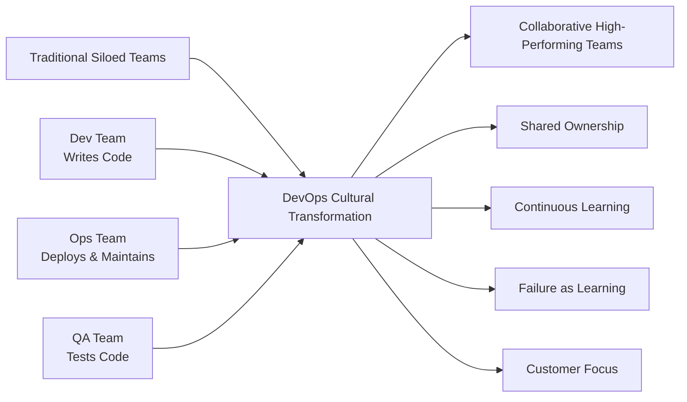

# 🚀 Day 6: DevOps Fundamentals

<div style="background: linear-gradient(90deg, #ff6b6b 0%, #4ecdc4 100%); padding: 20px; border-radius: 10px; color: white; text-align: center;">
  <h2>🌟 Master DevOps Culture, Principles & Practices</h2>
  <p>Complete guide to understanding DevOps fundamentals and implementation strategies</p>
</div>

## 📚 **Course Overview**

Welcome to Day 6 of your DevOps journey! Today we'll explore the fundamental concepts, culture, and practices that form the foundation of DevOps. This comprehensive guide will help you understand what DevOps really means and how to implement it effectively in your organization.

### 🎯 **Learning Objectives**

By the end of this day, you will be able to:

- ✅ Understand the core principles and philosophy of DevOps
- ✅ Explain the DevOps culture and mindset transformation
- ✅ Navigate the complete DevOps lifecycle and methodologies
- ✅ Identify key DevOps tools and technologies
- ✅ Implement DevOps practices in real-world scenarios
- ✅ Recognize and avoid common DevOps implementation pitfalls
- ✅ Design effective collaboration strategies between Dev and Ops teams

---

## 🗂️ **Course Structure**

This day is organized into comprehensive guides covering all aspects of DevOps fundamentals. Follow them in sequence for the best learning experience:

### 📖 **Core Topics**

| 📋 Topic | 📄 File | ⏱️ Est. Time | 🎯 Difficulty |
|----------|---------|--------------|---------------|
| **1. DevOps Culture & Principles** | [`01-devops-culture-principles.md`](./01-devops-culture-principles.md) | 2-3 hours | 🟢 Beginner |
| **2. DevOps Lifecycle & Methodologies** | [`02-devops-lifecycle-methodologies.md`](./02-devops-lifecycle-methodologies.md) | 3-4 hours | 🟡 Intermediate |
| **3. DevOps Tools & Technologies** | [`03-devops-tools-technologies.md`](./03-devops-tools-technologies.md) | 2-3 hours | 🟡 Intermediate |
| **4. Implementation Best Practices** | [`04-implementation-best-practices.md`](./04-implementation-best-practices.md) | 2-3 hours | 🟠 Intermediate-Advanced |
| **5. Hands-on Exercises & Labs** | [`05-hands-on-exercises.md`](./05-hands-on-exercises.md) | 3-4 hours | 🟠 Intermediate-Advanced |

---

## 🚀 **Quick Start Guide**

### 📋 **Prerequisites**

Before diving into DevOps fundamentals, ensure you have:

```bash
# Basic understanding of software development lifecycle
# Familiarity with version control (Git) - covered in Days 4-5
# Basic Linux/Unix command line knowledge - covered in Days 1-2
# Understanding of networking basics - covered in Day 3
```

### 🎯 **Learning Path Recommendations**

**For Beginners:**
1. Start with DevOps Culture & Principles
2. Understand the DevOps Lifecycle
3. Explore Tools & Technologies overview
4. Practice with basic exercises

**For Intermediate Learners:**
1. Review Culture & Principles quickly
2. Deep dive into Methodologies
3. Focus on Tools implementation
4. Complete advanced exercises

**For Advanced Practitioners:**
1. Focus on Implementation Best Practices
2. Study enterprise-scale DevOps patterns
3. Work on complex lab scenarios
4. Design your own DevOps strategy

---

## 🌟 **Key Concepts Preview**

### 🔄 **What is DevOps?**

DevOps is not just a set of tools or practices—it's a **cultural philosophy** that emphasizes:

- **Collaboration** between Development and Operations teams
- **Automation** of software delivery and infrastructure changes
- **Continuous Integration and Deployment** (CI/CD)
- **Monitoring and Feedback** loops
- **Shared Responsibility** for the entire software lifecycle

### 🎨 **The DevOps Culture Shift**



### 🛠️ **DevOps Toolchain Categories**

| Category | Purpose | Popular Tools |
|----------|---------|---------------|
| **📝 Planning** | Project management, requirements | Jira, Azure DevOps, Trello |
| **💻 Code** | Version control, code review | Git, GitHub, GitLab, Bitbucket |
| **🔨 Build** | Compilation, packaging | Maven, Gradle, npm, Docker |
| **🧪 Test** | Automated testing | JUnit, Selenium, Jest, PyTest |
| **📦 Release** | Deployment automation | Jenkins, GitLab CI, GitHub Actions |
| **🚀 Deploy** | Infrastructure provisioning | Kubernetes, Docker, Terraform |
| **🔧 Operate** | Monitoring, logging | Prometheus, Grafana, ELK Stack |
| **📊 Monitor** | Performance, alerting | New Relic, Datadog, Splunk |

---

## 📈 **Learning Outcomes**

After completing Day 6, you'll have:

### 🧠 **Conceptual Understanding**
- Clear grasp of DevOps philosophy and principles
- Understanding of organizational transformation requirements
- Knowledge of DevOps maturity models

### 🛠️ **Practical Skills**
- Ability to assess current DevOps maturity
- Skills to design DevOps implementation roadmaps
- Understanding of tool selection criteria

### 🎯 **Strategic Thinking**
- Capability to lead DevOps transformation initiatives
- Understanding of change management in DevOps context
- Ability to measure DevOps success metrics

---

## 🎮 **Interactive Elements**

Throughout this day, you'll encounter:

- 🧩 **Conceptual Puzzles** - Test your understanding of DevOps principles
- 🔍 **Case Studies** - Real-world DevOps transformation stories
- 🛠️ **Tool Exploration** - Hands-on experience with popular DevOps tools
- 📊 **Assessment Matrices** - Evaluate your organization's DevOps readiness
- 🎯 **Implementation Scenarios** - Practice DevOps strategy design

---

## 📚 **Additional Resources**

### 📖 **Recommended Reading**
- "The Phoenix Project" by Gene Kim, Kevin Behr, George Spafford
- "The DevOps Handbook" by Gene Kim, Jez Humble, Patrick Debois
- "Accelerate" by Nicole Forsgren, Jez Humble, Gene Kim
- "The Unicorn Project" by Gene Kim

### 🎥 **Video Resources**
- DevOps Fundamentals course by Microsoft Learn
- AWS DevOps Engineering path
- Google Cloud DevOps Engineer certification materials

### 🌐 **Community Resources**
- DevOps.com community
- r/devops subreddit
- CNCF (Cloud Native Computing Foundation) resources
- Local DevOps meetups and conferences

---

## 🎯 **Success Metrics**

Track your progress with these milestones:

- [ ] **Conceptual Mastery**: Can explain DevOps to technical and non-technical audiences
- [ ] **Cultural Understanding**: Understand the human aspects of DevOps transformation
- [ ] **Tool Awareness**: Know when and why to use specific DevOps tools
- [ ] **Implementation Skills**: Can design a basic DevOps transformation plan
- [ ] **Best Practices**: Understand common pitfalls and how to avoid them

---

## 🚀 **Let's Begin!**

Start your DevOps fundamentals journey by diving into the first topic: [DevOps Culture & Principles](./01-devops-culture-principles.md).

Remember: DevOps is as much about **people and culture** as it is about **processes and tools**. Keep this in mind as you explore each topic!

---

<div style="background: linear-gradient(90deg, #2196F3 0%, #21CBF3 100%); padding: 15px; border-radius: 8px; color: white; text-align: center; margin-top: 20px;">
  <strong>💡 Pro Tip:</strong> DevOps is a journey, not a destination. Focus on continuous improvement and learning!
</div>

---

**Next**: [DevOps Culture & Principles →](./01-devops-culture-principles.md)